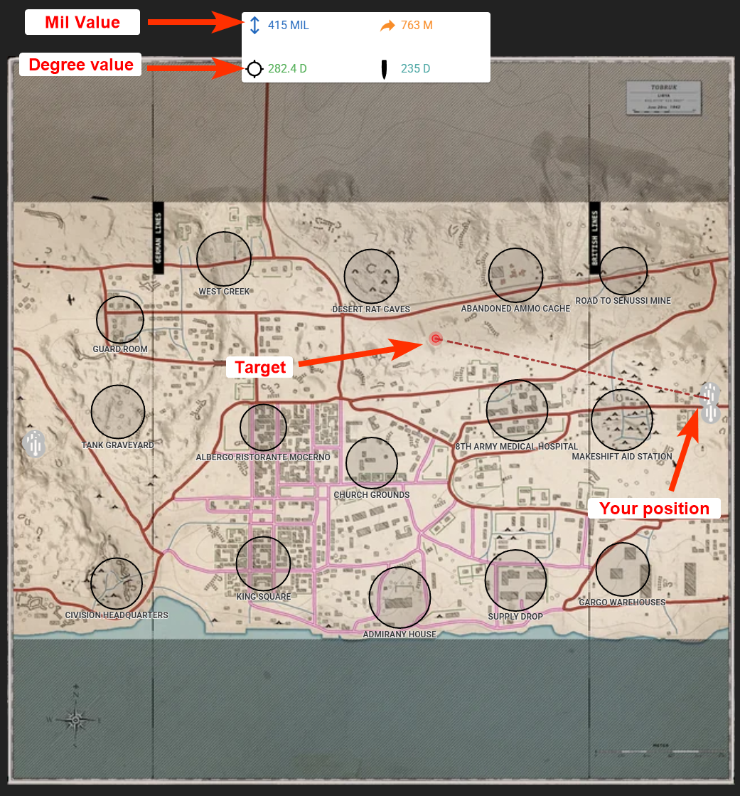

# Artillery Calculator

A simple artillery calculator:
[https://www.hell-let-loose-calculator.com/](https://www.hell-let-loose-calculator.com/)

## **Tutorial**
After selecting the map and then the artillery gun you're using, click any spot on the map where you'd like your shots to land.

You only need to look at two values, "Mil" and "D" (degrees).

- Mil refers to the ELEVATION you set in the artillery gunner seat.

- "D" refers to your compass bearing at the bottom middle of your screen.

- Note: If in the gunner seat you cant move left/right any further, then switch to the reloader seat, point to artillery further left/right, switch back to gunner seat.

Remember, each shell takes about 25 seconds to land.

## **Example**
In game, would set your elevation to 415 and point your compass to be approximately be between 282 and 283.

