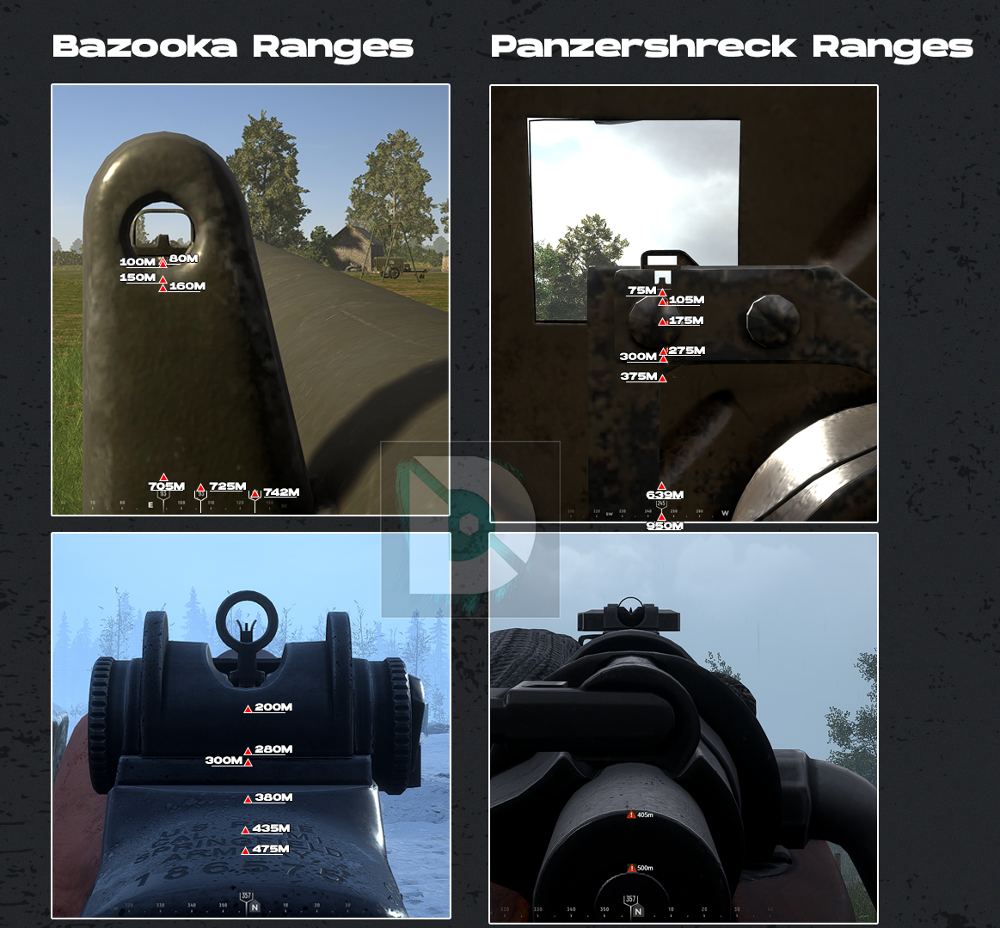
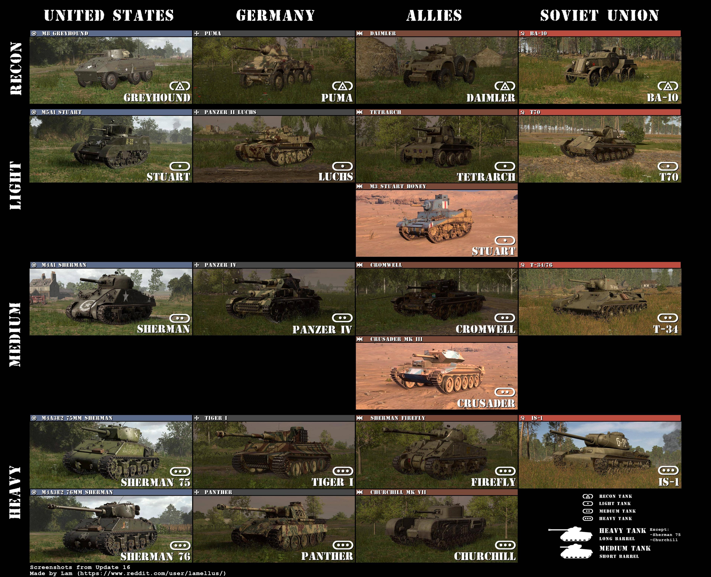

# Anti-tank Guide

# :material-information:AT Overview
<iframe width="560" height="315"
    src="https://www.youtube.com/embed/lrK4N7lBy1Q"
    title="YouTube video player"
    frameborder="0"
    allow="accelerometer; autoplay; clipboard-write; encrypted-media; gyroscope; picture-in-picture"
    allowfullscreen>
</iframe>

## :material-bullseye-arrow:Bazooka/Panzerschreck Range Guide
Credit: [Duned](https://www.youtube.com/@Duned)

 

## :material-tank:Tank Identification
Credit: [lamellus](https://reddit.com/r/HellLetLoose/comments/1i3n6e5/tank_identification_cheat_sheet_update_16)

 

Here are some things that stand out visually to help you identify the tank.
 