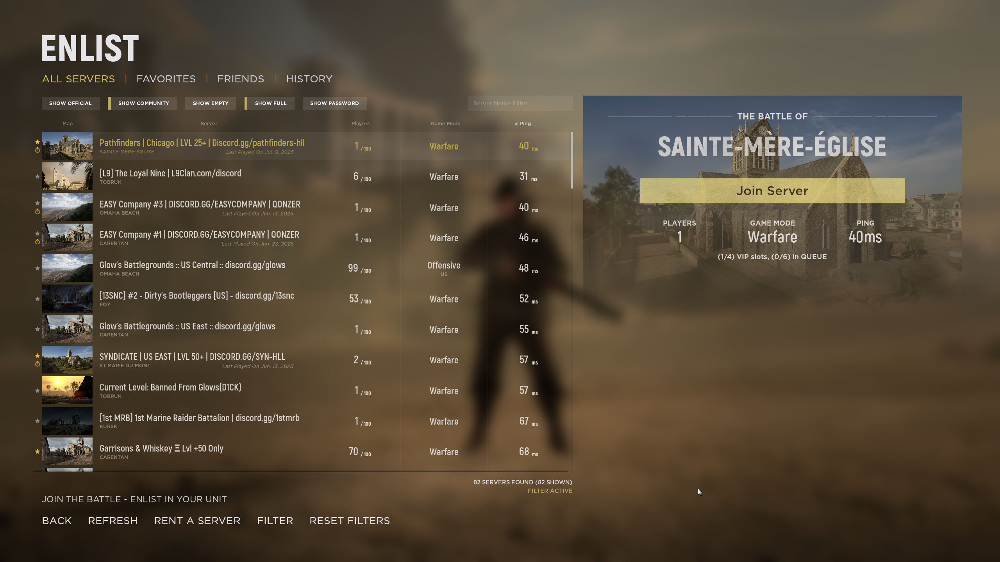
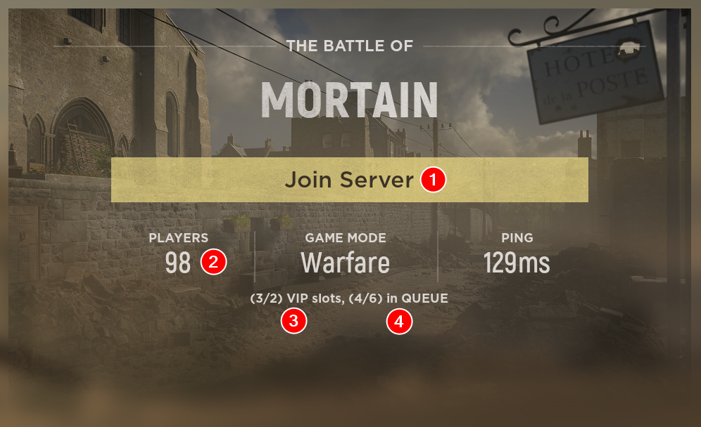
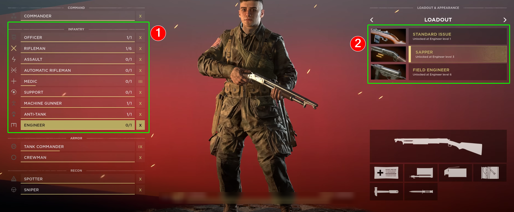
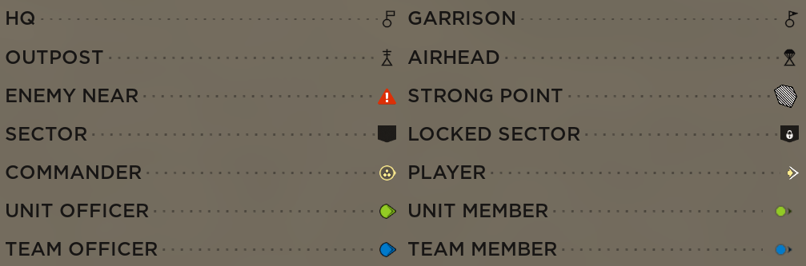
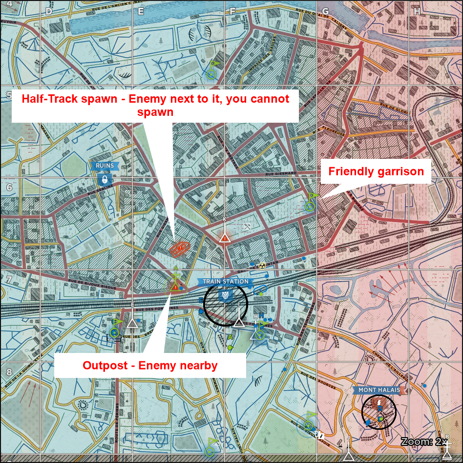
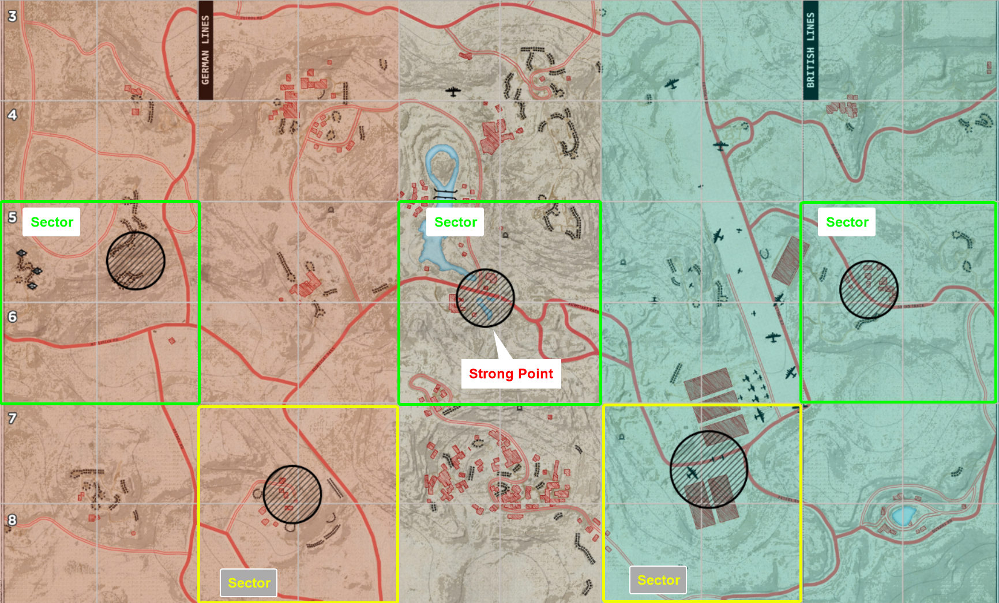
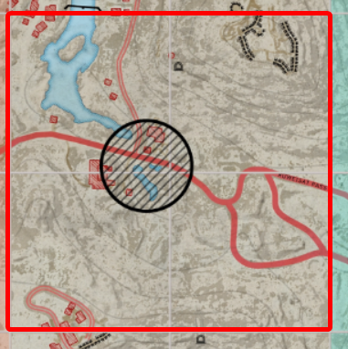
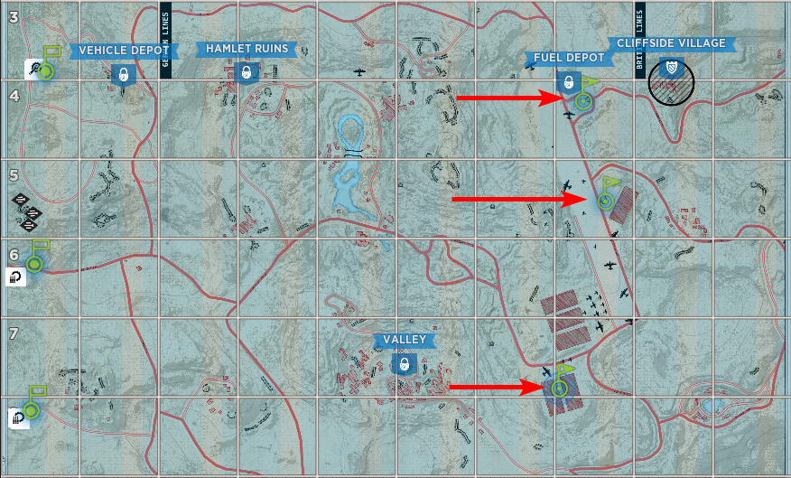
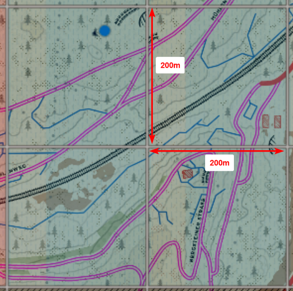

# Beginners Guide
---
## **Introduction**
This guide is meant to get new players quickly introduced to basic game mechanics. **Please use your microphone in game to communicate with your squad**.

## :material-server:**Server Browser**

- It's recommended you sort the list by "Ping" column to find low latency servers.
- Avoid official servers (can be unchecked through the filter), community hosted servers are better moderated especially against cheaters.
- It's normal to wait in queue for 5-10 minutes to join a server that is full.

### **Server Info Card**

**1.** Join Server button

**2.** Total players in servers

**3.** 3 VIPs currently in game, 2 VIP slots available. Server will fill up to 98 players and reserve 2 slots (99 and 100) for VIP status players. This allows VIPs to skip the regular queue.

**4.** Queue to join the game. 4 players currently waiting in queue, 6 is the maxiumum players the queue can hold.

---
## :material-monitor:**Spawn Screen**

Deployment screen

**1.** Select the arrow button beside squad icon to join a squad. As a beginner join an Infantry squad, **do not join Armor or Recon squad**.

- **Note**: **Do not create a new squad**, you'll be locked in Squad Officer role which is only recommended for experienced players.

**2.** Select spawn point on the list from the right or click one on the map in the middle.

**3.** Click deploy button and wait for the timer.

---

Loadout screen

- Click "Change Role" near bottom left to go to your loadout screen. Here you can pick different roles (1) and loadout (2). Note, there are limitations to amount of specific roles per squad.
- **Good beginner role is Rifleman**, after gaining an understanding of the game, you can try playing Support/Medic role.

---

Important icons to note on map screen

- **HQ**: 3 spawn points edge of the map you can redeploy at.
- **Garrison**: A forward spawn point built by a squad leader/commander, anyone on the **team** can respawn on it.
- **Outpost**: A spawn point built by **your squad leader**, only **your squad** can respawn on it.
- **Airhead**: Deployed by commander, anyone on the **team** can respawn on it.

 

- If a spawn point shows up with a red exclaimation mark (red ⚠️), it means enemy is nearby. Caution is advised.

- If spawn point turns red, you'll be unable to deploy to it as there is enemy right next to the spawn point which is locking it out.

---

## :material-gamepad:**Game Modes**
### **Warfare Game Mode**

Example of a map screen

- The goal is to **capture and hold more sectors with strong points** (minimum 3) than the enemy by the end of the timer. Alternatively, capture all sectors (5) and win outright.
- The map is divided into 15 sectors (2x2 grids). Each 2x6 grid has one **strong point** (black circle).
- Each teams has **3 HQ spawns** available with a respawn timer of 10 seconds at the edge of the map.
- Middle strong point is neutral at the beginning of match.
- Capturing a strong point rewards the whole 2x6 grid of the map to your team.
- You can only capture the next available strong point, you **cannot capture the strong point behind the active strong points**.
- Garrisons, Outpost (OPs), Half-tracks, and Airheads can be used as additional respawn points.
- **Garrisons and Outposts are immediately lost in the sectors that gets captured by enemy**, new ones must be built.

---

#### **Capturing Sector**

- A player standing inside the black strong point circle **counts as 3**.
- A player standing in a 2x2 grid sector around the active strong point **counts as 1**.
- Capture power has no affect on speed of the capture. The **capture time in warfare is always 2 minutes**.

### **Offensive Game Mode**
- There is an attacking team and a defending team.
- No recapturing of objective is allowed.
- **Only players inside strong point (black circle)** count toward capturing power.
- Attacking team has **30 minutes to capture strong point** to gain sector control and advance an attack to next sector.
- 30 minute timer resets each time attacking team captures a strong point.
- **Overtime** will be initiated if the strong point is contested when timer runs out.
- Attackers win if they push defenders all the way back and capture enemy HQ sector.
- **Attackers only get one HQ spawn in the beginning**, they must work to build additional spawn points.
- Defenders have 3 HQ spawn points plus an additional **3 garrisons at the frontline** at the beginning of round.

View of a defender's map, note the 3 garrisons placed near the frontline.

---

## :material-information:General Tips

Each large **grid square on the map is 200 meters**. The **minimum distance between garrison placement is 200 meters** as well. Use this as your guide for placing supplies and garrisons.

**Use "Redeploy" button** in the Esc menu whenever needed. There is no real penalty to using it other than extra 10 second respawn time. Use it to quickly spawn back on defense when sectors change hand and you're too far away. The same principle applies if you're attacking.

Take your time to observe, avoid sprinting frequently.
