The Tank Bible

# Disclaimer
This guide is taken from <https://www.theline.gg/tankbible/#2.7>, **ALL credit goes to the original author [Koleto_](https://reddit.com/u/Koleto_)**. You can donate to the original author [here](https://paypal.me/tankbible).

This guide is served on this wiki to preserve it and allow community authors to contribute to it for any changes that are needed as a result of game updates.

## **1 Introduction**

Where am I getting shot from!? Why do all these tanks keep eating my shells without taking any damage? How come I just got killed in 1 shot by that Tiger? Why did daddy go out for a pack of cigarettes and never come back? Never fear! All of these deep, thought provoking questions will be answered in the latest edition of The Tank Bible. The Tank Bible is a compilation of statistics observed through testing how various tanks react when getting absolutely pummeled by other tanks, as well as a complete collection of all the mechanics surrounding tanking. The purpose of these stats is to inform any tank players of the damage their tanks do to other tanks and why, to expose players to some new and interesting discoveries pertaining to new tank strategies, and to advise said tanks players on the best methods for dealing with enemy tanks and enemy anti-tank infantry. Some readers may already know some of the information stated below, but there will likely be many of you that might find these statistics interesting.

## **2 Findings That Apply to All Tanks**

In Update 12, there are a lot of aspects of tank gameplay that are shared between every tank in the game. These are noted below.

---

### **2.1 Tank Health Bars**

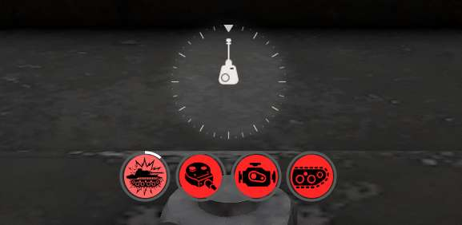 
Figure 1: "Poor Tank Having a Bad Day"

Every tank has four health pools, shown near the bottom middle of the screen. These show the status of each individual part of the tank, and whether it is damaged or disabled. The first health bar is the hull of the tank. This health bar signifies the overall health of your tank’s armor and can be considered the overall health of the tank. If this bar goes to 0%, the tank explodes in a ball of flame and you die. The next health bar is the turret’s health bar. When hit by enemy fire that penetrates the turret or the barrel, the turret’s health bar will go down, and when the health bar reaches 0, the turret is severely hindered. This means that its coaxial machine gun is disabled and its traverse speed (meaning the speed to turn left, right, up and down) is also significantly reduced. The third health bar, introduced in Update 10, is the engine. The engine health bar corresponds to (duh) the engine of your tank, and for every tank in the game except the BA-10, can usually only be damaged from the rear (the BA-10 is an armored car so it’s engine is in the front). Once damaged by any amount, your engine will remain on, but if for some reason you turn it off, you will not be able to start it again until you repair the engine to 100%. If the engine compartment is completely destroyed, your engine shuts down meaning you can’t drive the tank anymore, and you can only turn it back on by repairing the engine component back to 100% health. Finally, the last health bar is the tracks. This shows the functionality of the tracks, and when the health bar hits 0%, you are forced into 1st gear (or reverse) and cannot shift up, slowing you down considerably. As long as the health bar of the tracks is above 0%, the tracks will operate normally. Note that both tracks share 1 health bar, so shooting either of them (or both) will damage the track health bar.

With regards to the health pool of the tracks, Update 10 has ushered in the end of being able to destroy a tank through the tracks from the front, even with AP. The days where you could shoot a Tiger with "Jumbo" 75mm smoke rounds and then kill it through the front tracks are long gone. If your gun is powerful enough, you can still destroy a tank by shooting it in the tracks from the side (where you can see the wheels), but if the tank is facing you head on, you can only *disable* its tracks even with the heaviest tank.

---

### **2.2 Barrels of Fun**

Every tank in the game has a barrel through which the projectile is fired towards an enemy, and this barrel can be similarly fired upon by that enemy. When you hit an enemy tank’s barrel, it’s turret almost always becomes immediately disabled (meaning that the coaxial gun is offline and the traverse speed is reduced) and sparks start flying out of the barrel. Sounds good, right? Wrong. In every instance that has been tested and compiled here, while shooting the barrel does do damage to the turret quickly, it does *not* do damage to the hull, and therefore cannot kill the tank. As a result, you should never hit the barrel more than once, and even hitting it once is ill-advised. Typically, as you will see below, you will want to avoid the barrel when aiming for the turret.

The cupolas of different tanks act in much the same way. Depending on the tank, some cupolas are impenetrable and others are not, but all cupolas, if penetrated, will only do damage to the turret and never the hull, even if you shoot it multiple times. Because of this, you should avoid shooting the cupolas of tanks in general.

---

### **2.3 BBW: Big Bouncing Warheads**

So what is a ricochet anyways? A ricochet is when the projectile you fire from your tank bounces off the hull of an enemy tank instead of penetrating. In terms of the game, ricochets mean that your shots do no damage. Instead, the projectile is redirected somewhere else and may land nearby. Ricochet physics in Hell Let Loose are one of the biggest reasons why a lot of rookie tank crews are not as efficient as they could be at killing tanks. To understand how and why a tank round ricochets, it’s important to know the factors that are at play. The critical ricochet angle, meaning the angle at which a tank round will ricochet as opposed to penetrating, depends on the velocity of the projectile, the thickness and hardness of the plate on the tank, the shape of the projectile, the angle of the plate, as well as other factors. For the purposes of Hell Let Loose, however, all you need to know is that the bigger tanks tend to sling faster shells with greater penetrating power, but they also have thicker and harder plates to boot. So, *in general*, if you are facing a heavy tank with really hard armor such as a Tiger, most if not all of your shots to any angled or curved surface will ricochet. On the other hand, if you are a tank whose projectile is fast and hits hard, it may be okay to hit armor at an angle as it will penetrate anyway. All of that having been said, the most important thing to learn about ricochets is avoiding slanted and curved surfaces when you can. This may seem obvious, but typically you should aim for surfaces that are perpendicular to the projectile you are firing. For example, the American Sherman "Jumbo" 75mm and 76mm heavy tanks have a large flat rectangular front plate and a smaller flat plate, called the mantle, on the turret either side of the barrel. If you hit either of these areas with a Tiger or Panther heavy tank, you will penetrate and deal damage (Figure 2).

 
Figure 2: "Where to Shoot"

If instead you fire on the curved portion at the bottom of the front plate between the tracks, or at the slanted portions above and to the left and right of the turret mantle, you will ricochet (Figure 3).

 
Figure 3: "Where Not to Shoot"

As we will see later, angling specific tanks with respect to the enemy can open up new opportunities to ricochet enemy shells coming at you.

---

### **2.4 Knowing When You’ve Hit**

With Update 11, the developers have made it easier to tell whether you are penetrating, ricocheting, or neither (A.K.A. a non-penetrating hit). There are new sounds and visual effects for each, and examples are listed below of each separate one from the gunner’s perspective. *Note: feel free to right click on the video and set it to loop, make the video play in slow motion, or make it full screen so you can see these effects better.*

### **2.4.1 Ricochets**
<figure style="max-width: 600px; margin: auto;">
  <video controls style="width: 100%; height: auto;">
    <source src="videos/f4.mkv" type="video/mp4">
    Your browser does not support the video tag.
  </video>
</figure>
Figure 4: "The Ricochet"

Ricochets create a very visible bright ray or line that shoots out from the place the round hits the tank in the direction the round bounces. It also makes a sound almost like the stereotypical ricochet sound of a bullet—a kind of high pitched whistle that lasts for one or two seconds (Figure 4).

### **2.4.2 Non-penetrating Hits**
<figure style="max-width: 600px; margin: auto;">
  <video controls style="width: 100%; height: auto;">
    <source src="videos/f5.mkv" type="video/mp4">
    Your browser does not support the video tag.
  </video>
</figure>
Figure 5: "The Non-penetrating Hit"

Non-penetrating hits are marked by an explosion of orange sparks outward in all directions from the point of contact of the shell. It looks a bit like a spherical firework you might see on a holiday. It also makes the typical explosion sound you hear when hitting any other object such as a tree or the ground (Figure 5).

### **2.4.3 Penetrating Hits**
<figure style="max-width: 600px; margin: auto;">
  <video controls style="width: 100%; height: auto;">
    <source src="videos/f6.webm" type="video/mp4">
    Your browser does not support the video tag.
  </video>
</figure>
Figure 6: "The Penetrating Hit"

Penetrating hits make a bright orange fireball around the impact point and cause the impacted area to start throwing sparks for a while after the blast. You can use these sparks to see exactly where you have hit an enemy tank and as an easy indicator that you have done damage to an area. In addition, penetrating hits create a sound in Update 12 which is like banging on a metallic object, for lack of a better way to describe it. This sound is useful because it is loud and can be heard by all members of your crew, even the driver, which means that if someone does not see the hit, they can easily tell it is a penetrating hit by listening for this unique sound (Figure 6).

Except in very long distance engagements, usually these visual and audio effects can be seen and heard through the smoke and wobbling of the tank immediately after firing a shell. This is because of the bright color and unique shape of the visual effects as well as the volume and unique sound of the audio effects makes it easy enough to discern what is going on if you are paying attention.

---

### **2.5 Muzzle What?**

A lot of real life tanks use a barrel that features a muzzle brake on the end of it as opposed to simply a straight cylindrical barrel. The purpose of the muzzle brake is to funnel the gasses that come out of the barrel to either side of it when a round is fired instead of directly in front of the barrel. This (in theory) makes for better visibility as well as less recoil and a variety of other things on top.

This is all well and good, but how does it pertain to the game? Well, in a general sense, tanks in Hell Let Loose that have a muzzle brake tend to have smoke trails that dissipate quicker than those that do not have muzzle brakes. If a shot is fired through a barrel that does not have a muzzle brake visibility can be lost for a few moments. For the Americans, the Sherman "Jumbo" 75mm and the Sherman medium do not have muzzle brakes, and they tend to leave a smoke cloud that obscures the spotter’s vision for about 2 seconds. The Sherman "Jumbo" 76mm however does have a muzzle brake, and does not have to deal with this issue. On the German side, both the Tiger tank and the Panzer IV tank have smoke screens that block the gunner’s vision for 2 seconds as well. This is something that crews of those tanks have to learn to get used to, and be ready to react to enemy engagements immediately after the smoke has dissipated.

Because all the gasses of a tank shell come out of the end of the barrel, it is important to note that friendly (and enemy) infantry can be suppressed by your shells in a radius around the end of your barrel. For the Americans and Soviets, all tanks suppress within 5 meters of the end of the barrel, and for the Germans, all tanks suppress within 7 meters of the end of the barrel. This means that, as infantry, if you are pushing behind or to the side of a friendly tank, you can use the body of the tank as cover from the suppression of the muzzle even if you are within the radius of suppression, as long as you keep the body of the tank between you and the muzzle.

---

### **2.6 A Driver's Guide (For Dummies)**

Let’s talk about driving, because some of you can’t seem to figure it out. All of the tanks in the game except the recon vehicles are stick shift operated, meaning that you have to control the switching of gears of the tank as your speed changes. Typically, the lower gears turn quickly and the higher gears move the tank faster, but this is not true for all tanks (for example, the Panther turns slowly in 1st gear but quickly in 4th). If you switch gears too fast you can stall the tank and get stuck at a slow speed even if you switch to higher gears. I can already imagine some of you rolling your eyes and saying things like "I already know the basics" and "get to the good stuff already". Fine, let the "good stuff" commence.

### **2.6.1 Gears Just Want to Have Fun**

Update 10 has reworked the driving mechanics from the ground up to be more realistic. Now, when you accelerate in a straight line at 1st gear, the tachometer will steadily go up until it reaches a critical point at which it will "pop" and quickly spike to maximum RPM (Figure 7). In every tank, this happens when the tachometer reaches 20 RPM. When the 1st gear "pops", this is when you can start turning with the maximum speed that the gear affords you. If you try to turn before that point, however, your turn speed will be significantly reduced, the time it takes to "pop" will be increased, and if the tank is particularly sensitive, such as the IS-1 heavy tank, the first gear will never "pop" so long as you are turning (Figure 7). Turning reduces your RPM, so if you are stationary the quickest way to turn is to first accelerate in a straight line until 1st gear "pops", then press the "A" or "D" keys to turn (especially in tanks with high turn speed such as the Tiger and the "Jumbo"s).

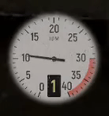 
Figure 7: "1st Gear of the Panzer IV ‘Popping’ While Driving in a Straight Line"

If you look closely at Figure 7, you will see that from 10 RPM (stationary), the needle quickly jumps to 15 RPM when you start accelerating, then it climbs slowly to 20 RPM, after which it quickly jumps again to 30 RPM. The jump from 20 RPM to 30 RPM is what is known as the "pop".

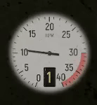 
Figure 8: "1st Gear of the IS-1 While Turning"

*If you stall the tank like in Figure 8 and you try to go to 2nd or 3rd gear, the tank will continue to stall.*

The "pop" mechanic is only applicable to 1st gear. Every other gear after that will already be "popped" if you shift gears correctly. So how do you shift gears perfectly every time without stalling the tank? The answer is simple, because it’s the same for every gear in every tank. You can shift gears safely after the needle of the tachometer hits 25 RPM (Figure 9). Every tank is different, and some can shift safely even before reaching the 25 RPM threshold, but if you want to make 100% sure you don’t stall the tank, then waiting for 25 RPM is advised because it works for every tank. Since the time it takes for a tank to reach 25 RPM is different depending on the tank, you will have to learn the timings for each tank to be able to maximize your acceleration.

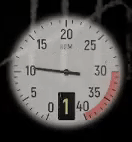 
Figure 9: "Optimal Shifting from 1st to 4th Gear in a Tiger"

Elevation can also affect your RPM and the way you shift gears as well as turn. When you go up a hill or obstacle, your maximum RPM will decrease slightly, and how quickly your tank accelerates will also decrease (duh). This means that you have to shift gears a little slower, and if you fail to do so, you may stall the engine depending on the tank you are driving. This applies to going up berms as well—if you try to shift gears and turn while going up a berm you will stall out the engines on most tanks. Conversely, if you are going down a hill, your acceleration will increase, making it faster and more forgiving to switch gears and turn.

Refer to the individual sections of each tank for more specific information about driving statistics as they pertain to particular tanks.

### **2.6.2 Advanced Agility Techniques (MLG Only)**

In Update 10, the maximum turn speed of tanks in the game was reduced across the board, and the maximum movement speed of a lot of tanks was also been slashed. There is, however, a way to get around this. Movement on flat ground can be extremely vexing and slow, but you can utilize almost every piece of geometry on the map from low bearing obstacles such as tires and rubble to the sharp and angular corners of buildings to dramatically increase the speed at which you turn, saving your life in critical situations. To illustrate this, the following figures show how you can turn much quicker than you otherwise would be able to by using some of the map terrain.

<figure style="max-width: 600px; margin: auto;">
  <video controls style="width: 100%; height: auto;">
    <source src="videos/f10.mkv" type="video/mp4">
    Your browser does not support the video tag.
  </video>
</figure>
Figure 10: "Tiger 90**°** Turn on Carentan"

Here is a Tiger on Carentan utilizing rubble, a piece of terrain that is very common in the streets on that map, to make a quick 90° turn in 4th gear without stalling the tank (Figure 10). This allows the Tiger to turn 90° in about 4 seconds, cutting the time it takes to turn 90° in 4th gear by **50%**.

<figure style="max-width: 600px; margin: auto;">
  <video controls style="width: 100%; height: auto;">
    <source src="videos/f11.mkv" type="video/mp4">
    Your browser does not support the video tag.
  </video>
</figure>
Figure 11: "Sherman ‘Jumbo’ 76mm 90**°** Turn Using A Building"

Here I am in a Sherman "Jumbo" 76mm on Sainte Marie Du Mont, utilizing the corner of a wall to make a quick 90° turn into a very tight space between two buildings (Figure 11).

<figure style="max-width: 600px; margin: auto;">
  <video controls style="width: 100%; height: auto;">
    <source src="videos/f12.mkv" type="video/mp4">
    Your browser does not support the video tag.
  </video>
</figure>
Figure 12: "Sherman Medium 180° Turn Using Berm"

Here is an example of the Sherman medium tank, which has a famously abysmal turn rate in 4th gear, nearly doing a 180° turn in record time, without leaving 4th gear, utilizing only a berm—one of the most ubiquitous terrain elements in Hell Let Loose (Figure 12).

<figure style="max-width: 600px; margin: auto;">
  <video controls style="width: 100%; height: auto;">
    <source src="videos/f13.mkv" type="video/mp4">
    Your browser does not support the video tag.
  </video>
</figure>
Figure 13: "Panther Going Up Sheer Walls"

Here is the Panther going up that annoying stone wall on Sainte-Mère-Église with ease by hitching the right track on top of the wall and then scaling it without ever having to downshift (Figure 13). Such style!

<figure style="max-width: 600px; margin: auto;">
  <video controls style="width: 100%; height: auto;">
    <source src="videos/f14.mkv" type="video/mp4">
    Your browser does not support the video tag.
  </video>
</figure>
Figure 14: "Panzer IV 180° Turn Using A Rock"

Lastly, here is the Panzer IV doing a clean pivot turn using a simple rock you might find on any map (Figure 14).

If you’ve driven these tanks for any amount of time in Update 12 you know that with the exception of the Panther and some of the mediums, none of them turn very quickly in 4th gear, and it can be frustrating and time consuming especially if you have to shift down gears to turn and then shift back up. That is why utilizing the map terrain around you is so important. The trick is to lift only one of your tracks into the air by coming into contact with an object that you cannot drive through. If you have a pile of rubble and the left side of your tank goes over it, for example, you can use that to quickly pivot left and increase your turn speed dramatically. If you want to utilize a wall to turn, you need to get close enough that your track goes up the side of the wall, then turn in the direction of the track that is up against the wall (so if your left track is up against the wall, turn left around the corner, and vice versa). This trick takes practice to get right, and the sensitivity of the tank’s turn is different for each tank (for example, light tanks like the Stuart are really sensitive and can sometimes do crazy pirouettes), but pulling off turns like this consistently is what separates the chad drivers from the virgin ones.

Another tip is that pressing the "S" key on any tank stops it almost immediately, making it the best method to stop a tank quickly to acquire a target. Trying to downshift to 1st gear or park without pressing the "S" key will take significantly more time. On top of that, with the removal of barrel physics, there is significantly less barrel sway when any tank is stopped now, meaning your crosshair will be at rest within 1 or 2 seconds of full stop. (Note: the Panther is the only tank that is an exception in this regard, it’s barrel sway after a complete stop is longer than that of every other tank).

The last thing to mention about mobility is moving while shooting. In Update 12, every tank can move and shoot relatively accurately, as long as the gunner can maintain the crosshair on the desired target. At maximum zoom and maximum speed, this can be difficult because minor bumps are translated into dramatic jumps in the reticle. That said, heavier/slower tanks can travel at 1st, 2nd, or even 3rd gears on reasonably flat ground and be able to land accurate shots consistently because of the removal of the barrel shake bug that existed in Update 9. This opens up combined arms tactics where tanks slowly move up as mobile cover for friendly infantry while simultaneously raining death on enemy infantry positions.

### **2.6.3 The Tank Jesus QuickTurn™**

As per usual, I try to keep readers of the Tank Bible up to date on the latest mechanics and techniques used by the best tankers in Hell Let Loose, and this next trick is no exception. Have you ever been cruising along in 4th gear in your beautiful tank and suddenly been accosted by a band of pesky AT players right behind you? Have you ever needed to turn on a dime from 4th gear, in place, without losing RPM?\* Are you annoyed that I’m wasting your time with stupid questions like these? If you answered yes to any or all of the above questions, you’re in luck! My patented QuickTurn™ is for you.

So what is it? Well, it’s a technique that allows drivers to react to threats while they are most vulnerable: driving from position to position in 4th gear. It allows drivers to turn certain tanks\* in place faster than any other method can turn them, and it utilizes the peculiarities of old driving and tank physics on tanks that have not been updated yet. To illustrate this in action, let’s look at a side by side comparison (time it yourself!) of the "Jumbo" 76mm heavy tank using the previously known fastest method (namely dropping down to 1st gear from 4th gear since 1st gear has the fastest turn speed for the "Jumbo") (Figure 15) and the new method (Figure 16).

*\* - This cannot be done with the Panther, Sherman medium, or IS-1*

<figure style="max-width: 600px; margin: auto;">
  <video controls style="width: 100%; height: auto;">
    <source src="videos/f15.mkv" type="video/mp4">
    Your browser does not support the video tag.
  </video>
</figure>
Figure 15: "‘Jumbo’ 76mm Slow Turn"

<figure style="max-width: 600px; margin: auto;">
  <video controls style="width: 100%; height: auto;">
    <source src="videos/f16.mkv" type="video/mp4">
    Your browser does not support the video tag.
  </video>
</figure>
Figure 16: "‘Jumbo’ 76mm QuickTurn™"

Not only does this technique easily shave off 2-3 seconds from the time it takes to do a full 180° turn using the previously known fastest method, which could be the difference between life and death, but you also don’t have to shift all the way down to 1st gear, further decreasing the total time from danger to safety and allowing you to spend less time getting back to 4th gear after the turning has been completed. Additionally, this mechanic does not require any type of wall, mound, rock, bush, or any other terrain object, unlike the one outlined in [section 2.6.2](#262-advanced-agility-techniques-mlg-only). On top of all that, even though the turn is started from 4th gear, the turn itself is extremely tight, effectively making the tank spin in place, which allows you to do this maneuver in tight spaces.

So are there any downsides? Unfortunately, there are a few. As mentioned previously, the turn can only be started from 4th gear, which means that if you want to turn from a stationary position your best bet is still 1st gear or reverse. The tank also must be at maximum speed and RPM in order to perform the maneuver without stalling the engine, meaning that if you are not quite at max speed and RPM (presumably because you are on a steep incline or have just shifted up to 4th) then you must wait to do the turn until you get back up to max speed and RPM. There are also three tanks that cannot turn this way at all, no matter what the circumstances, namely the IS-1 heavy tank, the Panther, and the M4 Sherman medium. These three tanks share an extremely poor turn rate in 2nd gear, making their engines either stall out on execution of the turn (IS-1) or not turn quickly enough to make a difference (Panther and Sherman medium). Lastly, while the two "Jumbo"s and the Tiger can do this turn even while driving up small hills, the medium Panzer IV and T-34/76 tanks can only utilize this technique on perfectly flat or downhill terrain. Unlike the heavies, if there is even a slight incline, the engines of these medium tanks will stall out which, during a life and death situation where you *need* to turn, will most likely lead to your death. Below is an example of what the correct turn in a Panzer IV looks like, for reference (Figure 17).

<figure style="max-width: 600px; margin: auto;">
  <video controls style="width: 100%; height: auto;">
    <source src="videos/f17.mkv" type="video/mp4">
    Your browser does not support the video tag.
  </video>
</figure>
Figure 17: "Panzer IV QuickTurn™"

Notice the turn is performed over a slight *downward* slopewith respect to the tank. If performed correctly, this technique allows the driver to spin the tank quickly for as long as they want, and even allows them to gear up and quickly get in back on the move in 4th gear without stalling the engine. Next is an example of what happens if you try to do the turn over a slight *upward* slope instead (Figure 18).

<figure style="max-width: 600px; margin: auto;">
  <video controls style="width: 100%; height: auto;">
    <source src="videos/f18.mkv" type="video/mp4">
    Your browser does not support the video tag.
  </video>
</figure>
Figure 18: "Botched Panzer IV QuickTurn™"

The difference in the terrain is subtle, but the result is obvious. When performed correctly, the turn keeps the tachometer’s needle exactly at 20 RPM as you spin. If instead the turn is made incorrectly, the tachometer will dip below 20 RPM and you will have to explain to your crew mates how you stalled out the engine on a simple turn.

So finally, after much ado, let’s get to how to actually do this turn. Here are the steps in order:

1. Starting from 4th gear, holding the "w" key, press and hold the downshift key (default "ctrl").
2. Press and hold the directional key ("a" for left and "d" for right).
3. Count 2 downshifts and then release the downshift key
4. Continue to hold the "w" key and the directional key for as long as you want to turn, after which you can release the directional key and shift up normally or press the "s" key to stop entirely.

To explain it a little more in depth, as you hold the "w" key to keep your RPM up in 4th gear you hold the downshift key and count 2 downshifts then release to get to 2nd gear. As soon as you press the downshift key and your tank goes in-between gears (the tachometer will show N as the gear while this is happening), the tank will stop receiving input from your directional keys until it lands on a gear. The idea is that while you are downshifting you want to be holding the directional keys "a" or "d" keys depending on which direction you want to turn so that when you land on 2nd gear you immediately start moving in that direction. If you have done it right, you will release the downshift key while holding the directional key and the "w" key and execute the technique. There is an element of timing in that you must make sure that you downshift the correct amount of gears (in other words, do not release the downshift key too early or too late).

It is a simple enough maneuver that with a little practice everyone can learn. The important thing to remember about this technique is its limitations; namely, which tanks can utilize it on what kind of terrain.

### **2.6.4 Spacial Awareness**

Another very important aspect of driving is knowing the size of your tank and the location of the viewport as a driver. This is the single biggest reason why so many drivers get stuck in urban or forested maps or even when simply trying to make a sharp turn. Because the driver’s viewport is on the left hand side of the tank, not the middle, the tank actually extends farther to the right of the driver than it does to the left. For tanks like the Tiger that are wider than my aunt Bertha, this means you have to be careful how you make your turns. If the right side of your track gets caught on a tree or a wall, your entire tank will pivot into said tree or wall if you keep going forward and thus force you to reverse, wasting time. Note: you can move the mouse downwards to allow greater vision of the ground immediately in front of you, and can be useful in determining what you are stuck on.

Awareness of your tank also means awareness of which direction your turret is facing and what your gunner can see. A good driver knows if there are obstacles that will cause their gunner to have trouble getting a good sight picture and is able to position exactly so that there is the minimum amount of extra movement required during an engagement. If you have to move 1 foot to the left or right because there is a pole or a bush preventing your gunner from shooting the enemy tank you are engaging, you could end up paying for that oversight with your life. For this reason, you should always ask your gunner if their sight picture is satisfactory when stopping for a non-trivial amount of time. Additionally, you should know as a driver how visible your tank is from behind cover. If you are trying to disengage from a fight with a tank and retreat into cover you need to know whether your tank is visible from their perspective, including whether or not your turret can be seen over a hedge or wall or if your tracks can be seen sticking out of said cover, for example.

### **2.6.5 Kiting**

Kiting is another technique utilized to great success by competitive level tankers at the highest levels of play. Kiting, as I like to define it in the context of Hell Let Loose tanking, is the act of peeking out of hard cover to shell infantry or tanks and backing up behind said cover and repairing the tank when taking damage. The purpose of kiting is to elongate your life in a tank and act as a safety net against surprise damage from an unknown source, all while not sacrificing your ability to lay the hurt down on enemy positions and tanks. Now, in theory, using cover is nothing new and certainly you, dear reader, understand its benefits. This section, therefore, is about how to determine which cover to use in the first place, the best ways to make use of said cover, and how to work with your gunner and spotter to kite effectively.

The first thing to understand is that not all hard cover is the same. Sometimes the hard cover itself can obscure your sight lines or is in an area of the map that does not have good sight lines to begin with. Other positions do not obscure your tank from damage in its entirety or have holes in them, such as stone walls. Others still are too close or too far away from the action to be effective spots. What you want in a good cover position is (1) the ability to protect your entire tank from damage, (2) good sight lines to enemy infantry and tank positions, (3) enough space behind the cover for the tank to smoothly maneuver back and forth to open and obscure the sightline, and (4) a position that is neither too close to enemy positions to risk getting overwhelmed nor too far from enemy positions to render you ineffective (in other words somewhere where you can sit for a while and get value without having to move immediately). When you apply these filters to all cover on a map, there usually ends up being only a handful of great positions that you can then memorize. Note: hedgerows can be good cover depending on the map and location. Sometimes bushes are penetrable and sometimes they are impenetrable, so be careful when kiting using bushes.

So you’ve found a good position. How best can you kite using this cover? The most efficient way to kite is to park sideways with respect to the cover and turn the barrel 90° left or right with respect to the front of the tank. The benefit of this is that the driver can peek straight out of the cover without turning at all, allowing the gunner to more quickly acquire any targets, but more importantly, it allows the driver to reverse the body of the tank straight back into cover upon taking damage, which is the quickest way to get to safety. As a driver, this takes some getting used to—you will have to depend on your crew mates to be your eyes because you will be looking away from any engagement you are in. Another important aspect of kiting is keeping in mind the distance between you and the cover you are using. Being too close to the cover can be detrimental because it hinders your ability to move around and turn if needed, but it is also harmful to the gunner because of perspective. As veterans of CS:GO will no doubt know, if you are close to a corner as you peek it and you are engaging an enemy farther away from the corner than you are, you are at a disadvantage because the enemy will see your body before you see theirs. In other words, the farther away from the corner you are, the more quickly your gunner will be able to see any enemies and the less time those enemies will have at their disposal to see your body before your barrel crosses the corner. You want to be as far away from the cover as you can be as long as it is comfortably hiding the entirety of your tank from enemy fire when you close the angle.

The following is a top down example of kiting in action (Figure 19). As you can see, it’s a pretty simple concept.

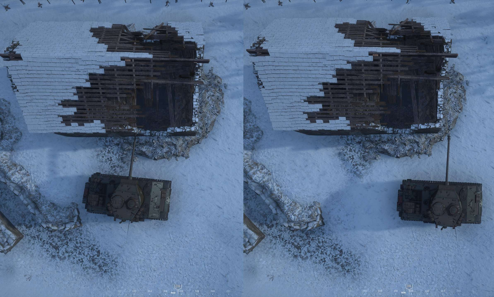 
Figure 19: "‘Jumbo’ 76mm Kiting"

*Note: kiting is best done by driving forwards out of the cover instead of reversing out of the cover. This is because you can control the speed at which you peek, which is important, and reversing is usually enough to get you into cover before you get shot a 2nd time. Additionally, many tanks’ barrels are closer to the front of the tank than to the rear, allowing for a quicker sight picture acquisition.*

Last but not least, kiting is a strategy that is most efficiently utilized by a 3 person crew. All 3 players need to communicate and work together to do this, and it requires a bit of practice. The first step is that the tank commander needs to call for a kite and the driver and gunner need to set up in the kiting position behind cover. Once everyone is ready, the driver rolls out of the cover in 1st gear and waits for the spotter and gunner to tell them when the barrel has cleared the cover and they can see any targets. When the "stop" call is communicated, the driver must immediately downshift to park to stop the tank and then downshift again to reverse, but keep the tank stationary, in order to be ready to immediately back up into cover. If the tank takes damage, either through an engagement with an enemy tank or through some surprise source that the spotter cannot locate, the spotter or gunner must communicate to the driver if they should reverse into cover or stay to finish the engagement (if, for example, the gunner landed the first shot on a Tiger as a "Jumbo" 76, then the spotter or gunner could make the call to stay and finish the Tiger off since it is likely you will shoot and land the 2nd shot). When the call is made to reverse into cover, the driver should be in a position to simply hold the "w" key and reverse straight back into cover, at which point said driver gets out of the tank and uses their repair tool to fix the tank up. Note: if you are kiting from a safe position without risk of getting shot randomly, it is always beneficial for *all* members of the tank to get out and repair it. This will allow you to get back into the engagement as fast as possible and may be the difference between winning and losing that engagement.

Below is a showcase of what proper kiting in a competitive (KRT/OC vs TL/TC, 2021 Fall Seasonal) match looks like. *Note: headphone users beware, some of the comms in this clip are very loud!* (Figure 20).

<figure style="max-width: 600px; margin: auto;">
  <video controls style="width: 100%; height: auto;">
    <source src="videos/f20.mkv" type="video/mp4">
    Your browser does not support the video tag.
  </video>
</figure>
Figure 20: "Kiting in a ‘Jumbo’ 76mm"

I chose this example of kiting, even though it is a little sloppy, because it illustrates what to do when taking damage and how to work together with the spotter and gunner to repair the tank and re-peek the angle to get the kill, all within a short couple of minutes. To break this clip down, we start with our tank peeking out of the hedgerow we are using as cover to try to spot enemy tanks when I notice a sudden suppression effect, meaning that we’ve just been shot. We see the 1st shot that damages us coming in, so my spotter hones his vision on that location. Already in reverse gear, I start backing the tank up into the cover of the hedgerow. When the 2nd shot comes in, my spotter takes a mental note of where the Tiger is with respect to us so that when we repair and re-peek he can quickly reacquire the target. We then park safely behind the hedges and all get out to repair the tank quickly, while I tell my other tank crews the location of this tank. When we are done repairing we set out to slowly peek the angle, trying not to peek farther than we need. I then follow my spotter’s directions to back up right into the perfect spot pick up the Tiger kill.

As you can see, this is not the cleanest execution of kiting using cover, but it is important to note that most real instances of working together with a crew, including kiting, are prone to errors in high pressure situations and what separates the good tankers from the great tankers is reacting and adapting to the situation as it unfolds before you.

---

### **2.7 Stormtrooper Aim (MG's)**

If you’ve never seen a tank’s machine gun firing in Hell Let Loose before, you might think you’re seeing red and green lasers like in Star Wars, and you wouldn’t be far off the mark. Several updates over the years have gone a long way to fix the stability of MG fire (through the nearly complete removal of barrel shake) as well as its hit registration, creating consistently accurate coaxial MG fire that is offset by the same amount from the reticle every time. This means that you have no excuse for missing enemies like a complete Stormtrooper. You should always be trying to kill infantry players with MG if they are exposed as opposed to launching a round, because rounds can be conserved to shell targets who are behind cover.

Suppression is also a decent tactic to use against enemy infantry that isn’t outright exposed in Hell Let Loose as it limits their vision and makes it very hard for them to shoot anything. All tanks in the game have high enough fire rates on their MG’s that shooting at and around an enemy position at a constant rate of fire is a good way to lock down an area and force enemy infantry to deal with you or move around your zone, both of which hinder their potential push into your territory.

That being said, tank MG always shoots a tracer round every fifth bullet and you should be careful when spamming MG for suppressive purposes. Skilled enemy tankers will be able to tell the difference between the way your tank tracer looks and the way your team’s infantry MG tracer looks (the tank tracer is thicker and brighter) and will be able to locate you based on that tracer as well as the unique sound that your MG makes. Even though tanks use the same MG’s as infantry in Hell Let Loose, good tankers will assume the worst case scenario that any MG sound is a tank, so if you do not want to give your position away, not shooting MG (or main gun obviously) is important. Conversely, of course, if you are the one looking for enemy tanks but none have been marked out to you, listening for enemy tank MG is the best way to get an approximate bearing on potential locations of enemy tanks relative to your current position.

---

### **2.8 A Note on HE**

HE can be utilized to penetrate certain vehicles in specific spots. This is determined, like most tank-related interactions are determined in Update 12, by each tank’s class (with the only exception being the Panzer II). Only light tanks and recon vehicles’ hulls are penetrable using HE shells, and below is a table detailing what is possible with HE:

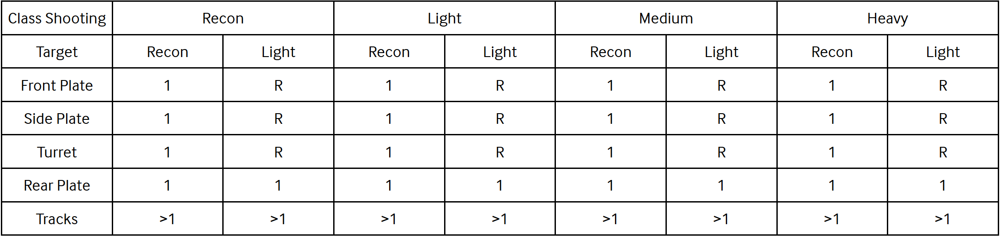 
*R - Ricochet or non-penetrating hit*

So what can we learn from this data? Well, if you are in a tank out in the field and you see a recon vehicle, you can destroy it with HE rather than AP, allowing you to save that AP shell for enemy tanks. This is especially useful on heavy tanks like the "Jumbo" 76mm, because you get many more HE shells than you do AP shells, so your AP shells should be used to fight the enemy tanks that require them. If you happen to have HE in your barrel and you see a recon vehicle, you can shoot it without having to dump the HE shell to load AP. Additionally, HE can be used by *any* tank to disable the tracks of any other tank instead of AP, as mentioned previously. They both do the same amount of damage to the tracks, so if you want to kill the tracks of a tank but want to conserve AP, load HE instead.

As it relates to trucks and halftracks, HE deals damage to them as well. All tanks (including recon vehicles and light tanks) destroy all trucks and halftracks with 1 HE round anywhere in the body, engine, tracks, wheels, you name it.

---

### **2.9 Solo, Duo, or Trio?**

To duo or not to duo, that is the question. Update 10 has changed the mechanics of tanking by increasing the time it takes to switch seats as well as get into a tank. Now, it depends on the class of your tank (4 seconds for light tanks and recon vehicles, 5 seconds for mediums, 6 seconds for heavies, and half of those values to get in and out of the tanks). Because of this change, the previous meta of only needing 2 players per tank is not viable any longer except in niche cases. The switch seat time, especially in a heavy, is way too long to be able to react to threats or perform well in a tank. For this reason, solo tanks are completely dead (there is no scenario where you aren’t wasting fuel and manpower by taking a solo tank) while duo tanks are very situational. Even if you know that you will be sitting in a static spot for a very long time and you have friendly infantry support, you still can’t really get away with a duo. This is because in Update 12, taking a static position is how you get a precision strike to land right on top of you, and since you are a duo, you most likely aren’t going to be in a position to dodge it. In most situations, you need to be able to immediately turn or react to enemy AT or tank engagements, and you simply cannot do that while in a duo tank. When you’re clinching those cheeks, every second counts, so trios are the only way to go.

---

### **2.10 The Achilles Heel**

With the addition of the engine compartment to the game in Update 10, a new opportunity to disable the engines of tanks has been discovered. Using the better track hitboxes introduced in the update, you can now shoot through gaps in the tracks and damage the engine on every tank without having to see its rear.

Here’s how the shot works: at any angle ranging from directly perpendicular to the side to directly perpendicular to the rear, medium and heavy tanks can shoot the tracks in specific spots—outlined further in this section—to damage both the module they are hitting (track module if hitting tracks or hull if hitting between the tracks) *and* engine at the same time (Figure 21). If you try this shot even 1 degree more towards the front of the tank than the rear of the tank (i.e. 1 degree outside of the angles outlined in Figure 21), you will not be able to penetrate the engine block, even if you shoot the exact same areas. Evidently the developers have implemented this as a way to prevent engine damage bugs from the front.

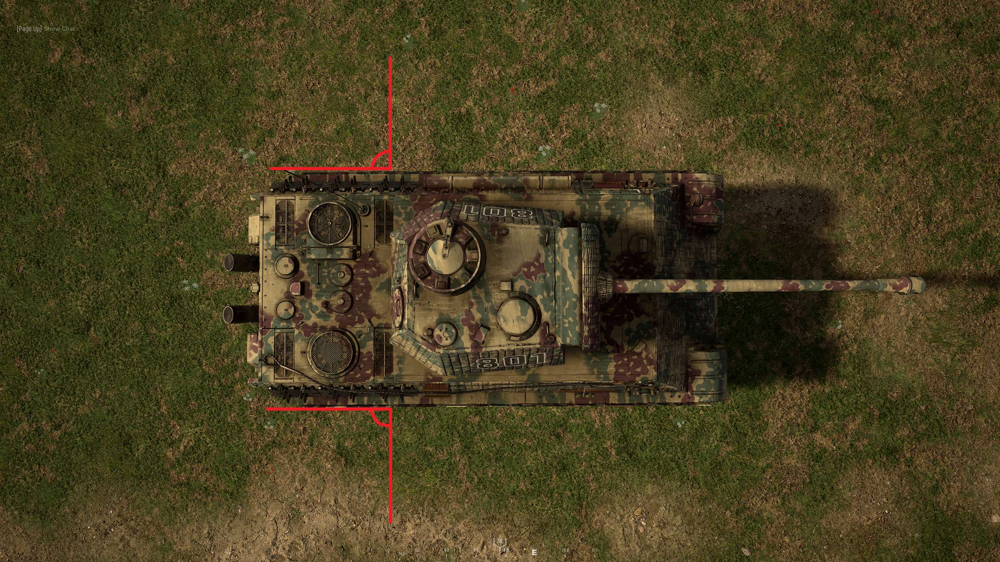 
Figure 21: "Angles for the Achilles Heel"

This means that care must be taken when trying to aim for this particular shot to be at the correct angle. There isn’t a good way to know if you are actually damaging the engine of the tank or not (other than its inability to move), especially from far away, so making extra sure that you are at a favorable angle is critical. If you *do* manage to hit the engine through the tracks, however, you may be able to get something unique—engine damage and track damage, but no hull damage (Figure 22).

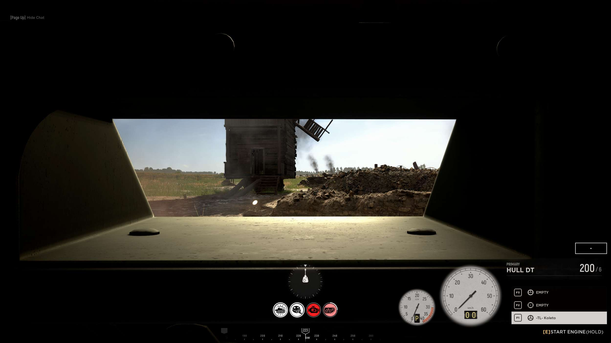 
Figure 22: "Achilles Heel from Victim’s Perspective"

Update 10 has seen tank hitboxes completely redrawn from the ground up, and this includes tracks. Many tanks now have empty space between the cogs and wheels in their tracks which can be utilized to make this shot even better. As we will see below, if your tank has a gun that can penetrate the side of the enemy tank you are shooting at, and you are able to hit between the tracks, you can bypass the tracks and penetrate both the armor *and* the engine at the same time, just like you would by hitting the rear of the tank dead on. Because this "sweet spot" is different for every tank, I have gone ahead and marked the exact points to aim on all mediums and heavies in the game (Figure 23).

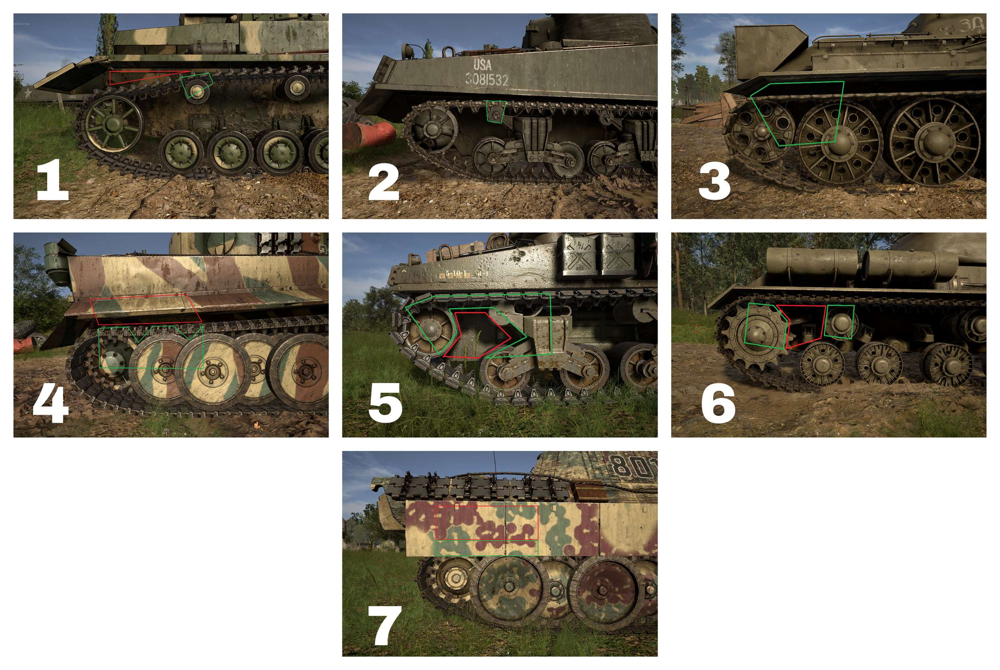 
Figure 23: "Achilles Heel Breakdown"

**Green** - Deals track and engine damage

**Red** - Deals hull and engine damage

1. Panzer IV
2. Sherman medium
3. T-34/76
4. Tiger
5. Sherman "Jumbo" 75mm and 76mm
6. IS-1
7. Panther

*\*See Figure 22 for the correct angles.*

*\*\*This shot can only be performed using AP ammunition.*

*\*\*\*See individual AT and tank sections for what can pierce side armor.*

As you can see, every tank is a little different, but there are a few general rules of thumb: (1) aim for the top corner of the last cog if you want to penetrate tracks and engine (except on the Panzer IV and Sherman medium), and (2) aim for between the first and second cog to hit the side plate and the engine (again, except for the Panzer IV and Sherman medium).

The Tiger and Panther are a little different from the rest, because they do not have gaps in their tracks but rather overlapping track wheels. The Panzer IV, the Panther and the Tiger also have a very large space above the tracks and below the side armor (which is covered up with a side skirt on the Tiger and Panther), making this shot a lot easier to land on German tanks. If you want to hit the "sweet spot" to damage the hull of a German tank, simply aim at the side skirt above the track but below the side.

The engine compartment is actually a hitbox located somewhere inside the rear of the tank chassis. As a result, this shot can be very finicky depending on the angle. If you are nearly perpendicular with respect to the side plate, the diagrams above provide a very accurate representation of what it looks like to hit the engine compartment. When you introduce a more significant angle, however, you can run into problems where the shell misses the engine compartment even though you technically hit the correct area on the track or between the track. If you are at a significant angle with respect to the Achilles Heel shot, you should consider adjusting a bit and hitting the rear instead.

In Update 10, every single tank, including recon vehicles and light tanks, as well as all forms of AT, from rifles to guns to rockets, were able to penetrate the green sections in Figure 23 and do engine damage. This is no longer the case in Update 12. Now, only tanks and AT guns/rockets that have enough penetrating power to deal damage to the side can take advantage of this shot. This means that AT guns, medium and heavy tanks, and the "Panzerschreck" are the only things that can utilize the Achilles Heel.

So what is the purpose of a shot like this? When would you actually use it in a real game? There are 3 scenarios where this might be useful:

1. German AT rocketeers can take advantage of the Achilles Heel to perform better flanks on larger tanks. The reasoning behind this is that AT players can now be dangerous in a much wider area of operation since they can completely immobilize a tank by killing its engine without ever needing to see the rear of that tank, and do so from a relatively safer position. After the enemy tank is immobilized it becomes a sitting duck, allowing your teammate tankers and AT personnel to finish it off.
2. Medium tanks who find themselves at the correct angle to hit this shot on an enemy tank can immobilize that tank in one shot, thereby securing the kill. This is especially useful against heavies such as the Sherman "Jumbo" 76mm, who can turn fast enough to deny a second shot (and ensure your swift death) if the crews manning them are skilled. It isn’t uncommon in an average game for conditions to be just right for the Achilles Heel, especially in a medium tank, so ensuring you capitalize on your advantage by taking out the engine instead of just hitting the side armor is crucial.
3. Heavy tanks, especially the "Jumbo" 76mm, who find themselves at the correct angle to hit this shot on an enemy heavy tank can immobilize that tank in one shot, thereby securing the kill without taking any damage in the process. Stopping to repair can have consequences for any tank, especially if you are flanking, so not taking damage and securing the kill is the best possible scenario.

There is no doubt this shot is situational, and players may opt to ignore it entirely in favor of less difficult shots, but the knowledge and execution of it is one thing that differentiates good tank crews from the best tank crews.

## **3 Anti-tank Shenanigans**

Ever stopped to wonder why you spent a full minute making sure there was absolutely no one behind you and as soon as you looked away you got shot? Or why as soon as the map switches to Hill 400 your team goes from 5 full tank squads to 1 solo? Why are enemy infantry more OP than enemy tanks for crying out loud? This phenomenon is what experienced tankers like to call "getting AT’d in the ass" and is how most novice tankers meet their ends on the battlefield. To fix that, I have compiled a complete section on everything you need to know about all forms of AT—rockets, guns, bombs, precision strikes, mines, satchels, shells, and rifles—to help you understand what can happen in the field and how to react to it.

Let’s start with the AT rockets and rifle first. Below are the individual damage values of each team’s AT rockets and rifle against enemy tanks. Knowing the damage values of each of these off the top of your head will allow you to get a better idea of when you are safe as a tank and when you are in imminent danger.

---

#### **3.1 The American "Bazooka"**

The "Bazooka" is a decent anti-tank weapon that can do the job if the AT player wielding it knows what they are doing. In the current iteration of the game a lot of tank engagements are standardized based on class as we will see below in the tank section and the "Bazooka" is no exception. The "Bazooka" has exactly the same firepower as an M5 Stuart light tank. Below are the hits to kill all German tanks in each location:

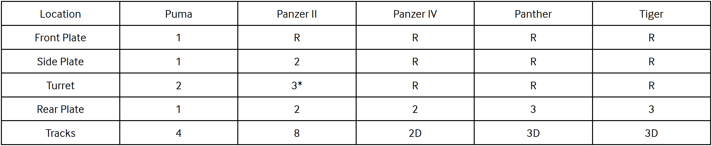 

*R - Ricochet or non-penetrating hit*

*#D - # shots to disable module (no hull damage), after which becomes non-penetrating hit*

*#\* - # shots can only be achieved under specific circumstances or in special areas*

Notes:

* For the Puma, aim at the dead center of the body. The Puma contains many small surfaces that are not able to be penetrated by anything and you need to avoid those. For more information on where they are, see [section 4.5.3](#453-the-puma).
* For the Panzer II, the front plate and turret mantle (which obscures the entire turret when looking at it from the front) are impenetrable. The turret mantle can be used to ricochet shots into the top of the chassis for a 2 shot kill from the front, but it is a difficult shot to land especially from distance (see the [section on the M5 Stuart](#421-the-m5-stuart-light-tank) for more). In normal everyday situations, however, you will have to aim for the side or rear of the tank. If aiming for the rear, there are some non-penetrating areas that you have to keep in mind that are outlined in [section 4.5.4](#454-the-panzer-ii).
* The Panzer IV, Panther, and Tiger can only be killed from the rear. There are some areas of each of these tanks which the "Bazooka" cannot penetrate (see [section 4.5](#45-achieving-maximum-penetration)).
* To damage the engine of a Panzer IV, care must be taken to aim at the section of the rear with the cylindrical canister. Anywhere else will only deal hull damage (Figure 26).

As the data above clearly shows, the "Bazooka" is effective at dealing with German recon vehicles and light tanks, but medium and heavy tank hulls can only be penetrated from the rear. Shooting the tracks of the Panzer IV or the Panther/Tiger will only result in disabling those tracks without doing any actual hull damage. That being said, here are some things good AT players can do to give you a bad day:

* American AT can disable your tank faster than you might think. If hit in the rear, the engine of the Panzer II is disabled in 1 shot and the engines of the Tiger and Panther are disabled in 2 shots, while the Panzer IV is killed outright in 2 but the engine is not disabled with the first shot. This means that although the Panzer II, Panther, and Tiger actually take 2, 3, and 3 "Bazooka" rockets to the rear to kill respectively, effectively once their engines are destroyed they are dead. Perhaps there is a small chance you can get out and kill the AT hounding you, but you would then have to repair the tank to 100% engine to be operational again.

Currently, the only AT loadout that includes the "Bazooka" gives that player 2 rockets. This means that like the "Panzerschreck", you can choose to ignore American AT players if they miss their first shot in a medium or heavy, because they cannot kill you or destroy your engine. In fact, if an AT player has shot all of their rockets, it’s better not to kill that AT player so that they do not have a chance to respawn with more ammunition. As a whole, only the back plate is a viable option for dealing substantial damage to German medium and heavy tanks with a "Bazooka". This fact allows German tanks to be a bit more lenient with their positioning as well as their infantry support. For more on dealing with AT rocketeers, see [section 3.8](#38-how-to-die-less-to-anti-tank-infantry).

---

#### **3.2 The German "Panzerschreck"**

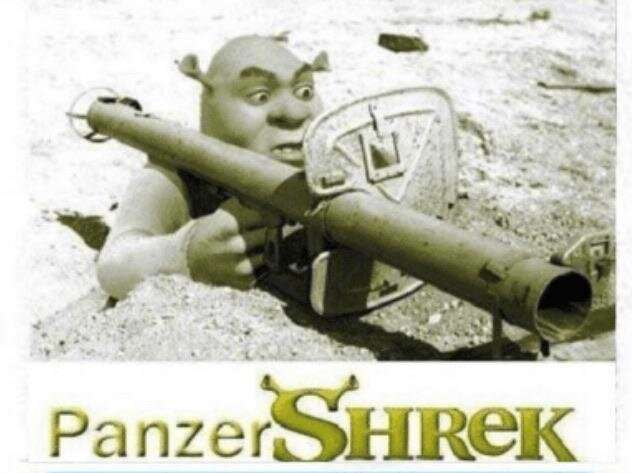 
Figure 24: "German Anti-tank Soldier (circa 1944, colorized)"

This bad boy packs a significantly stronger punch than its American counterpart. After extensive testing, the "Panzerschreck" seems to most closely resemble a slightly weaker version of the Panzer IV’s main gun in that it can penetrate most of the same areas but does less damage to those areas.

Below are the damage values for the "Panzerschreck" against all American tanks:

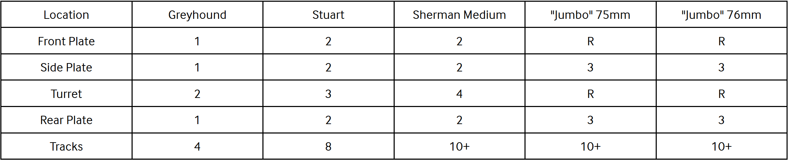 
*R - Ricochet or non-penetrating hit*

Notes:

* For the Greyhound, anywhere in the body will do. Try not to hit the turret or wheels as it will take longer.
* For the Stuart, the front, side, or rear plates are the place to go for. The turret will absorb more rockets than you have ammunition for in one life, so therefore is sub-optimal. The tops of the skirts that stick out over the tracks on the front of the tank are impenetrable. To see an illustration of this, go to [section 4.5.1](https://web.archive.org/web/20250409072049/https%3A//theline.gg/tankbible#4.5.1).
* The Sherman medium can be penetrated and blown up *anywhere* in the front, side, or rear plates in 2 hits if you hit perpendicular to the plate. These shots each do 50% hull, so 2 add up to exactly 100%. The turret mantle on the front of the turret will not penetrate, but you can penetrate the turret anywhere else besides the mantle for a 4 shot kill.
* "Jumbo" 75mm and 76mm can be penetrated in the side and rear of the tank for a 3 shot kill. These do 45% hull damage, so 2 of them do 90% hull and 3 kill. Take care to avoid all of the fuel canisters, boxes, and other junk strapped to the back of the tank if aiming for rear because these will not penetrate. Aim below them.
* Testing on tanks that took more than 10 rockets to the tracks was not pursued.

That’s all fine and dandy, but what about the Soviet forces? How does the "Panzerschreck" fare against their tanks? Here are the stats:

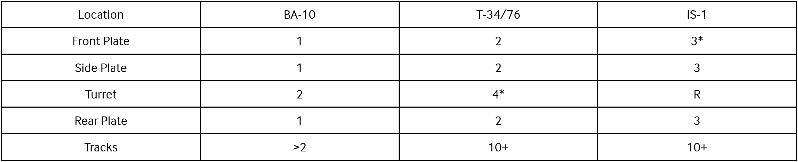 
*R - Ricochet or non-penetrating hit*

*#\* - # shots can only be achieved under specific circumstances or in special areas*

Notes:

* Hopefully you have started to notice the pattern here in Update 12—the different classes of tanks have largely the same armor with only minor differences, and the American tanks perform very similarly to Soviet tanks against German AT.
* For the BA-10, aim at the dead center of the body.
* The T-34/76 can be penetrated anywhere in the front plate for a 2 shot kill if you hit perpendicular to the plate. These shots each do 50% hull, so 2 add up to exactly 100%. Hitting the turret mantle will ricochet, and aiming for the turret is a bad idea anyways since even when you can penetrate in the side or the rear of it, the best case scenario is a 4 shot kill. Shooting the side and rear plate are also 2 shot kills, but the first shot to the rear will not disable the engine. If shooting the front, make sure you do not shoot the circular mg port as this will ricochet.
* The IS-1 can actually be penetrated in the front the same way the Panzer IV can penetrate the IS-1 in the front (Figure 25), in the two slanted portions of the front armor that connect to the side armor (to see the detailed breakdown of this exact shot, see the section on the [Panzer IV](#432-the-panzerkampfwagen-iv). In addition, the IS-1 can be penetrated in the side and rear of the tank in 3 shots. These do 45% hull damage, so 2 of them do 90% hull and 3 kill. If aiming for the rear, make sure that you are not shooting the cylinders left and right of the back plate—these will not penetrate.
* For more information on the impenetrable areas of Soviet tanks, see [section 4.5.8](#458-the-t-3476) and [section 4.5.9](#459-the-is-1).
* Testing on tanks that took more than 10 rockets to the tracks was not pursued.

<figure style="max-width: 600px; margin: auto;">
  <video controls style="width: 100%; height: auto;">
    <source src="videos/f25.mkv" type="video/mp4">
    Your browser does not support the video tag.
  </video>
</figure>
Figure 25: "The ‘Panzerschreck’ Penetrating IS-1 Front Armor"

The "Panzerschreck" is a more serious threat than the "Bazooka" to American tanks and to Soviet tanks but especially their mediums. This is because the "Panzerschreck" can penetrate every part of the mediums including the front plate—in other words, all a German AT player has to do is peek out of cover and shoot a rocket at the dead center of the medium’s front plate to do significant damage to it. Even if you are ready for him and kill him immediately as he peeks, a lot of times the AT player can still get a shot off. As for the "Jumbo" variants of the Sherman and the IS-1 heavy tanks, they fare similarly against German AT rockets, with one notable exception. The front plate of the "Jumbo" Shermans is impervious to damage, while the front plate of the IS-1 *can* be hit but requires some amount of expertise to land. The sides of allied heavy tanks are a 3 shot kill (the same as the rear plate). This effectively means that both sides and your back plate are vulnerable spots that you need to have protected by cover or by infantry support thereby forcing you to take more conservative positioning than in the German tanks.

The following is a list of strategies that skilled German AT players can employ to disable and destroy your tank in the field:

* As outlined above, the "Panzerschreck'' can penetrate both the red *and* green sections of the [Achilles Heel](#210-the-achilles-heel) weak spot on Soviet and American medium and heavy tanks. This means that the engine compartments of all of these tanks can be destroyed from the *side* of the tank, and the "Panzerschreck" in particular is powerful enough to (if aimed between the tracks of Shermans or the IS-1) do hull and engine damage from the side as well, leaving you dead in 2 shots in American and Soviet mediums and with your engine disabled in 2 shots (and therefore helpless) in heavies.
* All tanks mentioned above can also be shot right down the barrel by the "Panzerschreck" (though this is now a much harder shot to hit in Update 12 since you have to be looking straight down the barrel to land it), disabling the turret and subsequently your coaxial MG.
* German AT can disable your tank faster than you might think. If hit in the rear, the engine of the Stuart is disabled in 1 shot and the engines of the "Jumbo"s and IS-1 are disabled in 2 shots, while the Sherman medium and T-34/76 are killed outright in 2 but their engines are not disabled with the first shot. This means that although the Stuart, "Jumbo"s, and IS-1 actually take 2, 3, and 3 "Panzerschreck" rounds to the rear to kill respectively, effectively once your engine is destroyed you are dead. Perhaps there is a small chance you can get out and kill the AT hounding you, but you would then have to repair the tank to 100% engine to be operational again.
* Because of the ability of the "Panzerschreck" to penetrate the front and sides of most tanks it comes up against, good Panzerschreck players will not risk getting all the way behind you for a flank, opting instead to engage you head on and die to get more ammunition. This is problematic because it is undoubtedly more difficult to surround yourself on *all* sides with friendly infantry support as opposed to just the rear, for example.

The good news is that currently, the only loadout that is equipped with the "Panzerschreck" carries only 2 rockets. This means that if for some reason one rocket misses, you can breathe a sigh of relief knowing that (assuming you are not in a Greyhound) you are no longer in immediate danger of exploding unless there are multiple AT players near you. It’s useful to keep a mental note of which AT players around you have how many rockets left for this reason. For more on how to deal with annoying AT players, see [section 3.8.](#38-how-to-die-less-to-anti-tank-infantry)

---

### **3.3 The Soviet PTRS-41**

The PTRS-41 is a unique anti-tank weapon in Hell Let Loose because it is the only anti-tank rifle in the game. In fact, the Soviet forces do not currently get any type of rocket launcher—instead, they get this rifle. The PTRS itself is a semi-automatic anti-materiel rifle that shoots armor piercing rounds and can penetrate tanks in certain locations. It makes a very distinct and very audible sound on the battlefield which, after a bit of practice, will easily be noticeable from almost any location on the map. It has no damage drop off at range either, and despite having no optic can be fired accurately by a skilled shooter at over 400m.

But how does it do against German armor? The following table shows its effectiveness in the field:

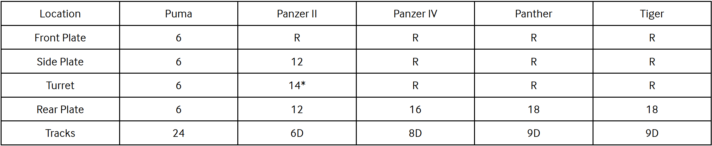 
*R - Ricochet or non-penetrating hit*

*#D - # shots to disable module (no hull damage), after which becomes non-penetrating hit*

*#\* - # shots can only be achieved under specific circumstances or in special areas*

Notes:

* For the Puma, aim in the center of the the body. The Puma contains many small surfaces that are not able to be penetrated by anything and you need to avoid those. For more information on where those are, see see [section 4.5.3](#453-the-puma).
* For the Panzer II, hitting the front plate or turret mantle (which obscures almost the entire turret from the front) will not penetrate. You can penetrate the side and rear for hull damage, and this is usually the best course of action. If hitting the rear, the PTRS kills its engine in 4 shots, allowing you to finish the job from there. You can also kill the Panzer II in only 6 shots by utilizing the fact that the turret mantle ricochets—simply aim for the lower half of the turret mantle and the round will bounce into the top of the chassis and penetrate the tank. If you shoot the turret from its side or rear instead, it will take 14 shots to kill. If aiming for the rear, there are some non-penetrating areas that you have to keep in mind that are outlined in [section 4.5.4](#454-the-panzer-ii).
* The Panzer IV, Panther, and Tiger can only be hit from the rear and the tracks. The tanks cannot be killed through the tracks either, only disabled, so if you want to kill these tanks you need to find a good place to hunker down and unload magazine after magazine into their rears. The Panzer IV takes 5 shots to kill the engine, and the Tiger takes 6. If they turn around before then, you are out of luck, but if you manage to kill the engine, you can basically keep unloading until you blow it up. There are also some areas of each of these tanks which the PTRS cannot penetrate (see [section 4.5](#45-achieving-maximum-penetration)).
* To damage the engine of a Panzer IV, care must be taken to aim at the section of the rear with the cylindrical canister. Anywhere else will only deal hull damage (Figure 26).
* The PTRS can kill a truck in 5 shots to the engine, 6 shots to the rest of the body, and curiously, only 3 shots to the wheels.
* Halftracks take 6 shots anywhere in the body to kill, just don’t hit the tracks or wheels as it will take longer.

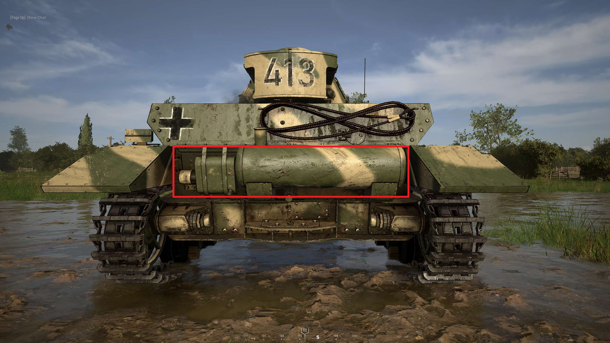
Figure 26: "Where to Penetrate Engine on a Panzer IV"

The Soviet loadout that fields the PTRS carries 8 enbloc clips of 5 rounds each for a total of 40 rounds. Since the Panther and Tiger can be killed in the rear in 18 rounds, one Soviet AT player can in theory carry enough ammunition to kill 2 Panthers or Tigers and still have 4 rounds left (the equivalent of 6 "Bazooka" rockets!). This fact, coupled with the high semi-automatic fire rate, allows PTRS players to disable and even destroy German tanks relatively quickly despite the large amount of shots required to do so. Unlike the AT rockets of other teams, the PTRS’ main bottleneck is not ammunition or reload speed (although you do need to reload every 5 rounds), but rather mobility. Soviet AT players need to go prone and deploy the bipod of the PTRS on a surface in order to even fire the gun, meaning they can’t just point and shoot while on the move like the AT rocket launchers of other teams.

In Update 12, the PTRS *cannot* take advantage of the Achilles Heel.

---

### **3.4 Anti-tank Guns**

For the second update in a row, the developers have seen fit to change AT guns and now nobody in public matches knows how they work (again). Luckily for you, dear reader, I am here to clear up any confusion. AT guns can still penetrate any vehicle in the game, including heavies, pretty much anywhere, but they deal a lot less damage than in Update 12 than they previously did. All AT guns of all factions deal the same damage to the same tiers of tanks, so the following table contains all the statistics you need to know as a tanker about their damage values:

*Note: All AT guns kill all trucks and halftracks in 1 shot to the body or engine.*

*Note 2: Even areas that would normally ricochet a heavy tank’s round, such as the bottom of the "Jumbo"s’ front plate, can still be penetrated without a problem by AT guns. It is not a joke to say that you really can aim almost anywhere with these things.*

Though AT guns lack the raw firepower of a heavy tank’s main cannon, they have some perks when compared to their heavy tank counterparts. First off, they are cheap, costing only 50 supplies. This means that an AT player with the loadout to build an AT gun and a support player is all you need to build one of these things, even in enemy territory. Update 12 has significantly increased the time it takes to build AT guns, but because enemy tanks cannot see their blueprints while they are being built, it can be hard to spot an AT gun going up until it has completed construction. On top of that, a loader allows the guns to fire *faster* than medium and even light tanks (an approximate reload speed of 4 seconds). Additionally, since they are located on the ground and have legs that extend into the dirt for recoil support, AT guns do not move horizontally or vertically between shots. If you have set up the gun and have aimed it at a particular spot of an enemy tank and you hit that spot, you don’t have to readjust the gun even after you fire it, switch seats to load a shell, and come back (this is not true for tanks). On top of all that, AT guns seem to shoot straighter than their medium tank counterparts with less shell drop, making aiming at targets easier.

With so many pros, what are the cons? Well, AT guns can be killed in 1 shot by any tank’s cannon with *both* AP and HE rounds. They also rotate slower than tanks do, even when both the gunner and loader are turning. They are immobile, so once they are found by an enemy tank they are pretty much dead, and the players themselves are not invulnerable while manning the gun from small arms fire. With Update 12, they deal significantly less damage to all tanks which means that against decent tankers AT guns really don’t stand a very good chance of killing medium or heavy tanks on their own. They can still be very annoying if they are coordinating with one of their friendly heavy tanks to double team tanks, since it only takes 1 AT gun shot and 1 heavy AP shell to kill an enemy heavy, and they can fire at the same time. By and large, however, in public matches this level of coordination is rare and you should have little trouble dispatching enemy AT guns on their own.

Though Update 12 has markedly reduced the damage that AT guns deal, they are still able to penetrate basically any surface of any tank in the game, including the front plate of heavy tanks. This means that you still have to pay attention to random AT guns popping up in addition to the regular threats such as enemy tanks, enemy AT rocketeers, satchel players, mines, artillery, and bombing runs. That being said, in the vast majority of games that are not competitive matches, teams will not even bother putting up AT guns anymore because it takes too long to kill a medium or heavy, and they usually end up getting blown up before they can land the killing blow even if they have the element of surprise. If you are still having trouble dealing with AT guns, you should play conservatively—always play near cover, [kite](#265-kiting), and play further back from the action where you can spend time finding and neutralizing AT guns should they pop up in the field. This strategy’s strengths lie in the fact that you can stay alive for longer—surprise AT guns are less likely to result in your death because of the cover near you, and you can control the angles you see (and therefore what angles the AT guns can see) in order to sweep the map safely. The added bonus to this strategy is the fact that you can also use it to deal with enemy tanks while being in the relatively more safe position of near your team and behind cover.

As for the mechanics of dealing with AT guns, they are small in size and can be hidden rather cleverly, so you are chiefly going to be relying on your spotter to spot enemy AT guns as they are built or as they try to shoot at you. Your friendly infantry on the ground can also be utilized to spot and mark enemy AT gun emplacements for you. A good way to identify an AT gun when you’re being shot by it is to notice the firing speed. With a loader and a gunner, the AT gun can fire much faster than any other tanks you might be facing in the field. If you are consistently taking shots quickly then there’s a good chance it’s an AT gun. If you’re having problems with an AT gun and you can’t hit it because it’s cleverly hidden, you can mark it and ask your artillery to send a few shells its way and that will make quick work of it.

---

### **3.5 Mine, All Mine!**

Ah, mines. The erstwhile bane of every tanker’s existence, turned into a useless toy that nobody uses. All mines in the game from all factions act exactly the same way and deal the exact same damage to all tanks based on their class. Here is the breakdown:

There are two ways mines can interact with tanks. If a tank runs over a mine with its track only, it will blow up and deal damage to just the track. If the tank runs over the mine with its body (or chassis), the mine will still explode, and deal much more damage. Mines in Update 12 do not deal proximity damage, so tankers can breathe easy knowing that they cannot get hurt by a mine even if it is placed right under or next to them and blown up with a grenade. Only if the tank itself moves can it get damaged by mines.

Additionally, medium and heavy tanks do not die with 1 mine anymore, instead requiring 2 or more. This makes dealing with mines relatively simpler, because you can stop the tank and repair it before continuing. Despite this, tankers should be aware that enemy infantry can still place two mines one right next to the other to kill you instantly, but that should also make them more visible. Mines cannot be shot with any small arms fire either, including tank MG’s, so if you want to blow up a mine in your way you must shoot the main cannon at it.

Below are pictures of each team’s AT mines for reference:

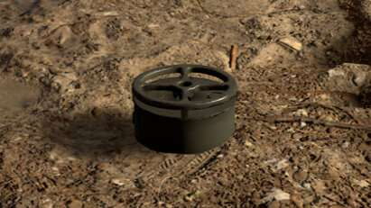

Figure 27: "Tuna Can with a Steering Wheel on Top"

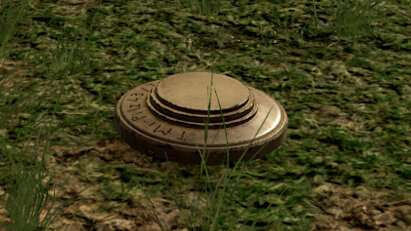

Figure 28: "Pancake"

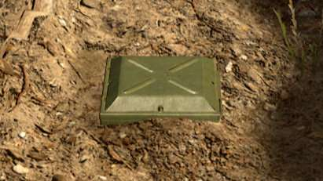

Figure 29: "School Lunchbox"

The American mine looks like a can of tuna with a steering wheel on top of it (Figure 27), the German mine is known as the "pancake" mine (Figure 28), and the Soviet mine looks like my old lunchbox from grade school (Figure 29). As you can tell from the pictures, the American mine sticks out of the ground more and is a dark color, meaning that it is easier to spot for the most part than the German or Soviet ones, especially in muddy environments. Sometimes mines can be exceedingly hard to spot especially while thinking about other things, so tank crews have to be extra vigilant (Figure 30).

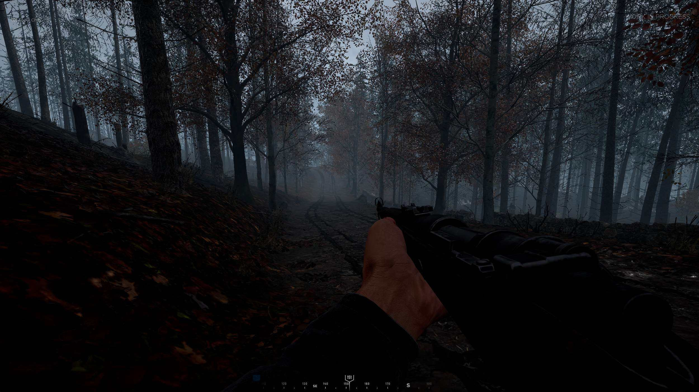

Figure 30: "Try to Find the Mine"

There are several ways to protect against death by mine. The first is simple: avoid roads. Most sensible engineers or AT players drop their mines on a road because that is what is likely going to attract the most traffic as well as what will create the highest likelihood of hiding mines (especially double mine placements) because of the muddy environment. If you avoid roads as a tank it may take longer to get to the objective, but dying to a mine will make you take a *lot* more time to get to the objective. If you’re not going to be avoiding roads (for instance if you’re playing on a forested map or Carentan) then you have to be on the lookout for mines. Go slow if you have to, but unless you are engaging something both the driver and gunner should both be looking at the road for mines. Once you get good at it, you should be able to spot most of them. Make sure you immediately tell your driver (who should always be ready to stop at once) and make sure there are no friendly infantry nearby when you destroy it (it has a huge blast radius). Lastly, you can also have infantry support push up and sweep for mines on the roads themselves so that you can focus on more important things. This last option is rare and typically is only performed by dedicated tank support squads, but it is an option nonetheless.

---

### **3.6 Satchels**

Satchels are arguably one of the strongest anti-tank weapons at the disposal of regular infantry in Hell Let Loose. Satchels can be placed anywhere on the tracks, body or turret of any tank in the game and, if they explode, kill that tank with 1 blast. Satchels are powerful enough to kill medium and heavy tanks without even needing to be placed on the tank itself through proximity damage.

Proximity damage to tanks from satchels starts from as far as about 25m and increases linearly as the satchel gets closer to the tank. For every tank, proximity damage is calculated the same way—the turret is damaged the most, then the hull, and then the tracks. This makes even proximity satchels that are too far away to outright kill you dangerous, because tankers will have to repair 3 separate modules in a tank, making the process take significantly longer.

Unlike Update 10, the satchels in Update 12 have been standardized such that all satchels deal the same amount of damage to all factions’ tanks, now depending only on the tier of the tank. As a result, the following table is a generalization of the **maximum distance** (in meters) at which **satchels placed on the ground will destroy full-health tanks in 1 blow**:

As the above data shows, it is possible to kill medium and heavy tanks with a satchel placed on the floor 12m in front of the tank or 4m from the side, and this effect **goes through walls and corners of buildings**. In other words, urban maps such as Carentan, Stalingrad, and Sainte-Mere-Eglise are much more dangerous to tanks than they already were because enterprising AT players can satchel you from places you cannot see (such as the inside wall of a building you are next to) with no counterplay available to the tankers. Additionally, AT players that are having a hard time placing a satchel on your tank as you are spinning to try to kill them may opt to put the satchel on the floor instead, which is much harder to see (you could kill the AT player, get out, see no satchel on the tank, get back in, and still blow up).

---

### **3.7 Precision Strikes, Bombing Runs, Katyusha Strikes, Artillery and You**

Bombing runs and artillery shells in Hell Let Loose have gone through many iterations during the development of the game, at times being utterly devastating to tanks and at others being laughably ineffective. In Update 12, they lean more towards the latter. Both German and American bombing runs have been changed in Update 12 (yet again) to now only *damage* a tank, even on direct hits. Each individual bomb of the run deals proximity **track damage** to tanks, and no one bomb can deal enough damage to kill the tank. Instead, each bomb that lands around or on top of a tank deals a certain amount track of damage that, when added up, may end up dealing hull damage. Even in the worst case scenario where the tank is positioned just right to catch damage from 4 different bombs in the zipper, the bombs still do not deal enough damage to kill a full health medium or heavy based on our testing. This means that only already damaged mediums or heavies can get killed by a bombing run.

Here is my artist interpretation of what a bombing run actually looks like, for reference (Figure 31).

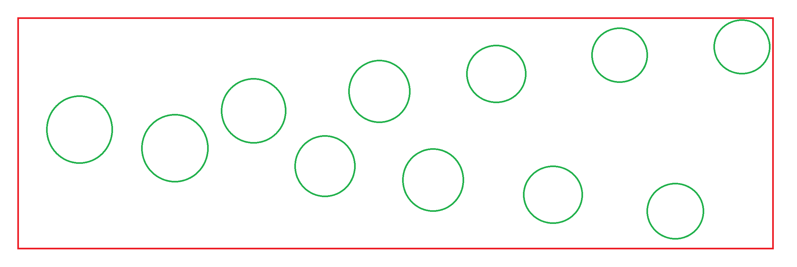
Figure 31: "Crude MS Paint Drawing of a Bombing Run"

As you can see by my amazing MLG MS Paint skillz, the bombs drop in a half-open flared zipper pattern (meaning that the bombs start towards the middle and zipper out towards the edges of the rectangle, shown in the green circles, and the red outline is what the bombing run looks like on the map. The bombs will deal significant track damage and some hull damage, so if you are in a tank and happen to catch a bombing run, you will probably survive, but get ready to repair those tracks.

As for artillery, since its dispersion was increased to 20m (meaning that the shells have a random deviation from the target up to a maximum of 20m in any direction of where the shell was aimed), it is now such a poor tool for damaging tanks that we could not even test how much damage it does to a tank if the shell lands directly on top of said tank—after about 25 minutes of continuous shelling directed at a stationary tank, none of the shells landed on said tank, and we concluded the test (needless to say, artillery deals no proximity damage to tanks). If artillery is anything like previous updates’ damage levels, the shells will only do 66% hull damage to mediums and heavies, so even if they do hit you once in a blue moon, they won’t kill you (light and recon tanks however do get 1 shot by artillery).

What about the Katyusha strike? The Soviet bombing run counterpart is similar to artillery in that it is problematic to test. The rockets land within a large circle seemingly randomly, and we could never get a single rocket to hit a tank directly. All we know for sure is that there is no proximity damage to tanks, like bombing runs and artillery. If a rocket hits you directly, it’s likely you will *not* die, though this has not been confirmed.

Now on to the part that everyone is here for: **Precision Strikes**. The precision strike is a very powerful tool in a commander’s arsenal that every tanker should be afraid of. This is because the precision strike can kill any vehicle or tank of any kind at full health anywhere within its small circular radius. Commanders with half a brain will use this ability whenever they can (luckily, it’s on a 20 minute cooldown and costs 250 munitions) to kill problematic stationary tanks. If you are farming the enemy team in a great position, and their commander catches wind of your success, you best be expectin’ a precision strike. On top of that, the Allied precision strikes give next to no warning, so it’s nearly impossible to get out of the blast radius even if you start moving immediately once you hear the very first noise. There is a silver lining, however—the American and German precision strikes can both be blocked by a tank’s turret itself. The American precision strike consists of two bombs, and the German one consists of only one, but if any of these bombs land *exactly* on the turret of any tank **it will not explode at all**, leaving the tank damaged (with its turret module completely destroyed but no hull damage) and the surrounding objects untouched. To illustrate this mechanic, see Figure 32 below. This means that you may get lucky during a match and actually survive a direct hit, but don’t count on it. Commanders should deliberately offset their precision strikes slightly in order to confirm kills on the tanks.

So how do you counteract something that you cannot hear, cannot see, and instantly kills you? As a tank crew you need to keep track of when the enemy commander has a precision strike available. Start a timer from the start of the game every 20 minutes if you have to, and restart the timer once the enemy commander uses a precision strike so that you know when you are in potential danger and when you can cruise without a care. If you know the enemy commander has a precision strike available and they are ready to use it, make sure you don’t stay in a stationary position for too long and if you can’t, hope and pray that they get the other tank squads on your team or hit you directly in the turret.

<figure style="max-width: 600px; margin: auto;">
  <video controls style="width: 100%; height: auto;">
    <source src="videos/f32.mp4" type="video/mp4">
    Your browser does not support the video tag.
  </video>
</figure>
Figure 32: "Panther Surviving Precision Strike Direct Hit"

So what is the lesson here regarding non-tank related explosives? Barring the precision strike, which is only a nuisance at maximum a few times per full length game, you can ignore them. If you are scared that a bombing run is coming towards you and you want to make sure you will not die, then you can move a few meters out of the direct blast zone and you are completely safe. If artillery comes down near your position you can feel free to let out a chuckle knowing that those idiots are wasting time and munitions on your tank.

---

### **3.8 How to Die Less to Anti-tank Infantry**

With all of the above information having been learned, what tactics can tankers employ to stay clear of enemy anti-tank infantry? The first step is to learn the above statistics by heart. Yes, I mean it. Knowing the exact damage something does to your tank can help you identify what just shot you before you can visually see it. For example, say you’re in a non-German heavy tank (such as the IS-1 or a "Jumbo" Sherman) minding your own business and suddenly you take a little less than 50% hull damage but no engine damage from something. The only thing that deals exactly 45% hull damage but no engine damage to an IS-1 or "Jumbo" in 1 shot is a "Panzerschreck" to the side armor. (a Tiger shot does more than 45%, for example, and a "Panzerschreck" to the rear will also do engine damage). Knowing this as a spotter, you can much more easily find the target by looking at one or both of the sides allowing you to turn the tank accordingly and save your life. Another example of this is if you are in a Panzer IV and you take exactly 50% hull damage and some engine damage, you can be sure that either a "Bazooka" or Stuart is on your rear right at that moment, since those are the things that can do that type of damage to you, and they can’t do that type of damage to you anywhere except the rear plate. Note: the exact specifics of the damage components take for each individual tank is outside of the scope of the Tank Bible, and is something you will have to memorize by playing the game and taking hits.

The general rule of thumb for mediums and heavies is that if you take engine damage, you should turn around 180°because you are being shot either in the [Achilles Heel](#210-the-achilles-heel) or the rear plate, and turning around will prevent the AT player from hitting either of those shots. If you took hull damage but did not take engine damage, then you were either penetrated in the front or side plates (see the sections above on AT rockets to see what AT weapons can penetrate where for which tanks). If you lose more than ⅔ of your hull in 1 shot, and you were not moving, then most likely you were just shot by an enemy tank.

Another tip is not staying in one location for too long. You may be having a great run killing tanks and infantry in a certain spot, but once you piss off enough people you will eventually start drawing a large amount of unwanted attention. This can mean getting pinged by enemy infantry and therefore increasing the chances enemy tanks can see you before you see them, enemy infantry building AT guns with the express purpose of killing you and you only, die-hard AT hunters whose only purpose in life is to shoot you in the ass, or new in Update 12, precision strikes. If you move around every so often you can reduce the likelihood of death related to these threats by a surprising amount.

Probably the most important piece of advice regarding AT is the driver’s observational skills. Obviously it’s the spotter’s job to look around and take note of all the threats in the surrounding area, including the rear, and good spotters make it easy to respond to threats no matter where they are—but sometimes the spotter is looking at something else when AT is coming behind the tank and it becomes the driver’s responsibility to save the lives of the crew. As soon as the driver sees that their tank has taken damage from an AT player, he or she need not wait for a command or spotter confirmation to turn the tank 180°. Since turning the tank (not running away, for example) is the best way to deal with flanking AT rocketeers, the driver should be ready to take quick and aggressive action. Incidentally, this is also why it’s best for drivers to keep their tanks in 1st gear or reverse while stationary, so that they can turn as fast as possible in an emergency—if the driver does not take this action right away, your tank is dead. So how can you know what you are taking damage from as a driver? Here are some tips:

* AT rockets travel much slower than shells of a tank or AT gun, so with enough practice you can learn to hear the time between when the shot was fired and when the shot hits your tank. In addition, AT guns and tanks make a particular sound, more of a loud "BOOM", and AT rockets make more of a "fwooooosh" sound when fired.
* If you are not engaging anything directly in front of you or to the sides, then you can assume the threat is at your rear until your spotter confirms otherwise.
* As mentioned before, specific damage values can be a telltale sign that you are getting shot by an AT rocket as opposed to a tank or that you were shot from a rear angle. This is something you will learn through experience over time. Know your hit to kill values.
* The PTRS specifically does a miniscule amount of damage per bullet but can shoot rather fast and has a distinct sound, so it should be obvious when you are getting pelted by this thing.

Lastly, positioning is a very important skill for everything with regards to tanking but especially surviving the onslaught of enemy AT players. Especially on urban maps and forest maps, you can get surrounded easily because your mobility is severely restricted when compared to that of the enemy infantry. For this reason it is advisable to be near friendly infantry at all times because they will naturally act as a screen for enemy AT rocketeers trying to attack you. Even if the friendly infantry are not a dedicated tank support squad, they will naturally kill any enemy they see (like bots), thus covering your flanks. Check your map frequently to see where your friendly infantry currently is and where they are going, as well as where their outposts are. If they start moving in a direction away from your tank, you need to either move up with them or retreat to a different position, both of which are viable options. This strategy has strong bonuses other than flank protection as well, such as the close proximity of engineers to repair your tank as well as the possibility of repair stations, not to mention the fact that you can clear enemy infantry out easily for a friendly infantry push thereby significantly increasing the chances that you can capture or defend a point. Positioning is half the battle in a tank—bad positioning is responsible for a majority of tank deaths, while good positioning is how games are won.

## **4 Findings That Apply to Individual Tanks**

Below is the meat and potatoes of this body of work: the tank stats. The following measurements were done using AP rounds at a distance of 100-200m. In Update 12, as in previous updates, the distance between the tank that is firing and the target tank has no effect on damage.

Before we get into the individual tank sections, it’s important to note one important thing about Update 12. As I have mentioned before in this guide, tanks have been standardized based on class (barring a few exceptions which are mentioned below). This means that for the most part, heavies kill other heavies in 2 shots anywhere in the body or turret and kill mediums, lights, and recons with 1 shot anywhere in the body as well. Mediums cannot penetrate heavies from the front, typically kill other mediums in 2 shots to the body and can kill lights and recons in 1 shot anywhere in the body. Light tanks and recon vehicles can only penetrate heavies and mediums in the rear, but can penetrate other tanks of the same class in their bodies. This standardization has helped remove a lot of the buggy hitboxes we have seen in previous iterations of the game, which means the statistics below are reproducible and accurate.

Medium and heavy tanks now deal the same damage to trucks and halftracks in Update 12—1 shot anywhere except in the canvas of a supply truck with AP or HE (the canvas on a supply truck is a non-penetrating surface for some reason).

---

### **4.1 Recon Vehicles**

As a result of the standardization brought about by Update 10, all recon vehicles in Hell Let Loose are functionally identical, both in terms of how other tanks interact with them and how they interact with other tanks. For this reason, I have saved everyone time by putting all 3 recon vehicles in the same section.

All recon vehicles share the same basic features—quick turn speed, automatic transmission, high top speed, a weak main gun, and paper-thin armor. This makes them great for maneuvering and flanking around the battlefield (as well as driving your recon players to the enemy artillery) but not much else. Their firepower leaves a lot to be desired, and they can only do damage to enemy medium and heavy tanks from the rear. Before we get into the general statistics, let’s take a look at the characteristic features that will allow you to spot these easily in game:

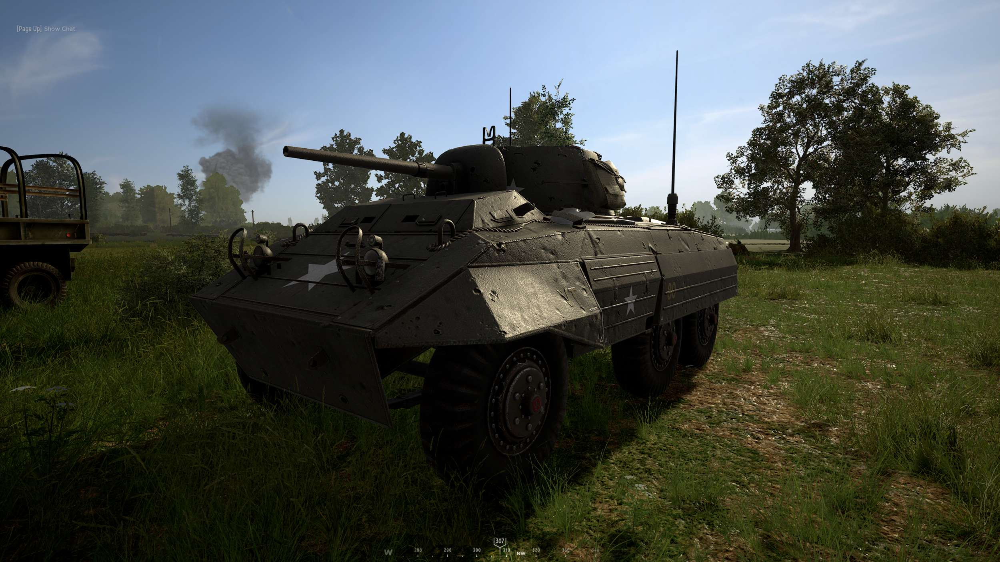
Figure 33: "The M8 Greyhound"

The M8 Greyhound has the following discernible features (Figure 33):

* An elongated body with a very small turret.
* A white star in the middle of the front and side plates.
* Wheels instead of tracks.

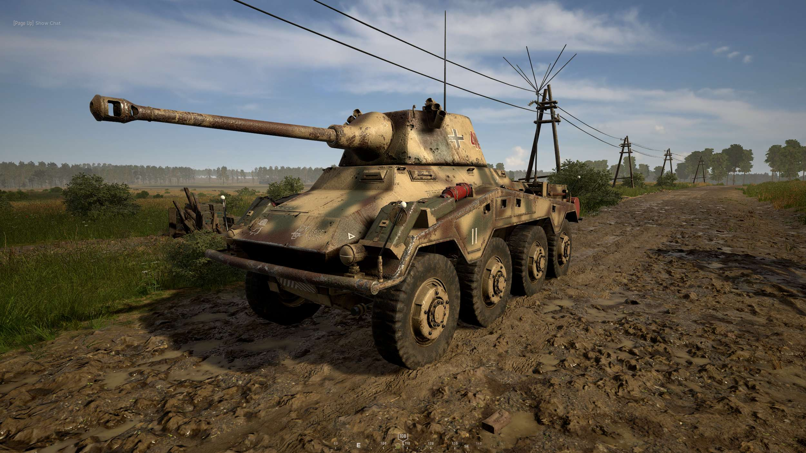
Figure 34: "The Puma"

Here is what the Puma looks like (Figure 34):

* A small but elongated body.
* A long barrel relative to its turret, complete with muzzle brake.
* A green-beige forest camouflage pattern on the hull.
* Wheels instead of tracks, 4 on each side.

Figure 35: "The BA-10"

Lastly, here’s what makes the BA-10 stand out (Figure 35):

* A 1940’s style car shape.
* A turret right above the trunk.
* 3 wheels on each side with a spare wheel between them.
* Various red army stars on the sides and turret.

With that out of the way, let’s talk about the damage these things can do. Recon vehicles’ AP shells are pretty weak in Update 12, meaning that you need a large amount of shots to kill medium and heavy tanks. It should also be noted that although the AP shells deal a minuscule amount of damage, HE shells are still as powerful as ever at destroying enemy recon and light tanks as well as halftracks and trucks. Since recon vehicles are functionally identical, the following table is an accurate generalization of their performance versus other recon vehicles as well as light, medium, and heavy tanks:

*R - Ricochet or non-penetrating hit*

*#D - # shots to disable module (no hull damage), after which becomes non-penetrating hit*

*#\* - # shots can only be achieved under specific circumstances or in special areas*

When engaging a truck or halftrack:

* HE rounds will kill these vehicles anywhere in the body or tires in just 1 shot. AP rounds, on the other hand, require 2 shots to the engine and 4 shots to the body in Update 12, so just use HE if you can.

When engaging another recon vehicle:

* If you can, load HE before engaging another recon vehicle. Recon HE rounds can destroy other recon vehicles in 1 shot unlike AP shells which take 2 shots (why this is in the game is a serious question for the developers). Aim for any part of the body or turret—try not to hit the tires since the other recon vehicle can also kill you in 1 shot with HE.
* If you cannot load HE, AP will do the trick in 2 shots to the body. Again, do not aim for the turret or tracks.

When engaging a light tank:

* Shooting the front plate or turret mantle will ricochet.
* If you have access to a light’s rear, 1 shot of HE will destroy it instantly (AP takes 3 shots, don’t ask me why). HE will not penetrate any other surface except the rear though.
* Shooting the side or rear plates will kill it in 3 shots of AP.
* The side or rear of the turret can be utilized to kill in 5 shots.
* Care should be taken to avoid the turret and tracks if possible, as hitting these will take longer to kill the tank.

When engaging a medium tank:

* Hitting any front plate, side plate, or turret shots will never penetrate. There is no reason why you should be aiming for these anyways.
* The tracks can be completely disabled in 4 hits, but this will deal no hull damage and you cannot kill the tank this way.
* It is inadvisable in general to engage a medium tank unless you can see it’s rear, and even then it’s situational. The back plate will kill it eventually, but requires getting around it in the first place and staying long enough to at least disable the engine (3 shots of AP or HE) which is difficult.
* HE does not penetrate mediums anywhere (except tracks, which you can only disable without hull damage)

When engaging a heavy tank:

* Any shots to the front plate, side plate, or front, side, or back of the turret will not penetrate.
* The tracks cannot be used to kill the heavies. You may disable the tracks in 5 shots of AP or HE, but none will do hull damage. This is not advantageous to do even if the heavy does not see you or cannot otherwise see you. A good heavy crew will figure out where you are and wipe you off the face of the earth with 1 shot because you have given your position away.
* You should generally avoid engaging heavies solo because in Update 12 it takes too long to kill them. It is better to pepper and annoy the enemy heavies with your presence without actually engaging them so that they are distracted, allowing your friendly tanks and infantry to move up and gain position. If you must engage a heavy, you should only do so if you can see its back plate and are in a position where you can easily back out of the engagement. With the recon vehicle’s quick reload speed and a bit of luck, you may be able to kill its engine (3 shots) and then finish the job.

**Opinion:** Because all recon vehicles are identical, their purposes on the battlefield are the same—to provide reconnaissance of enemy tanks, trucks, garrisons, and infantry positions for your team, as well as work in tandem with heavier friendly tanks to flank, disable, and destroy those tanks and trucks. This is a very high-risk, high reward playstyle—even just a light sneeze is enough to make a recon vehicle’s armor crumple like a napkin. On the other hand, if you can break through the enemy infantry and tanks and get around to the flank you can provide massive value to your team in the form of disruption of the enemy backline. Trying to play recon vehicles like you might play a medium or a heavy tank by locking down an area and shelling infantry will get you killed.

---

### **4.2 The American Tanks**

### **4.2.1 The M5 "Stuart" Light Tank**

The M5 Stuart light tank is a small and mobile tank that can run circles around heavier tanks like the Tiger and "Jumbo"s. Although its firepower is weak in comparison to even the Sherman medium (as mentioned before it has equivalent firepower to the "Bazooka"), its mobility and versatility allow this tank to rise to the top of a lot of veteran tankers’ preferences.

That being said, what does a Stuart look like? The Stuart has the following outstanding features (Figure 36):

* A small overall build—this tank is one of the smallest in the game.
* The plate towards the back and sides forms a boxy shape behind the turret.
* There are curved plates over the tracks on either side of the front plate.
* Yellow letters and numbers on the side.
* A striking resemblance to Thomas The Tank Engine (Figure 37).

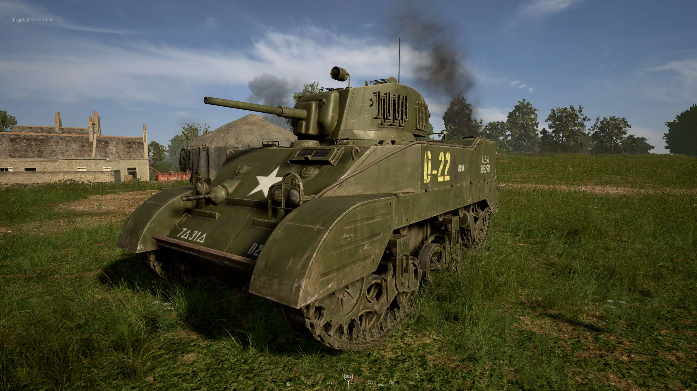
Figure 36: "The M5 ‘Stuart’ Light Tank"

View fullsize

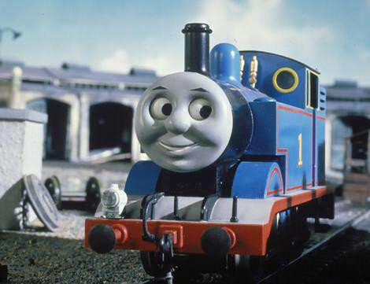
Figure 37: "Thomas The Tank Engine"

Below are the amount of rounds required to kill various enemy tank types with the Stuart:

*R - Ricochet or non-penetrating hit*

*#D - # shots to disable module (no hull damage), after which becomes non-penetrating hit*

*#\* - # shots can only be achieved under specific circumstances or in special areas*

When engaging a Puma:

* Using HE is more effective than AP and is the recommended way to deal with enemy recons as a Stuart. This is because HE kills enemy recon vehicles in 1 shot in the body *and* the turret, giving you more options in the field to quickly dispatch them.
* Care must be taken *not* to hit the stoplights on either side of the rear or the gas canisters on top of the side skirt on either side of the front plate because these areas are bugged and will not penetrate (see [section 4.5.3](#453-the-puma) for more on this).
* If you are using AP, aim for any part of the body—try not to hit the turret or tires since this will take longer to kill it, and it may be able to run away to safety because of its quick speed.

When engaging a Panzer II:

* Shooting the front plate or turret mantle (which covers the whole turret from the front) will ricochet.
* If you are engaging a Panzer II and can only see its front plate and mantle, you can actually ricochet AP rounds into the top of its chassis by shooting the lower half of the turret mantle, allowing the Stuart to 2 shot it from the front. This shot is a bit tricky especially if the Panzer II is moving or currently blasting you, but with some practice you can start doing it consistently.
* Shooting the side or rear plates will kill it in two shots, and if hitting the rear, the engine is disabled in 1 shot (there are some impenetrable regions on the rear of the tank, make sure to check [section 4.5.4](#454-the-panzer-ii) for more on this). This is always the best option if you have the angle.
* Care should be taken to avoid penetrating the turret or tracks if possible, as hitting these will take longer to kill the tank.

When engaging a Panzer IV:

* Hitting any front, side, or turret shots will always ricochet. There is no reason why you should be aiming for these anyways.
* The tracks can be completely disabled in 2 hits, but this will deal no hull damage and you cannot kill the tank this way.
* It is inadvisable in general to engage a Panzer IV unless you can see it’s rear. The back plate will kill it quickly, but requires getting around it in the first place.
* To damage the engine of a Panzer IV, care must be taken to aim at the section of the rear with the cylindrical canister. Anywhere else will only deal hull damage (Figure 26).

When engaging a Panther:

* Any shots to the front plate, side plate, or front, side, or back of the turret will not penetrate.
* The tracks cannot be used to kill the Panther. You may disable them in 3 shots, but none will do hull damage. This is not advantageous to do even if the Panther does not see you or cannot otherwise see you. A good Panther crew will figure out where you are and wipe you off the face of the earth with 1 shot because you have given your position away.
* You should only engage a Panther if you can see its back plate. With the Stuart’s quick reload speed, you should be able to kill its engine relatively quickly (2 shots) and then finish the job. The Panther has a slow turn speed in 1st gear or reverse compared to the Tiger or Panzer IV, so you (counterintuitively) stand a better chance of killing enemy Panthers if you can get the drop on them.
* There are areas of the Panther rear that are impervious to damage. See [section 4.5.6](#456-the-panther) for more on where these are located.

When engaging a Tiger:

* Any shots to the front plate, side plate, or front, side, or back of the turret will not penetrate.
* The tracks cannot be used to kill the Tiger. You may disable them in 3 shots, but none will do hull damage. This is not advantageous to do even if the Tiger does not see you or cannot otherwise see you. A good Tiger crew will figure out where you are and wipe you off the face of the earth with 1 shot because you have given your position away.
* You should only engage a Tiger if you can see its back plate. With the Stuart’s quick reload speed, you should be able to kill its engine relatively quickly and then finish the job. Tigers can turn very quickly in 1st gear or reverse, so you need to make sure you are landing every single shot after you give away your position or else a good Tiger crew will be able to quickly turn and close off the angle you have on their rear plate, ensuring your death.
* There are areas of the Tiger rear that are impervious to damage. See [section 4.5.7](#457-the-tiger) for more on where these are located.

**Opinion:** In conclusion, the M5 Stuart light tank is a very interesting specimen. Depending on your playstyle as a tanker this could be the best tank in the game or the worst. The Stuart’s strengths lie in getting behind enemy lines and around enemy tanks, as well as destroying enemy garrisons and trucks in the backline, much like the Greyhound. It differs from the Greyhound however in that it has greater armor all around, which means that the Puma and Panzer II cannot damage it in the front plate or front turret, it takes 2 "Panzerschreck" AT rockets to kill, and can take 2 shots instead of 1 from the Panzer IV if it happens to shoot the Stuart’s turret (not to mention that it cannot use HE to kill the Stuart except from the rear). This greater protection does come at a small cost to maneuverability, but the Stuart’s low weight can be used to mitigate this through the agility techniques outlined in [section 2.6.2](#262-advanced-agility-techniques-mlg-only). On top of that, the greater firepower with respect to the Greyhound afforded to the Stuart in Update 12 makes the Stuart a strictly superior tank to the Greyhound. The high top speed, good turn rate, better protection than a recon vehicle, and quick reload speed of the Stuart lets this tank keep enemies on their toes. Flanking is the soundest strategy, as a frontal assault against any other tank will get you killed 99% of the time. This is not a tank that should be used to sit in a position like the Shermans and lock down an area against enemy infantry. You have mobility, use it!

### **4.2.2 The M4A1 Sherman "Medium" Tank**

Surprise surprise folks, the Sherman medium is back to being a hunk of garbage—just like it was always meant to be. After a long history of being the worst medium tank (and possibly the worst tank outright) in Hell Let Loose, there was a brief stint in Update 11 where the Sherman medium was stronger than the Panzer IV in head to head engagements and could do some damage during the first minutes of the game, propelling it from the depths of hot garbage into the dull light of mediocrity. That has all changed with the introduction of a brand new version of the Sherman medium in Update 12, complete with a new hitbox and new textures. Compared to the Update 11 variant, the new Sherman medium features (somehow) worse handling, a way more vulnerable front and side plate, less HE and AP ammo, a giant obstruction on the top of the tank turret that blocks the spotter’s field of view, and Rinky-Dink™ smoke rounds that dissipate in mere seconds, all while retaining the old Sherman medium’s many weaknesses.

Lovely! So how do you recognize the Sherman medium amongst the billions of other types of Shermans? The Sherman medium sports the following features (Figure 38):

* A short, almost *chubby*, smooth cylindrical barrel with no muzzle brake on the end.
* Hades written on the side of the barrel.
* No equipment hanging off the side.
* A giant white star on its side armor.

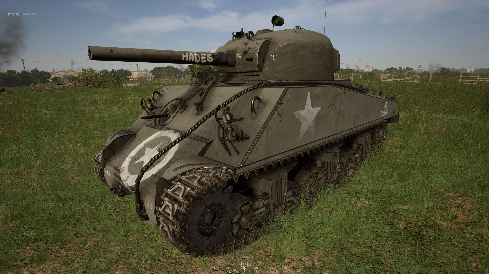
Figure 38: "The M4A1 Sherman Medium"

This table shows some baseline stats about the "chubby" Sherman, as I like to call it:

Notice that the new Sherman variant contains 13 rounds of the smoke variety. Smoke rounds coming from tanks have been changed in Update 12—these new smokes are slightly bigger in size and thicker in density than infantry smokes but last about as long, making them quite a bit less useful than the old "Jumbo" 75mm or artillery smoke varieties. They can still be utilized to moderate effect if your infantry is trying to push a specific area of the map or to blind enemy tanks temporarily and force them to move, but they dissipate very quickly so their uses are situational.

Another huge change for the medium is the reduced AP and HE ammunition. In a normal match, this means that you are running out of HE ammunition by the end of the opener of the game, assuming you are still alive, and that can make it problematic to be effective for longer periods of time against both infantry and tanks like other tanks can.

The next table shows the new medium’s turn speeds at different gears:

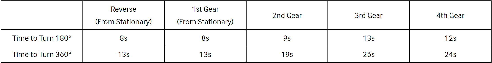

One thing to note here is that the new medium’s hitbox makes it difficult to drive over uneven or obstacle-ridden terrain in Update 12. This is because the front of the tank easily gets stuck on rubble piles, berms, and other garbage, forcing you to downshift all the way to 1st gear to get over these things. If you are intent on going over a berm or mound in this thing, get ready to hit it at a 45 degree angle at least if you want to stay in 4th gear.

Next, here is the amount of shots it takes to kill enemy tanks of different types when shooting rounds from a Sherman medium:

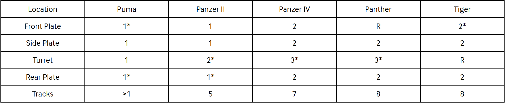

*R - Ricochet or non-penetrating hit*

*#\* - # shots can only be achieved under specific circumstances or in special areas*

Based on these statistics, we can extrapolate the optimal place to hit each tank as follows.

When engaging a Puma:

* Aim for the center of the body or the turret for a 1 shot kill. Care must be taken *not* to hit the stoplights on either side of the rear or the gas canisters on top of the side skirt on either side of the front plate because these areas are bugged and will not penetrate (see [section 4.5.3](#453-the-puma) for more on this). You may use an HE shell if you wish to conserve AP shells, since they will also 1 shot everywhere.
* Avoid hitting the barrel or the base of the barrel, this will only do barrel damage (and it will not kill the tank).
* Hitting the wheels will take longer than 1 shot. Avoid them.

When engaging a Panzer II:

* Make certain to hit anywhere in front, side or rear plates, as it is always a 1 shot kill.
* Make certain *not* to hit the tracks or the turret, as this can increase the shots it takes. The turret mantle is also impenetrable. You can ricochet into the top of the Panzer II chassis by aiming for the bottom half of the turret mantle for a one shot.
* Do not shoot the top half of the fuel canisters on either side of the turret as well as the back of the side skirt on the rear of the tank as these areas are bugged and do not penetrate. For more on this, see [section 4.5.4](#454-the-panzer-ii).
* Since the Panzer II cannot do any real damage to you in a Sherman medium, it is not a foe you should be worried about.

When engaging a Panzer IV:

* Just like the "Jumbo" 76mm vs the Tiger, the medium Sherman will penetrate the Panzer IV anywhere in the front, side, or rear plates for a 2 shot kill.
* Trying to kill the Panzer IV by hitting the tracks is impossible from the front and inadvisable from the side, as it takes many shots to do so and the turret or side takes less shots to kill.
* Hitting the turret is a viable approach to killing a Panzer IV whose body is obscured from view, but care must be taken not to hit the barrel or the small mantle either side of it as this will not penetrate. Left/right of the mantle, or side/rear of the turret will kill the tank in 3 hits.
* If you want to engage a Panzer IV, try to position yourself so that you can hide your front plate and only show your turret. Your turret *can* be penetrated by the Panzer IV from the front, but hiding your body will force the Panzer IV to take one more shell to kill you, thereby securing your kill if you are shooting the Panzer IV’s body. Hard cover or hills on maps like Foy will allow you to do this.
* The [Achilles Heel](#210-the-achilles-heel) shot is viable. Since the Sherman medium can penetrate the side plate of the Panzer IV, both the red and green outlines are penetrable and both will disable the engine in 1 shot (Figure 23). Hitting the red outline is relatively simple, provided you are at the right angle—aim for the space above the tracks and below the side skirt towards the rear of the side of the tank.
* As with any other medium, 2 shots to the back plate at most angles will kill it. The first shot disables the engine if aimed at the canister (Figure 26).
* There are some locations where the Sherman medium cannot penetrate the Panzer IV. For more on where these are located, see [section 4.5.5](#455-the-panzer-iv).

When engaging a Panther:

* Any shots to the front plate will not penetrate.
* Side and rear plates can be penetrated for a 2 shot kill. If hitting rear, 1 shot will kill the engine and render the Panther immobile. If you are lucky enough to be in a position where you see the side armor of the Panther, 2 shots will kill the tank as long as the projectile lands at an angle less than 55 degrees with respect to the perpendicular of the side armor (35 degrees with respect to the front plate). A greater angle than 55 degrees will bounce. Care must also be taken not to aim too low when attempting to hit the side armor. The top half of the side skirt that extends over the tracks penetrates the side plate for hull damage, and the bottom half penetrates tracks.
* While the front mantle and cupola of the turret are impenetrable by the Sherman medium, the turret can still be penetrated from the front by shooting the small triangular corners, or "cheeks", of the Panther’s turret either side of the mantle (Figure 39). Hitting the side or rear of the turret will also penetrate, and both of these shots kill the Panther after 3 rounds. While this can be done in a regular game, it’s extremely rare that a Panther who isn’t already damaged will allow a Sherman medium to unload 3 AP rounds into its turret without blowing it up in 1 shot, so this should only ever be done in emergency cases or if there is no other choice.
* The Sherman medium can hit the [Achilles Heel](#210-the-achilles-heel) shot to kill the Panther’s engine instantly. Both the green and red sections (Figure 23) of the shot work, and the red section in particular—which is just the top half of the side skirt of the Panther towards the rear of the tank—deals hull and engine damage at the same time and is really straightforward to hit. The Achilles heel is the recommended way to engage Panthers if you are at the correct angle so that they do not have the chance to turn around.
* You can use your smoke rounds to disengage from or temporarily blind enemy Panthers you are engaging with. This allows you to safely reposition your tank to avoid getting killed by a Panther, or to force the Panther to move from its entrenched position.
* Take care not to shoot some specific locations, outlined in [section 4.5.6](#456-the-panther) that will not penetrate the Panther when hit.

<figure style="max-width: 600px; margin: auto;">
  <video controls style="width: 100%; height: auto;">
    <source src="videos/f6.webm" type="video/mp4">
    Your browser does not support the video tag.
  </video>
</figure>
Figure 39: "Sherman Medium Penetrating Panther ‘Cheeks’"

When engaging a Tiger:

* *Any* shots to the front plate, front of the turret, side of the turret, or back of the turret will ricochet at *any* angle. Even if the round does not bounce, no damage will be done to the hull itself.
* If you are lucky enough to be in a position where you see the side armor of the Tiger, 2 shots will kill the tank as long as the projectile lands at an angle less than 55 degrees with respect to the perpendicular of the side armor (35 degrees with respect to the front plate). A greater angle than 55 degrees will bounce.
* The Sherman medium can hit the [Achilles Heel](#210-the-achilles-heel) shot to kill the Tiger’s engine instantly. Both the green and red sections (Figure 23) of the shot work, and the red section in particular—which is just the side skirt of the Tiger towards the rear of the tank—deals hull and engine damage at the same time and is really straightforward to hit. Since the Tiger turns quickly in 1st gear and can kill the medium in 1 shot, the Achilles heel is the recommended way to engage Tigers if you are at the correct angle so that they do not have the chance to turn around.
* The back plate is a 2 shot kill at any angle. The engine will die with the first shot, making securing the kill super easy. Be careful not to shoot the non-penetrating regions described in [section 4.5.7](#457-the-tiger).
* You can use your smoke rounds to disengage from or temporarily blind enemy Tigers you are engaging with. This allows you to safely reposition your tank to avoid getting killed by a Tiger, or to force the Tiger to move from its entrenched position.
* There *is* a way to penetrate the Tiger in a medium Sherman when engaging it from the front that has recently been discovered courtesy of -TL- EvilTactics (whose Hell Let Loose YouTube channel you can find [here](https://www.youtube.com/channel/UCV53YF5x3fww2yFhMW3MVkA)). This shot should only be attempted if the Tiger is distracted or you are in a position with high ground and hard cover where only your turret is showing. The Tiger can still 1 shot you in the body, so respect it. I’ve gone into much more detail about it in the following paragraphs.
#### The Shot
The shot that allows the medium Sherman (or indeed the "Jumbo" 75mm or the T-34/76) to kill a Tiger from the front is a little tricky to land, but if done correctly can kill it from the front in only 2 shots. The shot itself is likely a bug not intended to be in the game, but the basic idea is that you can ricochet a shot off of the bottom of the turret mantle below the barrel into the top of the chassis for a penetrating hit (Figure 40). To do this, aim to land the shell anywhere along the bottom of the mantle, right above the turret ring (at 100m, for example, the Sherman crosshair’s horizontal line should be in line with the very bottom of the mantle). Below is an example of this shot in action (Figure 42).

There are two major caveats to the front plate Tiger shot. The first is that in order to *consistently* land it the Tiger must be pointing its barrel directly at your tank. When the Tiger’s barrel is off to the left or right with respect to your tank, the shots may or may not land depending on the elevation or depression of the Tiger’s barrel and the difference in elevation between both tanks. If the Tiger’s barrel is pointing upwards, the shot will be easier to land since you will have a better angle on the surface of the underside of the mantle needed to make the shot. If instead the Tiger’s barrel is facing downwards with respect to your tank, the shot becomes impossible to hit. That being said, you can still land the shot even if the barrel is not turned towards you if you are close enough or are in an advantageous position (on high ground, for instance), as shown in Figure 43.

The second caveat is distance. Not only is it harder to hit such a small target at longer ranges, but after about 300m, the trajectory of the shell makes the shot impossible to hit. This is because the shell’s acceleration due to gravity makes it fall more and more the farther it travels, meaning that the gunner must aim higher by greater and greater amounts as distance increases. This creates an arc in the shell’s trajectory, instead of a relatively straight line, which makes the shell ricochet off of the bottom of the mantle at an angle that hits the turret ring (which is impenetrable) instead of the top of the chassis. In other words, past approximately 300m the shot becomes impossible to hit no matter how accurately you fire the projectile. This is illustrated in the following wonderfully hand-crafted definitely legit ms paint diagrams (Figures 40 and 41):

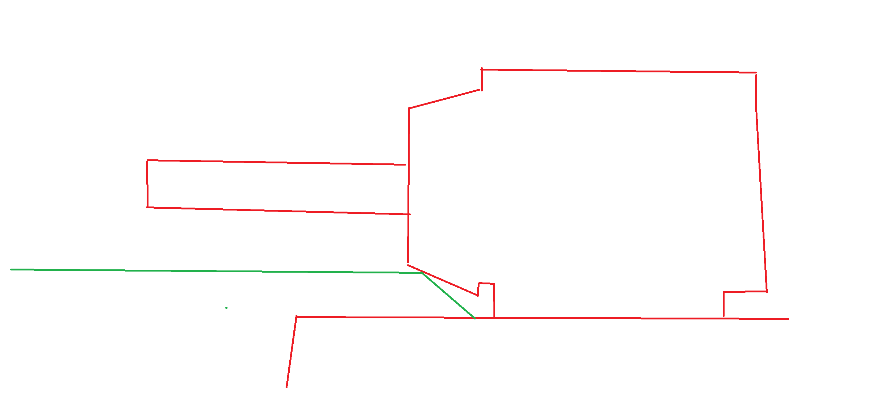
Figure 40: "Front Plate Tiger Shot at 100m"

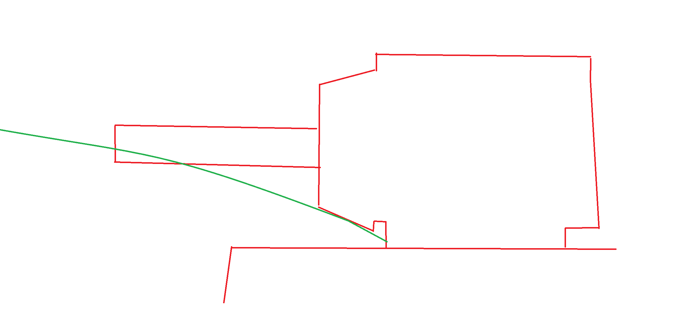
Figure 41: "Front Plate Tiger Shot at 400m"

<figure style="max-width: 600px; margin: auto;">
  <video controls style="width: 100%; height: auto;">
    <source src="videos/f42.mp4" type="video/mp4">
    Your browser does not support the video tag.
  </video>
</figure>
Figure 42: "Front Plate Tiger Shot, Barrel Straight"

*Note: this video depicts the Update 11 version of the Sherman medium and the Update 11 version of the Tiger. Despite this, the shot is still exactly the same in Update 12, so don’t you fret.*

<figure style="max-width: 600px; margin: auto;">
  <video controls style="width: 100%; height: auto;">
    <source src="videos/f43.mkv" type="video/mp4">
    Your browser does not support the video tag.
  </video>
</figure>
Figure 43: "Front Plate Tiger Shot, Barrel Angled"

*Note: this video depicts the Update 11 version of the Sherman medium and the Update 11 version of the Tiger. Despite this, the shot is still exactly the same in Update 12, so don’t you fret.*

Even when engaging a Tiger closer than 300m, the shot can be very finicky and there is no room for trial and error. The margins are very low, so the only way to properly take advantage of this shot on a regular basis is to memorize where to place the crosshair at different distances. To help you do this, I have compiled a graphic of where to aim the crosshair at 100m, 200m, and 300m to land the shot perfectly (Figure 44). If you are somewhere between the distances shown in the graphic you will have to manually adjust to somewhere between the two pictures based on your distance (for example, if you are at 150m aim roughly in the middle between the 100m picture and the 200m picture).

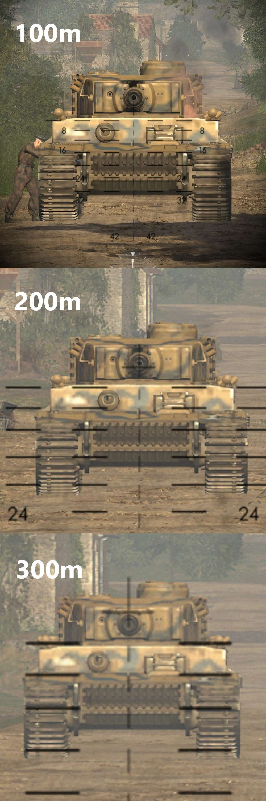
Figure 44: "Distance Reference for the Tiger Shot"

*Note: this video depicts the Update 11 version of the Sherman medium and the Update 11 version of the Tiger. Despite this, the shot is still exactly the same in Update 12, so don’t you fret.*

*Disclaimer: this graphic was created using images from the inside of the medium Sherman’s gunner seat. It is likely inaccurate for the T-34/76 since its crosshair is different and its shell drop is more pronounced. Tough luck Soviet players, you’ll have to figure it out on your own.*

**Opinion:** In conclusion, the Sherman medium’s uses as a tank have been reduced to holding the enemy Panzer IV at bay during the opening minutes of the match and coordinated plays with multiple mediums to smoke and push a point with friendly infantry. In terms of tank engagements, while it can hold its own against a Puma, a Panzer II, and a Panzer IV in a head on engagement, it is still outmatched against a Panther (even with the ability to penetrate the "cheeks") and a Tiger (even with the newly discovered front shot) unless it can catch said Panther or Tiger off guard. It is outclassed by the heavier tanks, and it is out-maneuvered by the lighter tanks, so its role seems to best be suited for infantry control and AOE zoning. The smoke rounds are nice, but they come at the expense of a painfully inadequate HE and AP ammunition count, and the smokes themselves have a smaller radius and lower density compared their Update 11 versions while also dissipating quickly (by the time you fire the 4th smoke in a 4 smoke barrage, the 1st smoke is gone).

The medium’s maneuverability also leaves a lot to be desired—it gets stuck on the tiniest obstacles, getting over berms is a pain in the ass, and the slightly higher max speed it can reach compared to other medium tanks does not really translate to much in a real game. On top of all of that, German AT players are able to penetrate its armor practically anywhere, including the massively simplified and easy to penetrate front plate, in just 2 shots. All in all, this is a very mediocre tank and you would be better off waiting for a "Jumbo" 76mm if you have the choice. If you are running this thing after the opener of a match, you’re doing it wrong.

### **4.2.3 The M4A3E2 Sherman "Jumbo" 75mm**

The 75mm "Jumbo" Sherman, like its 76mm counterpart, boasts a thicker front armor as well as a bigger and sturdier turret than it’s medium variant. It is equipped with AP, HE, and 6 of the same exact smoke rounds that the Sherman medium has. The greater tenacity and its smokes allow this tank to fill somewhat of a more supportive role on the battlefield.

So what does the 75mm Sherman "Jumbo" look like? How do you recognize it in the field? The 75mm can be recognized by spotting these features (Figure 45):

* The color of the paint on the hull is a lighter green than other Sherman variants. More of a Hulk color.
* The barrel is short, stubby, and features no muzzle brake.
* The "Jumbo" variants of the Sherman can be recognized by their larger, more boxy turrets as well as their thick turret mantles.
* The sides of the plate and the turret of the 75mm "Jumbo" both have a bunch of equipment strapped to them.

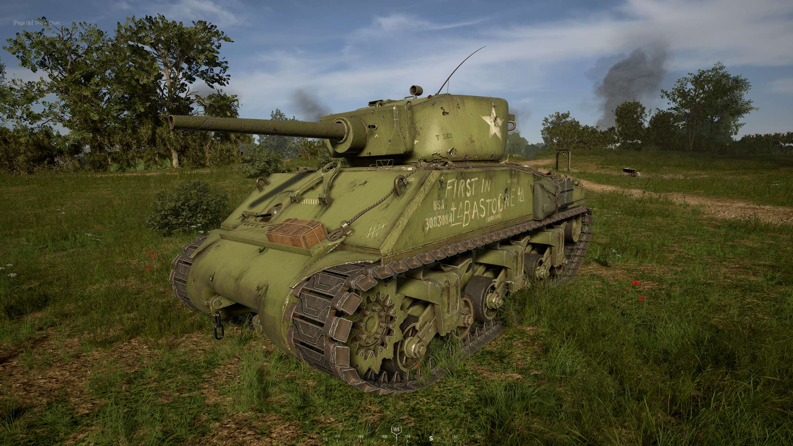
Figure 45: "The M4A3E2 Sherman ‘Jumbo’ 75mm"

First thing’s first, the stats:

The "Jumbo" 75mm is also equipped with smoke rounds, however much like the medium Sherman, these new smoke rounds in Update 12 are only marginally bigger than an infantry smoke and disperse about as fast. These facts, coupled with the 75mm "Jumbo"’s lackluster supply of only 6 smoke rounds, makes them practically useless in a real game. Notice as well that the reload speed of the 75mm "Jumbo" is 2 seconds longer than the reload speed for the medium Sherman and the Panther, making this tank even more of a meme than it already is.

Both "Jumbo" variants have identical transmissions and engines, meaning their turn speed and maximum speed are the same, and they drive exactly the same. They have a slow maximum speed, but in stark contrast to other heavies such as the Panther, the "Jumbo"s have the highest 1st gear and reverse turn speeds of all the heavy tanks.

Once again, here are the amount of shots it takes to kill various types of enemy tanks using the 75mm gun. The "Jumbo" 75mm has the exact same gun as the Sherman medium.

*R - Ricochet or non-penetrating hit*

*#\* - # shots can only be achieved under specific circumstances or in special areas*

When engaging a Puma:

* Aim for the center of the body or the turret for a 1 shot kill. Care must be taken *not* to hit the stoplights on either side of the rear or the gas canisters on top of the side skirt on either side of the front plate because these areas are bugged and will not penetrate (see [section 4.5.3](#453-the-puma) for more on this). You may use an HE shell if you wish to conserve AP shells, since they will also 1 shot everywhere.
* Avoid hitting the barrel or the base of the barrel, this will only do barrel damage (and it will not kill the tank).
* Hitting the wheels will take longer than 1 shot. Avoid them.

When engaging a Panzer II:

* Make certain to hit anywhere in front, side or rear plates, as it is always a 1 shot kill.
* Make certain *not* to hit the tracks or the turret, as this can increase the shots it takes. The turret mantle is also impenetrable. You can ricochet into the top of the Panzer II chassis by aiming for the bottom half of the turret mantle for a one shot.
* Do not shoot the top half of the fuel canisters on either side of the turret as well as the back of the side skirt on the rear of the tank as these areas are bugged and do not penetrate. For more on this, see [section 4.5.4](#454-the-panzer-ii).
* Since the Panzer II cannot do any real damage to you in a "Jumbo" 75mm; it is not a foe you should be worried about.

When engaging a Panzer IV:

* Just like the Sherman medium, the "Jumbo" 75mm will penetrate the Panzer IV anywhere in the front, side, or rear plates for a 2 shot kill.
* Trying to kill the Panzer IV by hitting the tracks is impossible from the front and inadvisable from the side, as it takes many shots to do so and the turret or side takes less shots to kill.
* Hitting the turret is a viable approach to killing a Panzer IV whose body is obscured from view, but care must be taken not to hit the barrel or the small mantle either side of it as this will not penetrate. Left or right of the mantle, or side/rear of the turret will kill the tank in 3 hits.
* Unlike the Sherman medium, you can position yourself much more liberally when engaging a Panzer IV since it cannot penetrate you anywhere in the front plate or turret. This allows you to fire away at it without fear of death if you are facing your front plate towards it.
* The [Achilles Heel](#210-the-achilles-heel) shot is viable. Since the "Jumbo" 75mm can penetrate the side plate of the Panzer IV, both the red and green outlines are penetrable and both will disable the engine in 1 shot (Figure 23). Hitting the red outline is relatively simple, provided you are at the right angle—aim for the space above the tracks and below the side skirt towards the rear of the side of the tank.
* 2 shots to the back plate at most angles will kill it. The first shot disables the engine if aimed at the canister (Figure 26).
* There are some locations where the Sherman medium cannot penetrate the Panzer IV. For more on where these are located, see [section 4.5.5](#455-the-panzer-iv).

When engaging a Panther:

* Any shots to the front plate will not penetrate.
* Side and rear plates can be penetrated for a 2 shot kill. If hitting rear, 1 shot will kill the engine and render the Panther immobile. If you are lucky enough to be in a position where you see the side armor of the Panther, 2 shots will kill the tank as long as the projectile lands at an angle less than 55 degrees with respect to the perpendicular of the side armor (35 degrees with respect to the front plate). A greater angle than 55 degrees will bounce. Care must also be taken not to aim too low when attempting to hit the side armor. The top half of the side skirt that extends over the tracks penetrates the side plate for hull damage, and the bottom half penetrates tracks.
* While the front mantle and cupola of the turret are impenetrable by the "Jumbo" 75mm, the turret can still be penetrated from the front by shooting the small triangular corners, or "cheeks", of the Panther’s turret either side of the mantle (Figure 39). Hitting the side or rear of the turret will also penetrate, and both of these shots kill the Panther after 3 rounds. While this can be done in a regular game, it’s extremely rare that a Panther who isn’t already damaged will allow a "Jumbo" 75mm to unload 3 AP rounds into its turret without blowing it up in 2 shots, especially with the much slower "Jumbo" reload speed (the Panther can fire 4 shells for every 3 that the "Jumbo" can, so your extra armor is useless here). This should only ever be done in emergency cases or if there is no other choice.
* The "Jumbo" 75mm can hit the [Achilles Heel](#210-the-achilles-heel) shot to kill the Panther’s engine instantly. Both the green and red sections (Figure 23) of the shot work, and the red section in particular—which is just the top half of the side skirt of the Panther towards the rear of the tank—deals hull and engine damage at the same time and is really straightforward to hit. The Achilles heel is the recommended way to engage Panthers if you are at the correct angle so that they do not have the chance to turn around.
* You can use your smoke rounds to disengage from or temporarily blind enemy Panthers you are engaging with. This allows you to safely reposition your tank to avoid getting killed by a Panther, or to force the Panther to move from its entrenched position. The extra armor of the "Jumbo" 75mm allows you to position a little more liberally when performing these types of shenanigans.
* Take care not to shoot some specific locations, outlined in [section 4.5.6](#456-the-panther) that will not penetrate the Panther when hit.

When engaging a Tiger:

* *Any* shots to the front plate, front of the turret, side of the turret, or back of the turret will ricochet at *any* angle. Even if the round does not bounce, no damage will be done to the hull itself.
* If you are lucky enough to be in a position where you see the side armor of the Tiger, 2 shots will kill the tank as long as the projectile lands at an angle less than 55 degrees with respect to the perpendicular of the side armor (35 degrees with respect to the front plate). A greater angle than 55 degrees will bounce.
* The "Jumbo" 75mm can hit the [Achilles Heel](#210-the-achilles-heel) shot to kill the Tiger’s engine instantly. Both the green and red sections (Figure 23) of the shot work, and the red section in particular—which is just the side skirt of the Tiger towards the rear of the tank—deals hull and engine damage at the same time and is really straightforward to hit. Since the Tiger turns quickly in 1st gear and can close off the angle required to do damage in a "Jumbo" 75mm, the Achilles heel is the recommended way to engage Tigers if you are at the correct angle so that they do not have the chance to turn around.
* The back plate is a 2 shot kill at any angle. The engine will die with the first shot, making securing the kill super easy. Be careful not to shoot the non-penetrating regions described in [section 4.5.7](#457-the-tiger).
* You can use your smoke rounds to disengage from or temporarily blind enemy Tigers you are engaging with. This allows you to safely reposition your tank to avoid getting killed by a Tiger, or to force the Tiger to move from its entrenched position. The extra armor of the "Jumbo" 75mm allows you to position a little more liberally when performing these types of shenanigans.
* There *is* a way to penetrate the Tiger in a "Jumbo" 75mm when engaging it from the front that has recently been discovered courtesy of -TL- EvilTactics (whose Hell Let Loose YouTube channel you can find [here](https://www.youtube.com/channel/UCV53YF5x3fww2yFhMW3MVkA)). For a full description of how exactly it works, see [this section](#the-shot). This ability balances the engagement a little between the "Jumbo" 75mm and the Tiger because the "Jumbo"s heavier armor will allow it to survive a Tiger shell to the front plate and continue fighting, making the engagement technically 2 shots to 2 shots. The "Jumbo"s shots are considerably harder to land than the Tiger’s, but the "Jumbo" has smokes to disengage if it needs to, making engaging Tigers as a "Jumbo" 75mm a somewhat viable strategy.

**Opinion:** The Sherman "Jumbo" 75mm is passable as an infantry support/anti-personnel tank that has greater tenacity versus enemy infantry and enemy tanks than its Sherman medium variant. Its quick 1st gear turn speed, allowing it to quickly react to flanking enemy tanks and AT rocketeers, coupled with its heavy armor makes this tank harder to get rid of on the battlefield than its medium counterpart. The smoke rounds allow the 75mm to provide (admittedly mediocre) cover for friendly infantry to push a point, disengage from any tank engagement, or obscure enemy tanks to allow for a flank, and it’s newly discovered ability to damage Tigers from the front is an added bonus (but by no means does it mean that the 75mm can start hunting Tigers like the 76mm can). On top of that, it has a lot of HE ammunition compared to other tanks in the game as well.

Despite these pros, there are major cons. To start, it only has 6 smoke rounds and they don’t last very long, so any smoke oriented strategies are out of the window already. It costs 500 fuel, which is only 100 fuel away from the vastly superior 76mm "Jumbo". Most importantly, however, it’s 8 second reload forces this tank to lose engagements against enemy Panthers and Tigers (despite the added armor) and have a tough time finishing off enemy Panzer IV’s while also reducing its total ability to deal damage to infantry. These are the biggest reasons why no sane person still uses this tank—at the end of the day, if you really want the smokes and maneuverability you’re better off picking the medium, and if you’re like everyone else and want armor and firepower you’re better off choosing the "Jumbo" 76mm. Don’t waste your fuel on this thing.

### **4.2.4 The M4A3E2 Sherman "Jumbo" 76mm**

The Sherman "Jumbo" 76mm tank is the 75mm’s big brother in terms of firepower. While the armor is effectively identical to that of the 75mm "Jumbo" Sherman, the AP rounds fired are far superior. By all accounts, this is the best tank that the Americans have to offer and the only hope you will ever have of standing up to enemy Panthers and Tigers.

So what does she look like? Well, the 76mm can be distinguished from other Shermans by noticing the following features (Figure 46):

* The most important feature that is easily noticeable about the 76mm is the muzzle brake on the end of the barrel. No other American tanks have this muzzle brake.
* The "Jumbo" variants of the Sherman can be recognized by their larger, more boxy turrets as well as their thick turret mantles.
* The barrel is much longer than the "Jumbo" 75mm or the Sherman medium.
* There is a white star with a circle around it between the two tracks.

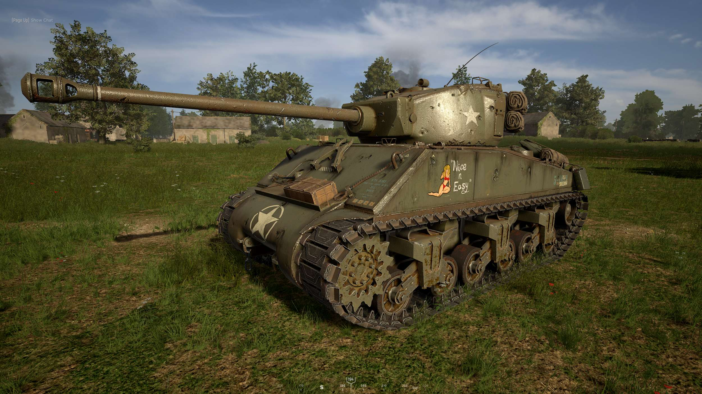

Figure 46: "The M4A3E2 Sherman ‘Jumbo’ 76mm"

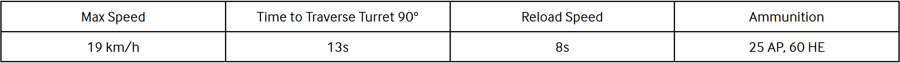

The "Jumbo" 76mm has a large supply of HE rounds and a small supply of AP rounds, which does affect the optimal playstyle for this tank (i.e. you shouldn’t be trying to spam AP just to find that one small hole in the bush).

Both "Jumbo" variants have identical transmissions and engines, meaning their turn speed and maximum speed are the same, and they drive exactly the same. They have a slow maximum speed, but in stark contrast to other heavies such as the Panther, the "Jumbo"s have the highest 1st gear and reverse turn speeds of all the heavy tanks.

The "Jumbo" 76mm shares some of the same driving characteristics with other heavy tanks, namely a slow top speed and an extremely sluggish 3rd/4th gear turn speed (34s for a full turn is plenty of time for an AT player to shoot 2 rounds into a "Jumbo"s butt).

Below are the amount of rounds required to kill various enemy tank types with the 76mm slugger:

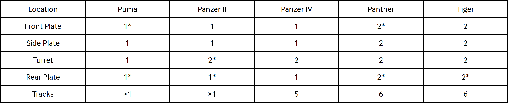

*#\* - # shots can only be achieved under specific circumstances or in special areas*

When engaging a Puma:

* Aim for the center of the body or the turret for a 1 shot kill. Even in the 76mm "Jumbo", care must be taken *not* to hit the stoplights on either side of the rear or the gas canisters on top of the side skirt on either side of the front plate because these areas are bugged and will not penetrate (see [section 4.5.3](#453-the-puma) for more on this). You may use an HE shell if you wish to conserve AP shells.
* Hitting the wheels will take longer than 1 shot. Avoid them.

When engaging a Panzer II:

* Make certain to hit anywhere in front, side or rear plates, as it is always a 1 shot kill.
* The turret mantle is impenetrable.
* Even in the 76mm "Jumbo", the top half of the fuel canisters on either side of the turret as well as the back of the side skirt on the rear of the tank are areas that are bugged and do not penetrate. For more on this, see [section 4.5.4](#454-the-panzer-ii).
* Since the Panzer II cannot do any damage to you in a "Jumbo" 76mm, it is not a foe you should be worried about.

When engaging a Panzer IV:

* Shooting the front plate, side plate, or rear plate obliterates this thing in 1 shot.
* The turret will take 2 shots before the Panzer IV explodes, and this can be done from any angle. This method should only be used to kill Panzer IVs that are only visible by their turret. If you can see the body, shoot it in the body and do not waste your time.
* The turret’s cupola and the inside of the barrel are penetrable but deal no hull damage—shots to those areas will just kill the turret module.
* Going for the tracks is inadvisable because of the sheer number of shots required to kill the tank.
* While the [Achilles Heel](#210-the-achilles-heel) shot is technically possible, it is not recommended to go for this shot since hitting the side plate will kill it in 1 shot anyway.
* Even in the "Jumbo" 76mm, there are places of the Panzer IV front, side, and rear plates which are impenetrable. To see where, check out [section 4.5.5](#455-the-panzer-iv).

When engaging a Panther:

* This is where the 76mm "Jumbo" Sherman really shines. This is the only American tank that can actually pierce the front plate of a Panther tank (the other Shermans can penetrate the turret, sides, and rear only), and it can blow the Panther up in 2 shots anywhere in the front hull plate. Care must be taken not to hit the side skirt protruding above the tracks left and right of the front plate, as this will not penetrate at all (see [section 4.5.6](#456-the-panther) for more). This is the go-to method for destroying a Panther tank.
* The 76mm "Jumbo" has a much slower reload speed than the Panther (8 seconds vs 6 seconds respectively). This means that even if you land the first shot in an engagement with a Panther, you may still end up losing if you get hit up to 2 seconds after shooting your first shot. Assuming all shots land, the Panther will be able to fire its 2nd shot and blow you up before you have a chance to finish it off. This single fact makes the Panther a very scary tank on the battlefield, and one that needs to be attacked intelligently. If you try to engage a Panther head to head, assuming both crews are of equal skill, you will lose the engagement in a 1v1 in most scenarios. The reload speed dynamic between these two tanks forces the "Jumbo" 76mm to go for the element of surprise when engaging Panthers or double up with other "Jumbo" 76mms or AT guns to land two blows at once and end the engagement early.
* The second spot that is very effective against a Panther is the sides, which can be hit twice for a kill even from a very shallow angle. In fact, if you can see the side at all then you can penetrate it. This is a strictly inferior method to hitting the front though because there is less surface area, so only do this if you can’t hit the front for some reason.
* If for some reason the front and sides of the body are obscured or otherwise inaccessible, the turret is the next best place to hit. It takes 2 shots to kill the Panther if you shoot it anywhere in the front, sides or rear of the turret. Do not hit the barrel or the cupola instead of the plates on the turret, as these will only destroy the turret and not damage the hull.
* Under almost no circumstances should you be hitting the tracks of a Panther tank given the aforementioned methods of dispatching the tank, as it takes three times as long in the best case scenario (by that time you’d be dead).
* The "Jumbo" 76mm can hit the [Achilles Heel](#210-the-achilles-heel) in both the red and green sections (Figure 23). This can be useful to mitigate the potential for the Panther to turn around and land a shot in your plate, since the engine dies in 1 shot, but in general if the 76mm has the angle to hit the Achilles Heel it will kill the Panther before the Panther can kill it.
* The rear plate of the Panther is still a 2 shot kill, just like the front and sides, except the engine gets disabled after the first shot.

When engaging a Tiger:

* Similar to the Panther, the Tiger tank can be blown up in 2 shots anywhere in the front hull plate. This is the go-to method for destroying a Tiger tank.
* The 76mm "Jumbo" and the Tiger have the same reload speed, so first shot wins.
* The second spot that is very effective against a Tiger is the sides, which can be hit twice for a kill even from a very shallow angle. In fact, if you can see the side at all then you can penetrate it. This is a strictly inferior method to hitting the front though because there is less surface area, so only do this if you can’t hit the front for some reason.
* If for some reason the front and sides of the body are obscured or otherwise inaccessible, the turret is the next best place to hit. It takes 2 shots to kill the Tiger if you shoot it in the front mantle, or the sides and rear of the turret. This means that if the Tiger is looking directly at you, the flat plates on either side of the barrel are where you want to aim, and hitting other surfaces will likely ricochet. Care also must be taken not to hit the barrel or the cupola instead of the plates on the turret, as these will only destroy the turret and not damage the hull.
* Under almost no circumstances should you be hitting the tracks of a Tiger tank given the aforementioned methods of dispatching the tank, as it takes three times as long in the best case scenario (by that time you’d be dead).
* The "Jumbo" 76mm can hit the [Achilles Heel](#210-the-achilles-heel) in both the red and green sections (Figure 23). This can be useful to mitigate the potential for the Tiger to turn around and land a shot in your plate, since the engine dies in 1 shot, but in general if the 76mm has the angle to hit the Achilles Heel it will kill the Tiger before the Tiger can kill it.
* The rear plate of the Tiger is still a 2 shot kill, just like the front and sides, except the engine gets disabled after the first shot. Note that the air filters and exhaust pipes on the back of the Tiger are impenetrable from the sides or the rear, even to the 76mm "Jumbo". See [section 4.5.7](#457-the-tiger) to see an illustration of these areas.

**Opinion:** The Sherman "Jumbo" 76mm is the best the Americans can do when it comes to firepower and armor. While the armor is the same as the 75mm, the bigger gun allows the 76mm to take on a more offensive role. This tank’s responsibility is to engage and destroy enemy tanks of all kinds, but especially enemy heavy tanks—namely, the Panther and the Tiger. While the 76mm and the Tiger are relatively evenly matched, the Panther outclasses the 76mm mainly due to its faster reload speed. This is a major problem for game balance because all else being equal, Panthers (especially when they work together) can roll over allied tanks of all kinds with relative ease and subsequently put immense pressure on your infantry and your defensive points.

Because all of the other tanks on the American side are put in more of an anti-personnel/support role, and because those other American tanks cannot engage enemy Panthers or Tigers with great proficiency, the 76mm is left to do the job and make the most out of what it’s got despite its disadvantages. Two schools of thought exist with regards to how to deal with Panthers. The first is doubling up your tanks and AT guns to allow you to dispatch single enemy Panthers without posing a danger to either of the tanks by having two guns be able to instantly kill a Panther before they can even get their second shot off. This requires coordination with your other tank squads and can be very hard to achieve even at the higher levels of play because tank engagements can many times be through small slivers of cover where only one tank can engage at a time. On top of that, it requires pooling 1200 fuel and 2 decent crews together which can be extremely hard to do if the Panthers are preventing you from grouping up. The other school of thought is to keep the Panthers on their toes. You can beat Panthers in 1v1 engagements as a 76mm "Jumbo" if you peek them while they aren’t looking at you, but this requires you to constantly change position lest you be marked by enemy infantry. Even if you have the element of surprise, you need to be in a position where the Panther cannot simply turn and shoot you within the 2 second window and still win the engagement, which can be difficult.

All of that being said, the 76mm still has a quick 1st gear turn speed and the ability to QuickTurn™ on a dime allowing it to easily turn and react to German AT and flanking tanks of all kinds. It’s armor allows it to take more aggressive positioning when compared to the other American tanks, and a good crew can still create problems for enemy Tigers and Panthers under the right circumstances.

---

### **4.3 The German Tanks**

The following chapters on German tanks will be somewhat longer to cover both engagements with American tanks and engagements with Soviet tanks, since the German force can be seen on western front as well as eastern front maps.

### **4.3.1 The Panzerkampfwagen II Light Tank**

The Panzer II is the light tank on the German side in Hell Let Loose. This little guy is equipped with a 20mm autocannon that fires HE rounds in a continuous fashion for a limited time until it has to be reloaded. The nature of only having HE available makes this tank unable to penetrate most American or Soviet tanks, even in the rear. Update 10 has however introduced buffs to the Panzer II, allowing it to penetrate certain parts of Stuarts and most surfaces on enemy recon vehicles, while adding protection to its front plate from light tanks, recon vehicles, and AT rockets and rifles. Additionally, this tank is agile and can put out a tremendous amount of anti-personnel firepower in a short time because of the autocannon’s continuous fire, not to mention the fact that its small overall stature and fast speed allow it to hide behind bushes and low buildings. It should be noted, however, that the Panzer II does not have a hull MG.

"Ok, so it can’t kill me, but I want to kill it anyway! How do I recognize it?" Good question. Here are its defining features (Figure 47):

* A forest tricolor camouflage pattern on the hull.
* A really tiny cannon. We’re talking -TL- tacotastic level pecker.
* A German white and black cross on its side.

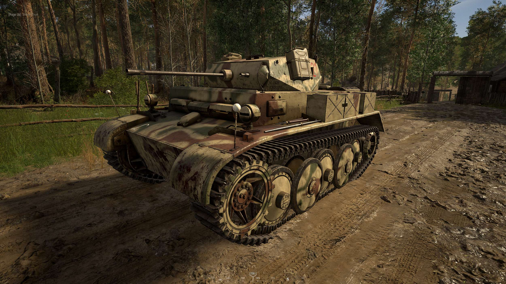
Figure 47: "The Panzerkampfwagen II"

Below are the statistics for hitting American tanks with this thing:

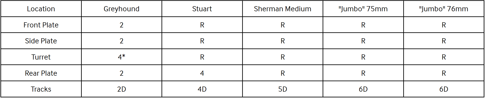

*R - Ricochet or non-penetrating hit*

*#D - # shots to disable module (no hull damage), after which becomes non-penetrating hit*

*#\* - # shots can only be achieved under specific circumstances or in special areas*

When engaging a Greyhound:

* The front plate will penetrate for a 2 shot kill. Because of the speed of the Panzer II canon, this happens very quickly.
* The sides and rear also penetrate for a 2 shot kill.
* Because of the nature of HE in Update 12, the tracks will never kill the tank, only disable the module after 2 shots.
* The turret is 4 shots to kill, but the mantle will ricochet.

When engaging a Stuart:

* The front and side plates ricochet, and the turret at any angle ricochets.
* Hitting the rear will kill the tank in 4 shots, and 3 will disable the engine.
* Because of the nature of HE in Update 12, the tracks will never kill the tank, only disable the module after 4 shots.

When engaging everything else:

* If you have a shot on the tracks and the tank doesn’t see you, you can disable the tracks. Otherwise, don’t bother.
* The Panzer II *cannot* take advantage of the Achilles Heel.

Next, we have the Soviet tanks:

*R - Ricochet or non-penetrating hit*

*#D - # shots to disable module (no hull damage), after which becomes non-penetrating hit*

When engaging a BA-10:

* Aim for anywhere in the front plate. Incidentally this also damages the engine since the BA-10 is an armored car. The sides and rear also penetrate for a 2 shot kill.
* Because of the nature of HE in Update 12, the tracks will never kill the tank, only disable the module after 2 shots.
* The turret is a 4 shot kill anywhere.

When engaging everything else:

* If you have a shot on the tracks and the tank doesn’t see you, you can disable the tracks. Otherwise, don’t bother.
* The Panzer II *cannot* take advantage of the Achilles Heel.

**Opinion:** The Panzer II has a unique place in the range of tanks that Hell Let Loose has to offer. It is the only tank that can fire automatically and has a very large amount of ammunition (8 belts of 20 rounds each, for a total of 180 shells). It has a high top speed and a decent turn rate, with the ability to absorb most enemy "Bazooka", PTRS, Stuart, Greyhound, and BA-10 fire from the front without taking damage. That being said, a good Stuart crew or at player can still penetrate the Panzer II by ricocheting a shell off the bottom of the turret mantle into the top of the chassis, so it loses out in head to head engagements that aren’t against recon vehicles or trucks. Its purpose is solely to engage enemy infantry and lock down areas of effect while hiding behind solid cover. If you try to flank in this thing you will not be able to get any value, since it cannot actually kill any medium or heavy tanks and is still quite vulnerable behind enemy lines, not to mention the unique and easily discernible sound of its auto cannon. On the other hand, picking a safe position and forcing enemy tanks to come to you while you engage enemy infantry is the best strategy with the Panzer II.

### **4.3.2 The Panzerkampfwagen IV**

The German medium tank in Update 12, the Panzer IV, is a mediocre stepping-stone tank that is useful only during the opening few minutes in the game until all of the German tank squads can outfit themselves with the mind-blowingly superior Panther. It has a top speed that is slightly slower than the Sherman medium and, as is standard in Update 12, can penetrate and be penetrated by the other mediums in the game in almost every surface. Its more forgiving driving as well as its armor vs American and Soviet AT players give it the slight edge vs the Sherman medium and the T-34/76 when manned by a capable crew.

The list below shows the unique features that can be used to recognize a Panzer IV in the wild (Figure 48):

* A forest green and beige camouflage (the other German tanks have a tricolor camouflage) .
* A moderately long barrel with a muzzle brake on the end.
* A flat side skirt on top of the tracks that does not extend over the side of them.
* Two extra wheels strapped to the side plate on the right side of the tank (when looking at it from the front).

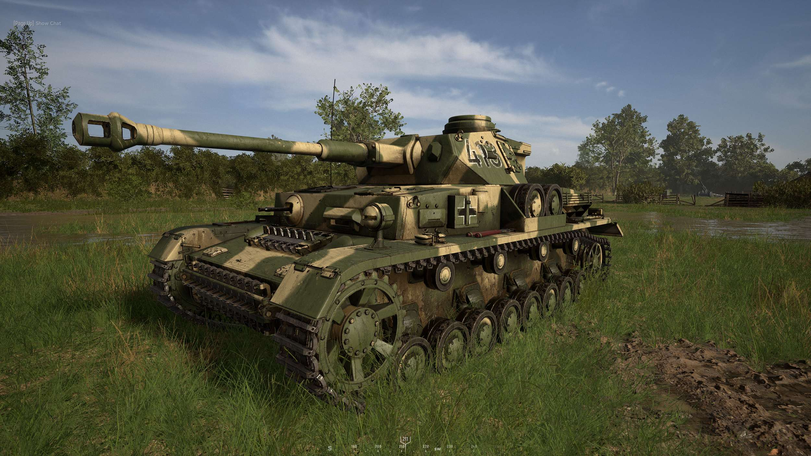

Figure 48: "The Panzerkampfwagen IV"

Below are the general stats. There is a good mix of AP and HE rounds, but the top speed is slightly slower than that of the other mediums.

And here’s how it drives:

The Panzer IV enjoys a very fast 3rd and 4th gear turn speed rivaled only by the T-34/76 and the Panther. This is useful when swerving against enemy AT players, rounding corners, and making maneuvers. It should be noted that the front hull of the Panzer IV sits very low to the ground, so it can snag on even small obstacles such as rocks, rubble piles, dirt mounds, train tracks, etc. If this ever happens, you can quickly downshift to 3rd gear to give yourself some extra leeway and keep your momentum going without stalling. If you aren’t quick enough and stall the tank, you’ll have to go all the way back down to 1st gear. Panzer IV drivers should also note that you should take at least a 45° angle to get over steep berms or obstacles if you wish to stay in 4th gear.

Next up, the interesting bit—the amount of shells it takes to kill enemy tanks—starting with the Americans:

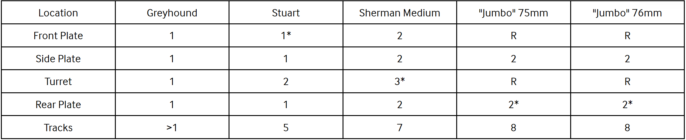

*R - Ricochet or non-penetrating hit*

*#\* - # shots can only be achieved under specific circumstances or in special areas*

When engaging a Greyhound:

* Aim anywhere except the tires—they will take more than 1 shot to kill. You can use an HE shell if you wish to conserve AP shells.

When engaging a Stuart:

* Hit it anywhere in the body for a 1 shot kill. Take care not to hit the tracks or turret, although it’s not the end of the world if you do.
* The top of the side skirt hanging over the tracks on the front of the tank is impenetrable (see [section 4.5.1](#451-the-stuart) for more).

When engaging a Sherman medium:

* The Sherman medium has been fundamentally changed in Update 12. The front plate can now be penetrated by the Panzer IV anywhere except at the sharpest point of the curvature between the tracks. If you want to ensure you hit, aim anywhere at the front plate above the tracks for a 2 shot kill.
* Shooting the turret from the front now penetrates so long as you hit left or right of the mantle. The new Sherman medium’s mantle is relatively small, so you can easily avoid it and kill the Sherman in 3 hits. Aiming at, above, or below the mantle will ricochet, so don’t even try it. You can shoot the turret from the side or rear for 3 shots as well, but this is inadvisable unless that is all you can see. If a Sherman medium is engaging you by only showing you its front turret, then you may have to disengage unless only your turret is visible as well.
* Shooting the side plate above the tracks for a 2 shot kill is also a viable option, and can be done from a relatively shallow angle with respect to the front plate (35°). The new Sherman medium has no rounded surfaces (other than the turret), so you need not worry about ricochets here.
* Shooting the tracks is almost never advisable given the much better aforementioned options.
* As outlined in section 2.10, the [Achilles Heel](#210-the-achilles-heel) shot is a potential tool in the Panzer IV’s arsenal, but it isn’t recommended. This is because the only viable area to land engine damage is very small and you cannot deal hull and engine damage at the same time, meaning you would have to land another 2 shots on the side or rear plates to kill the tank. If you land the shot the engine is disabled with 1 projectile (Figure 23).
* The Panzer IV can penetrate the Sherman medium in the back plate for a 2 shot kill. The first shot kills the engine.

When engaging a Sherman "Jumbo" 75mm/"Jumbo" 76mm:

* Shots to the front plate and all sides of the turret ricochet 100% of the time, and thus are inadvisable to aim for.
* Hitting the side will kill a "Jumbo" in 2 shots. This can be done at a relatively shallow angle exactly 35° with respect to the front plate (55° with respect to the perpendicular).
* The [Achilles Heel](#210-the-achilles-heel) shot is viable. Since the Panzer IV can penetrate the side plate of the "Jumbo"s, both the red and green outlines are penetrable and both will disable the engine in 1 shot (Figure 23). Hitting the red outline is relatively simple, provided you are at the right angle—aim at the large gap between the last and 2nd to last cog in the tracks and penetrate the side. This is a great way to cripple enemy "Jumbo" tanks, allowing your teammates in Panthers or Tigers to dispatch them easily or opening them up for a flank, and is one of the few counterplay maneuvers that a Panzer IV can employ against a "Jumbo".
* Hitting the tracks is inadvisable since it takes a long time to kill them, and if the "Jumbo" turns around to face your tank, you lose the opportunity to kill it through the tracks.
* Shooting the back plate is a 2 shot from any angle if you get the opportunity to do so. The first shot kills the engine. When shooting the rear, care must be taken to avoid the bags of equipment and fuel canisters on the rear of these tanks, outlined in [section 4.5.2](#452-the-jumbo), as these areas will not penetrate. Aim below them.

Having said all that, let’s move on to the Panzer IV’s performance against the Soviet tanks. This area of the game is probably where the most interesting tank vs tank engagements occur because of the deviation from the game’s standardization. Here is the table:

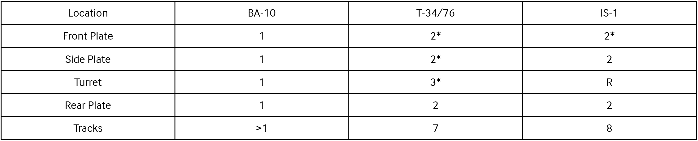

*R - Ricochet or non-penetrating hit*

*#\* - # shots can only be achieved under specific circumstances or in special areas*

When engaging a BA-10:

* Aim anywhere except the tires—they will take more than 1 shot to kill. You can use an HE shell if you wish to conserve AP shells.

When engaging a T-34/76:

* The T-34/76 can be penetrated anywhere in the front plate for a 2 shot kill provided the shot is either perpendicular to the front of the tank or within 35° degrees from the perpendicular. If the T-34/76 angles between 35° and 40° with respect to the Panzer IV, the majority of the front plate and the side will *not* penetrate but rather ricochet. Even in this scenario, however, the part of the front plate between the tracks that is angled towards the floor is still penetrable. To illustrate this dynamic, see Figure 49.
* Shooting the turret of a T-34/76 in a Panzer IV will kill it in 3 shots except in the mantle. Because the mantle ricochets and because it takes up the majority of the front of the turret, penetrating the turret from the front can be a challenge. There are two ways to go about this. The first shot consists of the sides of the turret that stick out to the left and right of the mantle in triangular shapes, also known as the "cheeks". Because of the small profile of the T-34/76 turret, this shot is exceedingly hard to land at any distance over 100m and is generally not advised. The second shot is the part of the turret that is directly above the mantle. This area, known as the "forehead", is a very thin line above the mantle that, if hit, will penetrate the turret. Any higher than that small area will go over the tank, and any lower will ricochet off the turret (Figures 50 and 51). Although the "forehead" seems like a harder shot than the "cheeks", because of the way the hitboxes of the turret are constructed, at ranges longer than 100m it is actually an easier shot to hit. As for the sides and rear of the turret, all hits here penetrate for a 3 shot kill.
* Shooting the side plate above the tracks for a 2 shot kill is also a viable option, but as mentioned before will only start penetrating at a 35° angle with respect to the side’s front (55° from the side’s perpendicular).
* Shooting the tracks is almost never advisable given the much better aforementioned options.
* The [Achilles Heel](#210-the-achilles-heel) shot is possible, but the T-34/76 has no area where you can damage the engine and the hull at the same time by shooting through the tracks. Shooting anywhere in the green section will kill the engine with 1 projectile (Figure 23).
* The Panzer IV can penetrate the T-34/76 in the back plate for a 2 shot kill. The first shot kills the engine.

##
<figure style="max-width: 600px; margin: auto;">
  <video controls style="width: 100%; height: auto;">
    <source src="videos/f49.mkv" type="video/mp4">
    Your browser does not support the video tag.
  </video>
</figure>
Figure 49: "Angled T-34/76 and Where To Hit It"

Note how at the critical angle of 35° to 40° with respect to the Panzer IV, both side plate and most of the front plate ricochets Panzer IV shells. Only the small front plate between the tracks penetrates at this angle.

##

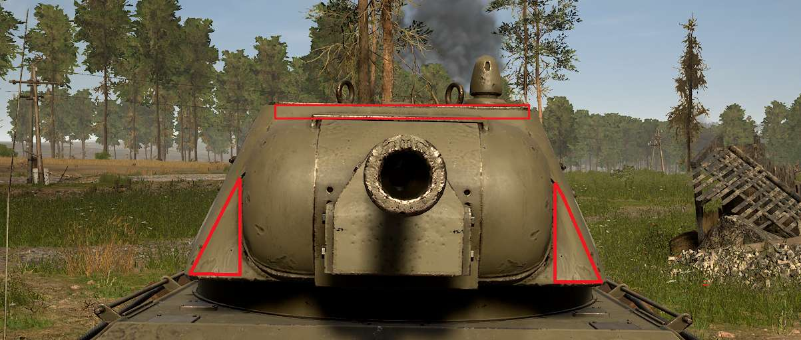
Figure 50: "Penetrable Spots on the T-34/76 Turret"

<figure style="max-width: 600px; margin: auto;">
  <video controls style="width: 100%; height: auto;">
    <source src="videos/f51.mkv" type="video/mp4">
    Your browser does not support the video tag.
  </video>
</figure>
Figure 51: "Panzer IV Penetrating the T-34/76 ‘Forehead’"

When engaging an IS-1:

* The Panzer IV *can* actually shoot the IS-1 in the front in a very specific spot. The way it works is this: there are two slanted portions of the IS-1’s front plate under the turret that connect to the side plate, known as the "shoulders". Those can be penetrated for a 2 shot kill (Figure 52). The catch is that, based on the angle, only one of the two areas can be hit at any given time, the other will always ricochet. If the IS-1’s body is angled as little as 2° with respect to the Panzer IV, the side that is closer to the Panzer IV will always penetrate and the side that is farther will always ricochet. On top of that, if the IS-1’s body is directly facing you down to the exact numerical bearing, *neither* of these two front plates will penetrate. To illustrate this, see Figures 53, 54, 55, and 56 below. Any other part of the front plate will ricochet at any angle.
* In public matches, most engagements with IS-1’s will be at some angle, allowing you to hit these shots. That being said, the best IS-1 tankers will turn to directly face your Panzer IV if they are penetrated, making it impossible for you to penetrate a second time and forcing you to have to reposition. One way of getting around this is working with another friendly tank to secure the kill. Since the IS-1 cannot face towards two tanks at the same time, at least one of the tanks will be able to take advantage of this shot.
* Despite being able to penetrate the front, the IS-1 can still kill you in the Panzer IV with 1 shot to the body. If you want to engage an IS-1 front on, make sure you are engaging somewhere where only your turret is showing and where you can easily back out and repair if shot, such as the top of the hill at windmills on Kursk. This will force the engagement to 2 shot vs 2 shot scenario (with the Panzer IV having a faster reload), similar to the normal dynamic of a Panther against an IS-1.
* Hitting the side will kill an IS-1 in 2 shots. This can be done at a relatively shallow angle of about 35° with respect to the front plate (55° with respect to the perpendicular).
* The turret is impenetrable everywhere.
* The [Achilles Heel](#210-the-achilles-heel) shot is viable. Since the Panzer IV can penetrate the side plate of the IS-1, both the red and green outlines are penetrable and both will disable the engine in 1 shot (Figure 23). Hitting the red outline is relatively simple, provided you are at the right angle—aim at the large gap between the last and 2nd to last cog in the tracks and penetrate the side. This is a great way to cripple enemy IS-1 tanks, allowing your teammates to dispatch them easily or opening them up for a flank.
* Hitting the tracks is inadvisable given the aforementioned shots.
* Shooting the back plate is a 2 shot from any angle if you get the opportunity to do so. The first shot kills the engine. Do not hit the cylindrical canisters hanging off either side of the rear, as these will not penetrate (see [section 4.5.9](#459-the-is-1) for an illustration of this).

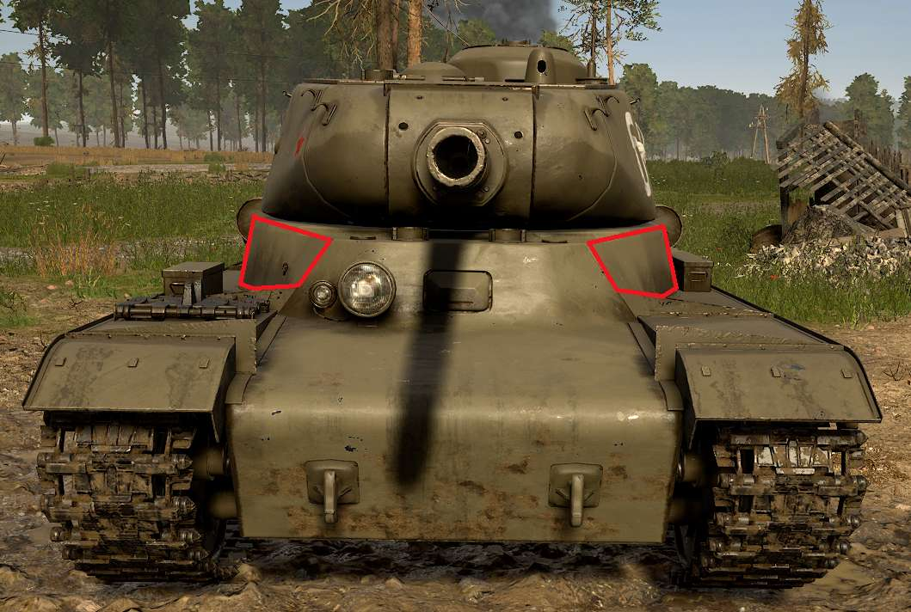
Figure 52: "Where to Penetrate an IS-1 in a Panzer IV, A.K.A. ‘Shoulders’"

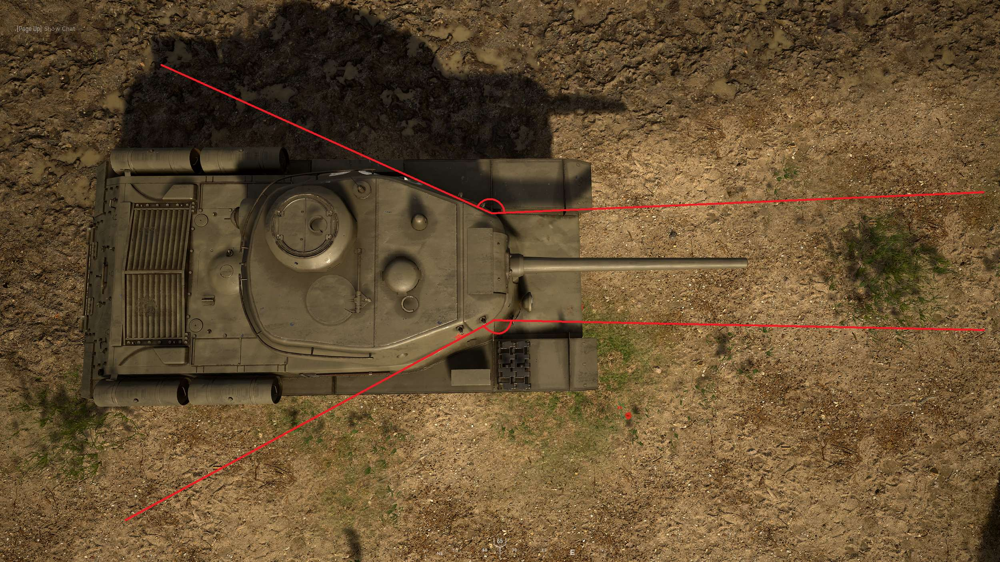
Figure 53: "Angles Needed to Hit ‘Shoulders’ on IS-1 as a Panzer IV"

If your tank shell lands anywhere within the two obtuse angles illustrated above, it will penetrate the tank. Note that because of the nature of the angles, you can never hit both at the same time. Additionally, if you are directly facing the tank, you will not be able to hit either of them.

<figure style="max-width: 600px; margin: auto;">
  <video controls style="width: 100%; height: auto;">
    <source src="videos/f54.mkv" type="video/mp4">
    Your browser does not support the video tag.
  </video>
</figure>
Figure 54: "IS-1 Angled 2**°** to the Left with Respect to the Panzer IV"

<figure style="max-width: 600px; margin: auto;">
  <video controls style="width: 100%; height: auto;">
    <source src="videos/f55.mkv" type="video/mp4">
    Your browser does not support the video tag.
  </video>
</figure>
Figure 55: "IS-1 Angled 2**°** to the Right with Respect to the Panzer IV"

<figure style="max-width: 600px; margin: auto;">
  <video controls style="width: 100%; height: auto;">
    <source src="videos/f56.mkv" type="video/mp4">
    Your browser does not support the video tag.
  </video>
</figure>
Figure 56: "IS-1 Directly Facing the Panzer IV"

When the IS-1 is angled to the left with respect to the Panzer IV, only the right "shoulder" penetrates. When the IS-1 is angled to the right with respect to the Panzer IV, only the left "shoulder" penetrates. When the IS-1 faces directly toward the Panzer IV, neither the left nor the right "shoulders" will penetrate. This means that spotters and gunners in the Panzer IV have to be able to quickly discern which of the two "shoulders" is closer to them based on the orientations of both tanks, and make a judgement call in the moment as to which one to hit. As you can see in the above figures, there isn’t a very large difference between angles only a few degrees apart, so this may take some practice.

**Opinion:** In conclusion, Update 12’s Panzer IV is slightly better than the other medium tanks in the game but at the end of the day, it’s still a medium tank. It has armor that any medium in the game can penetrate anywhere while having a gun that, depending on the circumstances, can sometimes have difficulty penetrating the front plate of the other mediums. On the flip side, however, it can go toe to toe with the IS-1 heavy tank under the right conditions, and has significantly better turn speed and mobility at the higher gears than many other tanks improving its ability to survive on the battlefield. The combination of increased maneuverability, reduced vulnerability to enemy AT’s (they can only hit the rear with rockets) and large and balanced ammunition supply give it a slight edge during the opener and for anti-infantry operations. After the first heavies are on the field, however, the Panzer IV loses all of its sheen and the need to replace it with the strictly better Panther becomes urgent.

Against the Americans, the Panzer IV can afford to take more aggressive positions during the opening few minutes of the match due to its armor and mobility. You can even flank with this thing due to its fast turn speed, but care should be taken to avoid getting stuck on obstacles due to the peculiarities of the Panzer IV’s front bumper (as well as avoid enemy heavy tanks, of course). The Soviets are a whole different ball game. Since a good Panzer IV crew is a threat to both T-34/76’s and IS-1’s, it can take a more aggressive anti-tank stance, allowing it to actively seek out enemy tanks even past the opener instead of just locking down infantry behind cover after the first heavies arrive. Ideally this is done in pairs or with the help of a Panther or Tiger to ensure at the very least a trade occurs. Flanking is an inadvisable strategy against the Soviets, since the PTRS can disable your engine extremely quickly with just 1 clip and the Soviet maps are less conducive to flanking in general. The bottom line is that the Panzer IV is satisfactory for the opener stage of the game but crews must be careful not to overstay their welcome in it when they could be driving around a Panther.

### **4.3.3 The Panzerkampfwagen V "Panther"**

The Panther is back, baby! And let Tank God himself smite me where I sit if this tank isn’t the most over-powered, broken metal box on wheels to have **ever existed** in this game. It’s not for us mere mortals to understand why the developers saw fit to give the Panther all the armor and firepower of a heavy **AND** the mobility and speed of a medium tank. All I can say for sure is that if you are on the German side, USE THIS THING.

We’ll get into the glorious specifics below, but first thing’s first: what does it look like (Figure 57)?

* Slanted front and side plates. The other German tanks are boxy.
* A side skirt that extends partially over the side of the tracks.
* A weird, rough texture on the front and side plates as well as the turret.
* Extra tracks strapped to the rear end of the side plate.

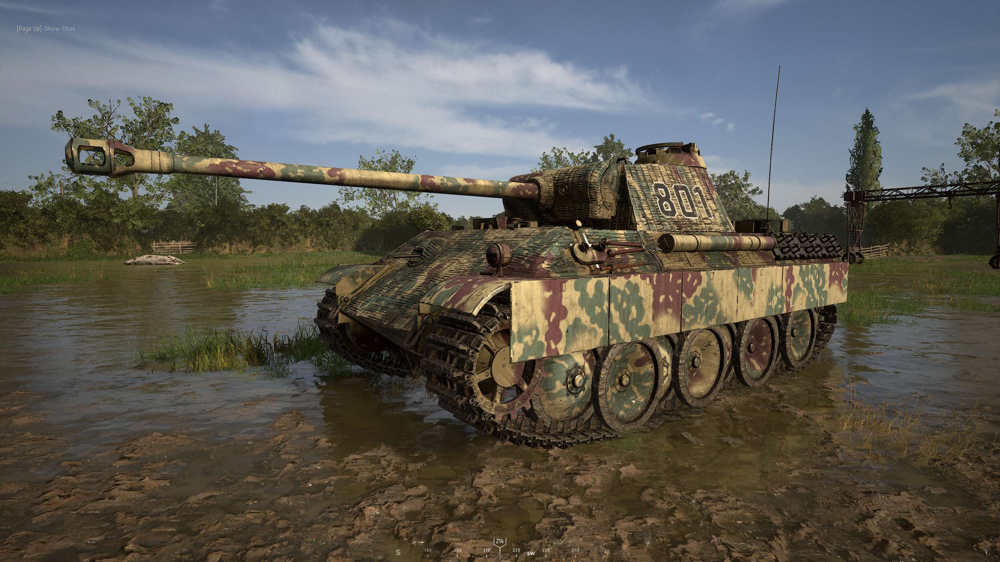

Figure 57: "The Panzerkampfwagen V ‘Panther’"

Let’s start with the stats:

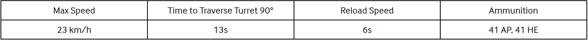

By far the most important change in Update 12 to the tank meta is the reload speed of the Panther. As we will see below, the Panther is a heavy tank in terms of its ability to penetrate enemy heavies as well as its ability to be penetrated by other heavies. Unlike other heavies, however, the Panther has the reload speed of a medium tank (6 seconds instead of 8 seconds). This means that all else being equal, in a head to head engagement, the Panther will usually win due simply to the fact that it can land the killing blow more quickly than its opponents can.

Another thing to notice is the top speed. Heavies like the "Jumbo"s and the Tiger have a top speed of 18-19 km/h, whereas mediums like the Panzer IV and the Sherman medium have a top speed of 22-25 km/h. The Panther has a top speed of 23 km/h, in line with the rest of the medium tanks. This means that together with the reload speed, the Panther has the best qualities of the medium tanks while retaining the best qualities of the heavy tanks.

Next, let’s look at the mobility of the Panther:

As if the stats of the Panther were not already stacked enough, it turns out that the Panther has the highest 3rd and 4th gear turn speed of any heavy in the game, even rivaling that of the mediums (which are supposed to have more mobility). Interestingly, the Panther has a unique quirk among the rest of the tanks in the game in that its 4th gear turn speed is actually its fastest turn speed (usually the 3rd gear or 1st gear are the fastest gears). The Panther’s mobility coupled with its high top speed allows Panther drivers to really whip this thing around and get to places faster than most other tanks. By contrast, the Panther’s 1st gear and reverse turn speeds are much slower than other heavies like the Tiger and the "Jumbo"s, which promotes really aggressive flank gameplay where you never stop moving. Unlike some of the more recently introduced tanks, the Panther has no trouble getting over obstacles and berms or performing any of the mobility tricks outlined in [section 2.6.2](#262-advanced-agility-techniques-mlg-only), allowing it to adopt this style of play easily, and its driver viewport takes up almost the entire screen, affording the Panther driver much greater visibility than drivers of other factions’ heavy tanks.

Finally, we come to the good stuff. How does it handle against American tanks?

*#\* - # shots can only be achieved under specific circumstances or in special areas*

When engaging a Greyhound:

* Aim anywhere except the tires—they will take more than 1 shot to kill. You can use an HE shell if you wish to conserve AP shells.

When engaging a Stuart:

* Hit it anywhere in the body for a 1 shot kill. Take care not to hit the tracks or turret, although it’s not the end of the world if you do.
* The top of the side skirt hanging over the tracks on the front of the tank is impenetrable (see [section 4.5.1](#451-the-stuart) for more).

When engaging a Sherman medium:

* The Sherman medium is a 1 shot kill anywhere in the front, side, or rear plates. Easy peezy, lemon squeazy.
* If you for some reason cannot hit the body, shoot the turret anywhere twice for a kill. Ricochets are hard to do here, so don’t discriminate.
* Do not hit the tracks.
* As outlined in section 2.10, the [Achilles Heel](#210-the-achilles-heel) shot is possible, but practically useless since you can kill it in 1 shot to the side armor.
* It should be noted here that the Sherman medium can penetrate you for a 3 shot kill from the front by hitting the "cheeks" of your turret. If you notice this, don’t panic too much—he has to land 3 shots on you and you need only land 1 shot on it, so stay calm, find the bugger, and blow him to smithereens.

When engaging a Sherman "Jumbo" 75mm/"Jumbo" 76mm:

* You can kill these tanks in 2 shots to the front plate. Care must be taken to avoid the rounded portion of the transmission towards the bottom of the hull between the tracks because that will ricochet unless the shell is perfectly perpendicular to the surface. (Figure 58).
* Another very viable 2 shot kill strategy is aiming for the side plate. Even if you can see only a sliver of the side plate, you can land the shot. You should only do this if you cannot see the front plate or turret mantle for some reason.
* The difference in cannons between the Panther and the 76mm "Jumbo" Sherman drastically changes the urgency of the engagement. Since the Panther and the "Jumbo" both need to land the same shots but the Panther has a faster reload speed, this means that the Panther has 2 full extra seconds of leeway in a head to head engagement to acquire the target and take careful aim. Even if a Panther gets hit first, it can still win the engagement by simply penetrating within 2 seconds of getting hit since it will still reload the 2nd round faster than the "Jumbo" can.
* If you encounter a "Jumbo" 75mm meme tank in the field, congratulations! You have met an exceedingly rare specimen and you have the tremendous honor of killing the last of its species. Similar to the Sherman medium, it needs to land 3 shots to the "cheeks" of the Panther turret while the Panther can aim anywhere in the body or turret for just 2 shots, making this engagement a bit of a joke especially considering the Panther’s 2 second faster reload speed.
* Shooting the turret from the front in the mantle is a 2 shot kill, but if you hit the slanted portions of the turret to either side of the mantle or the top of the turret itself, you will ricochet. The cupola also ricochets. If you can only see the side or rear of the turret, you can still penetrate for a 2 shot kill, but it’s easy to ricochet here since the turret itself is round.
* As outlined in section 2.10, the [Achilles Heel](#210-the-achilles-heel) shot is viable, but not strictly necessary in a Panther. If you are able to see the side of a "Jumbo", you likely already have the kill secured since you can shoot the first shot and have a faster reload, but killing the "Jumbo"s engine guarantees that it will not be able to shoot back and damage your tank, forcing you to repair. Both the green and red sections are penetrable in the Panther, but hitting the red section by aiming between the tracks is optimal since it does hull damage as well as engine damage (Figure 23).
* Of course, 2 shots to the back plate at any angle will kill it, with 1 shot killing the engine. When shooting the rear, care must be taken to avoid the bags of equipment on the rear of these tanks, outlined in [section 4.5.2](#452-the-jumbo), as these areas will not penetrate. Aim below them.

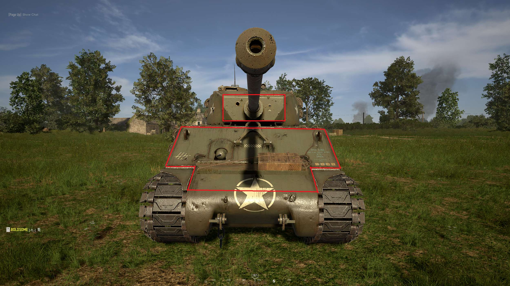

Figure 58: "Where to Hit the "Jumbo" Sherman as a Panther or Tiger"

The Soviets are a similar story:

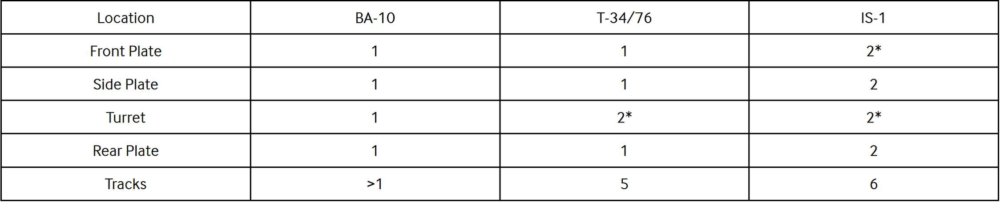

*#\* - # shots can only be achieved under specific circumstances or in special areas*

When engaging a BA-10:

* Aim anywhere except the tires—they will take more than 1 shot to kill. You can use an HE shell if you wish to conserve AP shells.

When engaging a T-34/76:

* The T-34/76 can be 1 shot anywhere in the front, side, and rear plates. It cannot save itself even if it angles the body, so shoot away.
* The mantle of the T-34/76’s turret will ricochet even Panther shots. Shooting any other part of the turret of a T-34/76, including the "cheeks" and "forehead" outlined in Figure 50, will kill it in 2 shots.
* Do not hit the tracks.
* The [Achilles Heel](#210-the-achilles-heel) shot is possible, but practically useless since you can kill it in 1 shot to the side armor.

When engaging an IS-1:

* The Panther can 2 shot kill an IS-1 in the large flat front plate between the tracks as well as the smaller flat front plate right below the turret under the barrel (Figure 59). If you connect with the long part of the front armor that faces upwards, perpendicular to the other plates, you will ricochet. This may result in the shell ricocheting into the flat part of the front plate anyway and penetrate that, but if you want to reliably destroy IS-1’s, make sure to avoid aiming for that area.
* With regards to the IS-1’s "shoulders", the Panther’s ability to penetrate them is the same as the Panzer IV’s ability to penetrate them. The "shoulder" that is closer to the Panther will penetrate, and the farther one will ricochet. If the IS-1 is directly facing the Panther, both "shoulders" will ricochet. For more on this, see Figures 52-56 in the [Panzer IV](#432-the-panzerkampfwagen-iv) section. That being said, is not recommended to even aim for this shot, since the other body shots are much more reliable.
* Hitting the side plate will kill an IS-1 in 2 shots. This can be done even if you only see a sliver of the side from the front, but is not recommended since the aforementioned shots are superior.
* The turret can be killed in 2 shots as well, but is a little finicky. This is because the entire turret, including the mantle, is rounded off, meaning the vast majority of shots aimed here will ricochet. Only a very small square on either side of the barrel, where the mantle’s curvature makes it flat enough with respect to the Panther’s shell to pierce, can be penetrated (Figure 59). Everywhere else will ricochet.
* The Panther has the reload speed advantage against the IS-1, so head to head engagements should come out in favor of the Panther, but keep in mind that clever IS-1 tankers will obscure their bodies behind cover and only peek with their turrets, meaning you have to aim for a relatively tiny surface and penetrate it twice to kill.
* The turret’s cupola and the inside of the barrel will penetrate, but will never do hull damage. Instead, they simply disable the turret.
* The [Achilles Heel](#210-the-achilles-heel) shot is applies. Since the Panther can penetrate the side plate of the IS-1, both the red and green outlines are penetrable and both will disable the engine in 1 shot (Figure 23). Hitting the red outline is relatively simple, provided you are at the right angle—aim at the large gap between the last and 2nd to last cog in the tracks and penetrate the side. This shot is not recommended in the Panther vs the IS-1 because the IS-1’s slow turn speed coupled with the Panther’s fast reload speed means that if the Panther is at the correct angle for the Achilles Heel, it can simply shoot the IS-1 in the side or rear twice before the IS-1 can respond.
* Hitting the tracks is inadvisable given the aforementioned shots.
* Shooting the back plate is a 2 shot from any angle if you get the opportunity to do so. The first shot kills the engine. If aiming from the rear, do not hit the cylindrical canisters hanging off either side of the rear, as these will not penetrate (see [section 4.5.9](#459-the-is-1) for an illustration of this).

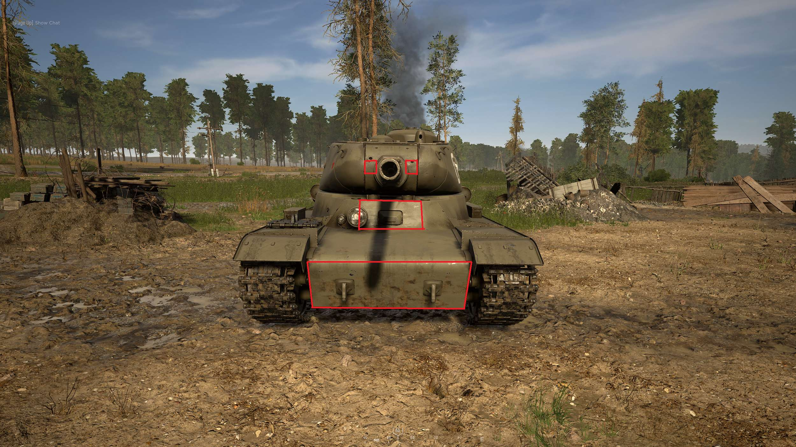

Figure 59: "Where to Penetrate the IS-1 as a Panther or Tiger"

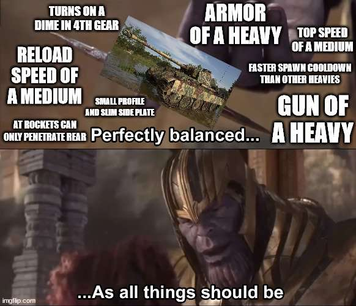

Figure 60: "A Quote From the Developers of Hell Let Loose"

**Opinion:** This thing is busted—there’s no two ways about it. It’s 6 second reload speed and cannon penetration allow it to take on any other heavy with ease as well as shell infantry more effectively, its heavy armor lets it shrug off enemy medium tanks and AT players (who can only hit the Panther in the rear by the way), and its mobility allows it to get to positions and get in cover significantly faster than other heavies and even other mediums. The Panther can outmaneuver and outflank any other non-light tank in the game while maintaining the ability to go toe to toe with heavies, mediums, at guns and rockets alike. It’s side plate has a very small surface area, making it hard to hit on the move, and the tank itself has a lower profile than the Tiger or 76mm "Jumbo" ever did. The Panther can fit in places that the Tiger never could, and it does not have as much trouble turning in tight spaces like other heavies. On top of this already gigantic pile of bonuses, the Panther also has a spawn cooldown that is a full **50 seconds** shorter (4 minutes and 10 seconds) than that of the other heavies in the game (5 minutes flat), meaning that these tanks can get spammed out into the field faster than allied tanks can. This further snowballs the Panther’s already massive advantages because over the course of a full 90 minute game, assuming infinite fuel, the axis team can spawn a total of 3.5 more Panthers than the allies can spawn "Jumbo" 76’s or IS-1’s.

The Panther’s mobility is a massive asset that should not be overlooked. With the fastest top speed and fastest 3rd/4th gear turn speed of any heavy tank by far (better than even most mediums), the Panther can get to positions first, reposition quickly, get to cover quickly if it gets shot on the move, and flank around enemy lines easily. You should be using and abusing this in the Panther—once you kill the enemy heavy tanks that are the only real threat to you, you should be holding the "W" key and burning OPs, garrisons, and taking aggressive positions where you can shell enemy infantry from the rear. You have a gigantic schlong in the Panther, so make sure you let everyone else on the enemy team know that. Flank enemy tanks, run around in the backline if you want to, the world is your oyster! The most effective flank strategies are hit and run attacks where you fly in, pick up a kill on a marked tank, then immediately bolt to a different position before enemy infantry can react. The emphasis is on staying in 3rd or 4th gear as much as possible when you are in the backline (especially since one of the Panther’s weaknesses is an abysmally slow 1st gear/reverse turn speed).

But what about the Panther’s weaknesses? Well, there aren’t many. The first one is the one I just mentioned, the fact that the Panther has a slow 1st gear and reverse turn speed. This can be a problem when you are dealing with AT or are in a contested position, but can be mitigated by staying on the move in 4th gear or playing with your infantry. The second weakness is the fact that the Panther’s turret can be penetrated from the front by enemy medium tanks. This is not so much of a weakness as it is an annoyance, but if you aren’t careful a good crew in a medium tank *can*, in theory, land 3 shots in your turret before you find them if your spotter is wetting the bed. That’s it. Those are all it’s weaknesses.

In conclusion, the Panther is **the best tank to ever have existed in Hell Let Loose** because of its perfect combination of all of the mobility and reload speed strengths of a medium tank and the armor and firepower of a heavy tank (Yes, even better than in Update 7). You should take every opportunity to get into a Panther in any match you play before the developers realize what a colossal mistake they have made.

### **4.3.4 The Panzerkampfwagen VI "Tiger I"**

In Update 12, the Tiger I tank has been reduced to off-brand Oreo status. It has not been directly changed—it still has a main cannon that can penetrate every tank in the game on almost any surface, armor that is difficult to penetrate by any tank other than a heavy, and a quick 1st gear/reverse turn speed—but the introduction of the insanely buffed Panther heavy tank at the exact same 600 fuel cost has made the Tiger essentially obsolete. Everything that the Tiger can do the Panther can do better. Most of this section will be showing why the Panther is better than the Tiger through direct comparison in every category.

First off, what does it look like? The Tiger is unmistakable on the battlefield, and can be spotted by looking for these features (Figure 61):

* Size. The Tiger is the widest and longest tank in the game.
* There is a beige/red/green tricolor camouflage pattern on the hull that somewhat resembles a tiger’s stripes.
* A very long main cannon with a muzzle brake on the end.
* A turret with spiked treads attached to its side.

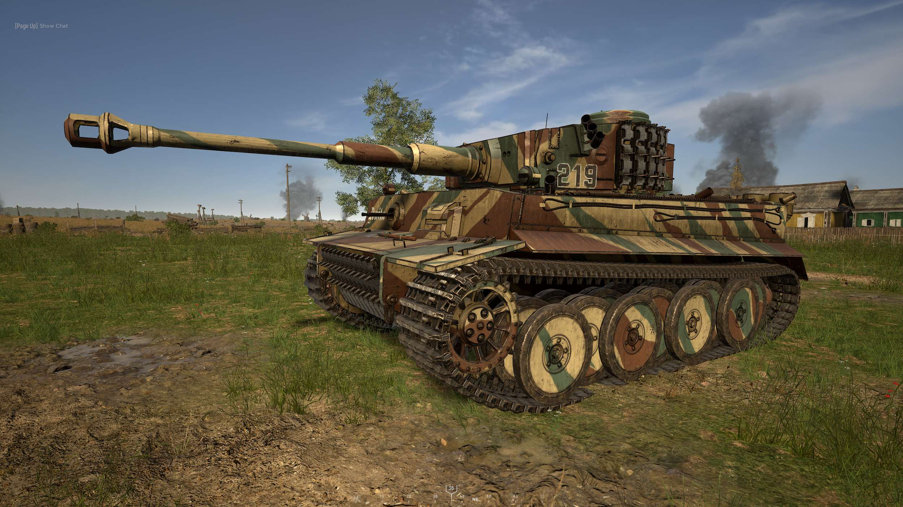
Figure 61: "The Panzerkampfwagen VI ‘Tiger I’"

The Tiger’s baseline stats are below:

The Tiger has a 2 second slower reload speed than the Panther, putting it at the same level as the "Jumbo" 76mm and the IS-1. It also drives 5km/h slower than the Panther on average (which is more than you think when translated to in-game speed).

Next are the driving stats. As you can see, the Tiger has a good 1st gear/reverse turn speed but really poor 2nd, 3rd, and 4th gear turn speeds.

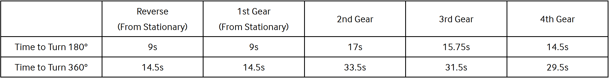

The Tiger has a much faster 1st gear and reverse turn speed than the Panther, almost twice as fast. This one caveat is nice, because it means that the Tiger can respond quickly to AT threats behind it when it is stationary and compliments a far back, static style of play well. That being said, the Panther’s 3rd and 4th gear turn speeds are still faster than *any* of the Tiger’s gears, and I need not tell you dear reader how abysmal 29.5 seconds is for a full turn in 4th gear. Another thing to note is that in Update 12, the Tiger’s driver window has been enlarged to fit almost the entire screen, meaning that the driver’s field of view is much greater than that of other heavies such as the "Jumbo" 76mm.

The Tiger’s cannon is just a slower version of the Panther’s, so it’s chart is the same:

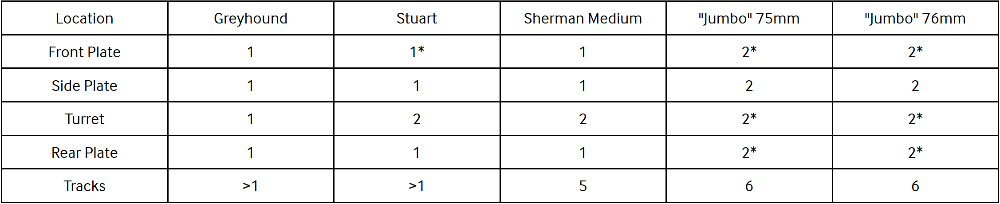

*#\* - # shots can only be achieved under specific circumstances or in special areas*

When engaging a Greyhound:

* Aim anywhere except the tires—they will take more than 1 shot to kill. You can use an HE shell if you wish to conserve AP shells.

When engaging a Stuart:

* Hit it anywhere in the body for a 1 shot kill. Take care not to hit the tracks or turret, although it’s not the end of the world if you do.
* The top of the side skirt hanging over the tracks on the front of the tank is impenetrable (see [section 4.5.1](#451-the-stuart) for more).

When engaging a Sherman medium:

* The Sherman medium is a 1 shot kill anywhere in the body. Don’t overthink it and don’t waste your time.
* If you for some reason cannot hit the body, shoot the turret anywhere twice for a kill. Ricochets are hard to do here, so don’t discriminate.
* Do not hit the tracks.
* As outlined in section 2.10, the [Achilles Heel](#210-the-achilles-heel) shot is possible, but practically useless since you can kill it in 1 shot to the side armor.
* While the Sherman medium can penetrate the Tiger in the front by ricocheting off of the bottom mantle into the top of the chassis, this shot is hard to hit and can only be done from under 300m, so don’t worry too much about it. Simply turn your front body to avoid giving away side plate and obliterate the medium.

When engaging a Sherman "Jumbo" 75mm/76mm:

* You can kill these tanks in 2 shots to the front plate. Care must be taken to avoid the rounded portion of the transmission towards the bottom of the hull between the tracks because that will ricochet unless the shell is perfectly perpendicular to the surface. (Figure 58).
* Another very viable 2 shot kill strategy is aiming for the side plate. Even if you can see only a sliver of the side plate, you can land the shot. You should only do this if you cannot see the front plate or turret mantle for some reason.
* The trick to engaging an enemy "Jumbo" 76mm from the front is landing the first shot. Since the Tiger and the "Jumbo" both have the same reload speed, the crew that lands the first shot will be the crew that wins the engagement, assuming all subsequent shots land.
* The difference in cannons between the 75mm and the 76mm "Jumbo" Shermans drastically changes the urgency of the engagement. The 76mm can kill the Tiger in 2 shots almost anywhere while the 75mm has to land a very difficult and situational shot that depends on a lot of variables, giving you a lot more time. This means that you can take your time when engaging the 75mm and it's not the end of the world if you miss a shot, but landing both shots and quickly destroying the 76mm is imperative. If a 76mm lands the first shot on you, the best course of action is to immediately disengage to cover.
* Shooting the turret from the front in the mantle is a 2 shot kill, but if you hit the slanted portions of the turret to either side of the mantle or the top of the turret itself, you will ricochet. The cupola also ricochets. If you can only see the side or rear of the turret, you can still penetrate for a 2 shot kill, but it’s easy to ricochet here since the turret itself is round.
* As outlined in section 2.10, the [Achilles Heel](#210-the-achilles-heel) shot is not just viable, but the recommended way to deal with "Jumbo"s provided you are at the correct angle. If you are able to see the side of a "Jumbo", you likely already have the kill secured since you can shoot the first shot, but killing the "Jumbo"s engine guarantees that it will not be able to shoot back and damage your tank, forcing you to repair. Both the green and red sections are penetrable in the Tiger, but hitting the red section by aiming between the tracks is optimal since it does hull damage as well as engine damage (Figure 23).
* Of course, 2 shots to the back plate at any angle will kill it, with 1 shot killing the engine. When shooting the rear, care must be taken to avoid the bags of equipment on the rear of these tanks, outlined in [section 4.5.2](#452-the-jumbo), as these areas will not penetrate. Aim below them.

Now, onto what we can learn from engagements with the Soviet tanks:

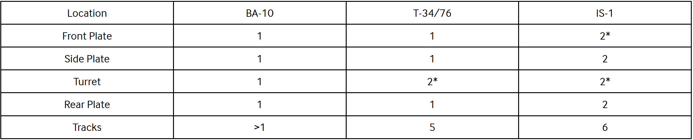

*#\* - # shots can only be achieved under specific circumstances or in special areas*

When engaging a BA-10:

* Aim anywhere except the tires—they will take more than 1 shot to kill. You can use an HE shell if you wish to conserve AP shells.

When engaging a T-34/76:

* The T-34/76 can be 1 shot anywhere in the front, side, and rear plates. It cannot save itself even if it angles the body, so shoot away.
* The mantle of the T-34/76’s turret will ricochet even Tiger shots. Shooting any other part of the turret of a T-34/76, including the "cheeks" and "forehead" outlined in Figure 50, will kill it in 2 shots.
* Do not hit the tracks.
* The [Achilles Heel](#210-the-achilles-heel) shot is possible, but practically useless since you can kill it in 1 shot to the side armor.

When engaging an IS-1:

* The Tiger can 2 shot kill an IS-1 in the large flat front plate between the tracks as well as the smaller flat front plate right below the turret under the barrel (Figure 59). If you connect with the long part of the front armor that faces upwards, perpendicular to the other plates, you will ricochet. This may result in the shell ricocheting into the flat part of the front plate anyway and penetrate that, but if you want to reliably destroy IS-1’s, make sure to avoid aiming for that area.
* With regards to the IS-1’s "shoulders", the Tiger’s ability to penetrate them is the same as the Panzer IV’s ability to penetrate them. The "shoulder" that is closer to the Tiger will penetrate, and the farther one will ricochet. If the IS-1 is directly facing the Tiger, both "shoulders" will ricochet. For more on this, see Figures 52-56 in the [Panzer IV](#432-the-panzerkampfwagen-iv) section. That being said, is not recommended to even aim for this shot, since the other body shots are much more reliable.
* The trick to engaging an enemy IS-1 from the front is landing the first shot. Since the Tiger and the IS-1 both have the same reload speed, the crew that lands the first shot will be the crew that wins the engagement, assuming all subsequent shots land.
* Hitting the side will kill an IS-1 in 2 shots. This can be done even if you only see a sliver of the side from the front, but is not recommended since the aforementioned shots are superior.
* The turret can be killed in 2 shots as well, but is a little finicky. This is because the entire turret, including the mantle, is rounded off, meaning the vast majority of shots aimed here will ricochet. Only a very small square on either side of the barrel, where the mantle’s curvature makes it flat enough with respect to the Tiger’s shell to pierce, can be penetrated (Figure 59). Everywhere else will ricochet.
* The turret’s cupola and the inside of the barrel will penetrate, but will never do hull damage. Instead, they simply disable the turret.
* The [Achilles Heel](#210-the-achilles-heel) shot is applies. Since the Tiger can penetrate the side plate of the IS-1, both the red and green outlines are penetrable and both will disable the engine in 1 shot (Figure 23). Hitting the red outline is relatively simple, provided you are at the right angle—aim at the large gap between the last and 2nd to last cog in the tracks and penetrate the side. If you are at the right angle you should always take this shot so that the IS-1 does not have the opportunity to turn around and damage your tank, forcing you to repair.
* Hitting the tracks is inadvisable given the aforementioned shots.
* Shooting the back plate is a 2 shot from any angle if you get the opportunity to do so. The first shot kills the engine. If aiming from the rear, do not hit the cylindrical canisters hanging off either side of the rear, as these will not penetrate (see [section 4.5.9](#459-the-is-1) for an illustration of this).

**Opinion:** The Tiger has been a staple of Axis tanking for years, but Update 12 has cast the Tiger into Panther’s shadow. The Panther has better mobility, a faster reload, a smaller chassis, and a higher top speed without any additional significant weaknesses to balance it out when compared to the Tiger. For the same 600 fuel cost, there is simply no reason to ever spawn or use a Tiger instead of a Panther. While it’s true that the Tiger has not been changed at all in Update 12 (except the enlarging of its driver window, which is actually a small buff) and it can still mop the floor with enemy "Jumbo" 76mm tanks as well as win games for the German side, as a tank crew you could be doing all of that and way more if you were in a Panther instead. The immense potential for lost opportunities caused by spawning a Tiger instead of a Panther means that any commander that does is throwing the game—period. Even if the German team happens to have 1200 fuel lying around and wishes to spawn 2 heavies at the same time, it is still way better to wait 4 minutes and spawn 2 Panthers than it is to spawn a Panther and a Tiger given that tanks tend to stay on the field for a lot longer than 4 minutes. **TL;DR: don’t spawn this thing, use the Panther instead.**

---

### **4.4 The Soviet Tanks**

### **4.4.1 The T-34/76**

The T-34/76 is the Soviet medium tank, and like other medium tanks in Hell Let Loose, it combines relatively fast maximum speed with a decent main gun and decent armor. Its main strengths are its very high 4th gear turn speed, the ability to angle its armor, and its cost (there are 2 naturally spawning T-34/76’s in Update 12, and all naturally spawning tanks are free).

Let’s take a look at what the T-34/76 looks like (Figure 62):

* A short barrel and a small turret relative to the body.
* Angled plates on the front, sides, and rear.
* Boxes, wooden crates, and other garbage on the side of the tank.
* A "pyramid" shape to the body, complete with corners where the front plate meets the side plate.

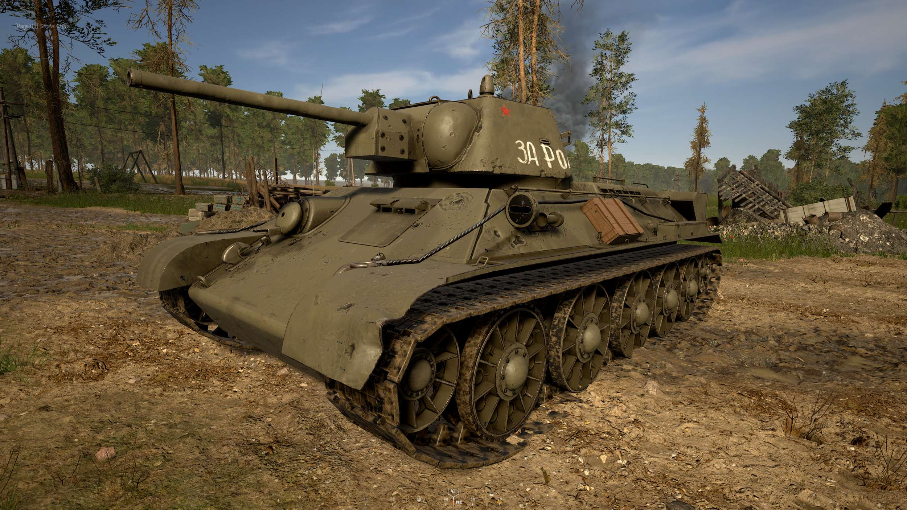
Figure 62: "The T-34/76"

As always, let’s first take a look at the stats:

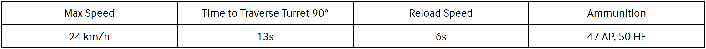

The T-34/76’s stats are not very noteworthy among the other mediums. The only thing worth mentioning is that it holds a little bit more ammunition than other tanks.

So how does it drive? Well, the T-34/76 has the best 4st gear turn speed of any mediums, as well as a comparable top speed:

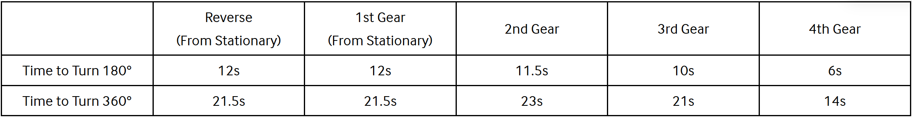

The T-34/76 shares a similar 1st gear/reverse turn speed when stationary to the Panzer IV, but is faster than the Panzer IV when it comes to turning in 4th gear. It’s 4th gear turn speed is slightly faster even than the Panther, which is known for its fast 4th gear turn speed. If flanking was not so difficult on the eastern front maps, the T-34/76 could be very effective at this kind of "hold W" tactic due to this maneuverability.

Here’s the amount of shots it takes the T-34/76 to kill German tanks:

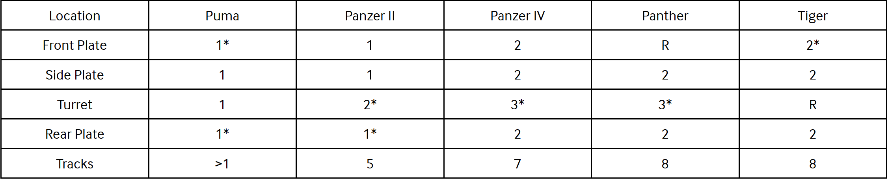

*R - Ricochet or non-penetrating hit*

*#\* - # shots can only be achieved under specific circumstances or in special areas*

When engaging a Puma:

* Aim for the center of the body or the turret for a 1 shot kill. Care must be taken *not* to hit the stoplights on either side of the rear or the gas canisters on top of the side skirt on either side of the front plate because these areas are bugged and will not penetrate (see [section 4.5.3](#453-the-puma) for more on this). You may use an HE shell if you wish to conserve AP shells, since they will also 1 shot everywhere.
* Avoid hitting the barrel or the base of the barrel, this will only do barrel damage (and it will not kill the tank).
* Hitting the wheels will take longer than 1 shot. Avoid them.

When engaging a Panzer II:

* Make certain to hit anywhere in front, side or rear plates, as it is always a 1 shot kill.
* Make certain *not* to hit the tracks or the turret, as this can increase the shots it takes. The turret mantle is also impenetrable. You can ricochet into the top of the Panzer II chassis by aiming for the bottom half of the turret mantle for a one shot.
* Do not shoot the top half of the fuel canisters on either side of the turret as well as the back of the side skirt on the rear of the tank as these areas are bugged and do not penetrate. For more on this, see [section 4.5.4](#454-the-panzer-ii).
* Since the Panzer II cannot do any real damage to the T-34/76, it is not a foe you should be worried about.

When engaging a Panzer IV:

* Just like the medium Sherman, the T-34/76 will penetrate a Panzer IV anywhere in the front, side, or rear plates for a 2 shot kill.
* Trying to kill the Panzer IV by hitting the tracks is impossible from the front and inadvisable from the side, as it takes many shots to do so and the turret or side takes less shots to kill.
* Hitting the turret is a viable approach to killing a Panzer IV whose body is obscured from view, but care must be taken not to hit the barrel or the small mantle either side of it as this will not penetrate. Left or right of the mantle, or side/rear of the turret will kill the tank in 3 hits.
* If you want to engage a Panzer IV, the optimal strategy is to try to position yourself so that you can hide your front plate and only show your turret. Your turret *can* be penetrated from the front, but it is a much harder shot than where the Panzer IV can penetrate you in the body. Hard cover or elevation differences such as those that exist on Kursk will allow you to do this.
* Another option to extend your life against a Panzer IV in the absence of hard cover is to angle the T-34/76 relative to the Panzer IV. If you are turned between 35° and 40° left or right of where the Panzer IV is, both your side plate and the top ⅔ of your front plate will ricochet. At this point, all the Panzer IV can do to penetrate your hull is hit the part of the front plate between the tracks that is angled the opposite way to the rest of the front plate for a 2 shot kill, or the turret in very specific spots for a 3 shot kill. In a public match, it is unlikely that any tanker will know these spots, so you will be able to survive most engagements provided you pull off the correct angle. Against skilled players, however, you may need to find some kind of low bearing object or hill to cover the lower front plate with, and angle the tank to protect the rest. In this niche example, you would force the enemy Panzer IV to have to shoot you in hard-to-hit turret spots while you can hit anywhere in its turret or body. To illustrate this dynamic, see Figures 63 and 64. To see the Panzer IV’s perspective of this angle, see [Figure 49](https://web.archive.org/web/20250409072049/https%3A//theline.gg/tankbible/#f49) in the Panzer IV section.
* The [Achilles Heel](#210-the-achilles-heel) shot is available. Since the T-34/76 can penetrate the side plate of the Panzer IV, both the red and green outlines are penetrable and both will disable the engine in 1 shot (Figure 23). Hitting the red outline is relatively simple, provided you are at the right angle—aim for the space between the side plate and the tracks towards the rear of the tank.f
* As with any other medium, 2 shots to the back plate at most angles will kill it. The first shot disables the engine.
* There are some locations where the T-34/76 cannot penetrate the Panzer IV. For more on where these are located, see [section 4.5.5](#455-the-panzer-iv).

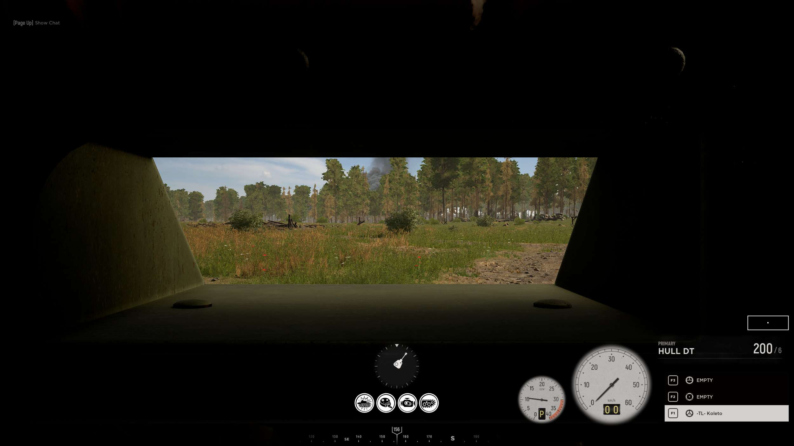
Figure 63: "Angling the T-34/76 from the Driver’s Perspective"

This is the driver’s perspective of the angle you need to protect your tank against enemy Panzer IVs (Figure 63). The barrel is directly facing the enemy Panzer IV (bearing 193 in this example) and the driver’s bearing is 156 (with the MG pointed at the middle of the screen), exactly 37° left of the Panzer IV. In this configuration, both the side plate and most of the front plate will ricochet. Note that the Panzer IV itself is not visible from the driver’s viewport, so drivers that wish to pull this off have to work with their spotters to get an accurate bearing on the enemy Panzer IV, quickly add or subtract 37° (to be safe), and rotate to that bearing. "Eyeballing" this is going to be unreliable.

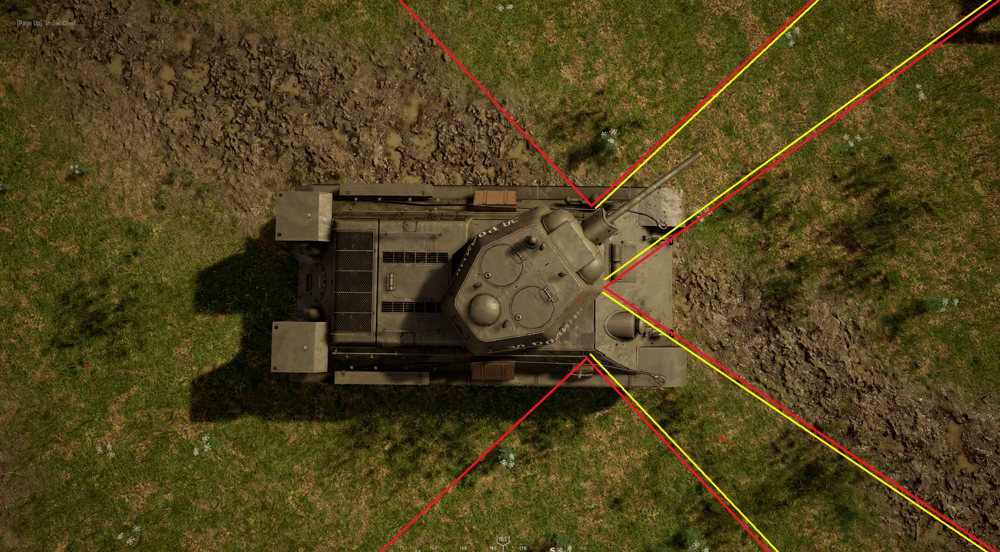
Figure 64: "Angling the T-34/76 from the Top Down Perspective"

The red lines are the angles where a Panzer IV’s shell can penetrate your front and side plates. If you want to make sure both plates ricochet, the Panzer IV’s shell needs to land between the yellow lines.

When engaging a Panther:

* Any shots to the front plate will not penetrate.
* Side and rear plates can be penetrated for a 2 shot kill. If hitting rear, 1 shot will kill the engine and render the Panther immobile. If you are lucky enough to be in a position where you see the side armor of the Panther, 2 shots will kill the tank as long as the projectile lands at an angle less than 55 degrees with respect to the perpendicular of the side armor (35 degrees with respect to the front plate). A greater angle than 55 degrees will bounce. Care must also be taken not to aim too low when attempting to hit the side armor. The top half of the side skirt that extends over the tracks penetrates the side plate for hull damage, and the bottom half penetrates tracks.
* While the front mantle and cupola of the turret are impenetrable by the T-34/76, the turret can still be penetrated from the front by shooting the small triangular corners, or "cheeks", of the Panther’s turret either side of the mantle ([Figure 39](https://web.archive.org/web/20250409072049/https%3A//theline.gg/tankbible/#f39)). Hitting the side or rear of the turret will also penetrate, and both of these shots kill the Panther after 3 rounds. While this can be done in a regular game, it’s extremely rare that a Panther who isn’t already damaged will allow a T-34/76 to unload 3 AP rounds into its turret without blowing it up in 1 shot, so this should only ever be done in emergency cases or if there is no other choice.
* The T-34/76 can hit the [Achilles Heel](#210-the-achilles-heel) shot to kill the Panther’s engine instantly. Both the green and red sections (Figure 23) of the shot work, and the red section in particular—which is just the top half of the side skirt of the Panther towards the rear of the tank—deals hull and engine damage at the same time and is really straightforward to hit. The Achilles heel is the recommended way to engage Panthers if you are at the correct angle so that they do not have the chance to turn around.
* Obviously, do not hit tracks.
* Take care not to shoot some specific locations, outlined in [section 4.5.6](#456-the-panther) that will not penetrate the Panther when hit.

When engaging a Tiger:

* *Any* shots to the front plate, front of the turret, side of the turret, or back of the turret will ricochet at *any* angle. Even if the round does not bounce, no damage will be done to the hull itself.
* If you are lucky enough to be in a position where you see the side armor of the Tiger, 2 shots will kill the tank as long as the projectile lands at an angle less than 55 degrees with respect to the perpendicular of the side armor (35 degrees with respect to the front plate). A greater angle than 55 degrees will bounce.
* The T-34/76 can hit the [Achilles Heel](#210-the-achilles-heel) shot to kill the Tiger’s engine instantly. Both the green and red sections (Figure 23) of the shot work, and the red section in particular—which is just the side skirt of the Tiger towards the rear of the tank—deals hull and engine damage at the same time and is really straightforward to hit. Since the Tiger turns quickly in 1st gear and can kill the T-34/76 in 1 shot, the Achilles heel is the recommended way to engage Tigers if you are at the correct angle so that they do not have the chance to turn around.
* The back plate is a 2 shot kill at any angle. The engine will die with the first shot, making securing the kill super easy. Be careful not to shoot the non-penetrating regions described in [section 4.5.7](#457-the-tiger).
* There *is* a way to penetrate the Tiger in a T-34/76 when engaging it from the front that has recently been discovered courtesy of -TL- EvilTactics (whose Hell Let Loose YouTube channel you can find [here](https://www.youtube.com/channel/UCV53YF5x3fww2yFhMW3MVkA)). For a full description of how exactly it works, see [this section](https://web.archive.org/web/20250409072049/https%3A//theline.gg/tankbible/#theshot). This shot is difficult to land for the T-34/76 and you probably should never go for it, since most eastern front maps offer engagements with average distances too far to make the shot possible to land.

**Opinion:** The T-34/76 is a satisfactory medium tank in Update 12. The Panzer IV’s easily penetrable front plate and turret allows a good T-34/76 crew to take engagements that are very favorable to it. If a T-34/76 peeks a hill on Kursk with only its turret, for example, it forces the Panzer IV to have to land hard-to-hit shots on the T-34/76 while it can land shots on the Panzer IV’s turret with relative ease. With the best 4st gear turn speed of any medium tank, and the ability to angle the armor and spare itself from most front and side plate damage from enemy Panzer IVs during the opening minutes of the game, as well as 2 naturally spawning T-34/76’s at the start of the game, the T-34/76 has a variety of tools in its toolbox to stay alive on the battlefield and deal some damage at the same time. That being said, Panthers and Tigers obliterate it without a second thought, and even AT rocketeers can penetrate this thing anywhere in the front, side, or rear plates. The ideal positioning and use for the T-34/76 is behind a hill or hard cover and far away from any enemy AT infantry or enemy tanks, and its optimal use is defensive shelling of a hardcap or peeking hills in ways that are advantageous to it in order to pick up cheeky kills on enemy Panzer IV’s, trucks, halftracks, Pumas, and Panzer II’s.

You will not be able to flank with this thing because of the nature of the eastern front maps—they are not really conducive to flanking in general since they are so open and have a vast elevation differences throughout the map. Lastly, two of them spawn naturally at the start of the game and replenish for 0 fuel after those ones explode, meaning in theory that there can be more T-34/76’s on the map any any given time than other mediums for the same amount of fuel, allowing them to work together to trade kills with Panzer IVs and even Panthers and Tigers. Overall, the T-34/76 is a decent medium tank for the opening few minutes, but like every other medium lacks punch into the middle and late game.

### **4.4.2 The IS-1**

The IS-1 heavy tank is definitely the poorest performing heavy tank in several different metrics. It has the weakest armor of any heavy tank and the slowest 1st gear turn speed of any heavy. That being said, it is still a heavy tank, and outclasses most other tanks in the field.

How can you differentiate the IS-1 from the T-34/76? Here’s a list (Figure 65):

* A very long, smooth, cylindrical cannon.
* A round turret with a rounded mantle.
* Big white numbers spanning the side of the turret.
* Slanted front armor pieces that smoothly connect with the side plate.
* A series of big cylinders hanging off the side of the tank towards the rear.

Figure 65: "The IS-1"

The IS-1’s stats are shown below:

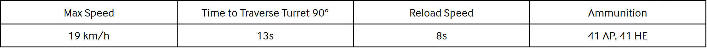

Note that the IS-1 has similar stats to the other heavies on the field except for, notably, the Panther.

Here is the driving info:

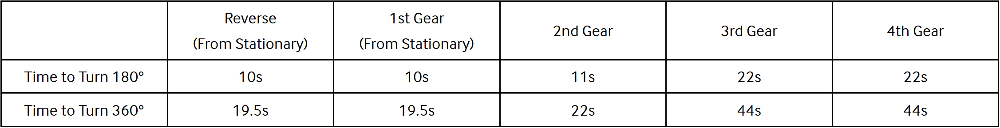

The IS-1 never fails to disappoint—it has by far the worst 3rd and 4th gear turn speeds, taking a whole 44 seconds to make a complete turn. This is in stark contrast to its main competitor, the Panther, who turns **3.4 times faster** in 4th gear. Its first gear/reverse turn speeds are nothing to write home about either.

Here’s the table on hit-to-kill values:

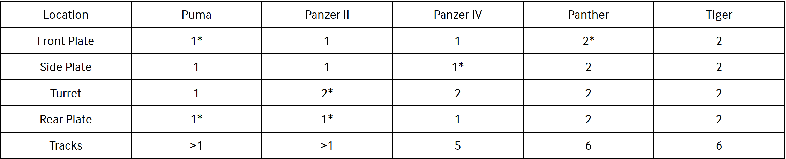

When engaging a Puma:

* Aim for the center of the body or the turret for a 1 shot kill. Even in the IS-1, care must be taken *not* to hit the stoplights on either side of the rear or the gas canisters on top of the side skirt on either side of the front plate because these areas are bugged and will not penetrate (see [section 4.5.3](#453-the-puma) for more on this). You may use an HE shell if you wish to conserve AP shells.
* Hitting the wheels will take longer than 1 shot. Avoid them.

When engaging a Panzer II:

* Make certain to hit anywhere in front, side or rear plates, as it is always a 1 shot kill.
* The turret mantle is impenetrable.
* Even in the IS-1, the top half of the fuel canisters on either side of the turret as well as the back of the side skirt on the rear of the tank are areas that are bugged and do not penetrate. For more on this, see [section 4.5.4](#453-the-puma).
* Since the Panzer II cannot do any damage to you in an IS-1, it is not a foe you should be worried about.

When engaging a Panzer IV:

* Shooting the front plate, side plate, or rear plates obliterates this thing in 1 shot.
* The turret will take 2 shots before the Panzer IV explodes, and this can be done from any angle. This method should only be used to kill Panzer IVs that are only visible by their turret. If you can see the body, shoot it in the body and do not waste your time.
* The turret’s cupola and the inside of the barrel are penetrable but deal no hull damage—shots to those areas will just kill the turret module.
* It is important to note that a good Panzer IV crew can shoot you from the front if you are not careful. Always keep an eye out for where enemy tanks are and could be soon, and when a Panzer IV shows up, make sure to work with your spotter to face the IS-1 in the Panzer IV’s direction (down to the exact bearing) or kill it before it gets a chance to land a shot. This will make it so the Panzer IV is not able to penetrate your front armor or turret anywhere (You can also do this for AT, though it’s harder since they are moving around).
* Going for the tracks is inadvisable because of the sheer number of shots required to kill the tank.
* While the [Achilles Heel](#210-the-achilles-heel) shot is technically possible, it is not recommended to go for this shot since hitting the side plate will kill it in 1 shot anyway.
* Even in the IS-1, there are places of the Panzer IV front, side, and rear plates which are impenetrable. To see where, check out [section 4.5.5](#455-the-panzer-iv).

When engaging a Panther:

* The IS-1 can blow the Panther up in 2 shots anywhere in the front plate. Care must be taken not to hit the side skirt protruding above the tracks left and right of the front plate, as this will not penetrate at all (see [Section 4.5.6](#456-the-panther) for more). This is the go-to method for destroying a Panther tank.
* The IS-1 has a much slower reload speed than the Panther (8 seconds vs 6 seconds respectively). This means that even if you land the first shot in an engagement with a Panther, you may still end up losing if you get hit up to 2 seconds after shooting your first shot. Assuming all shots land, the Panther will be able to fire its 2nd shot and blow you up before you have a chance to finish it off. This single fact makes the Panther a very scary tank on the battlefield, and one that needs to be attacked intelligently. If you try to engage a Panther head to head, assuming both crews are of equal skill, you will lose the engagement in a 1v1a majority of the time. The reload speed dynamic between these two tanks forces the IS-1 to go for the element of surprise when engaging Panthers or double up with other IS-1’s or AT guns to land two blows at once and end the engagement early.
* The second spot that is very effective against a Panther is the sides, which can be hit twice for a kill even from a very shallow angle. In fact, if you can see the side at all then you can penetrate it. This is a strictly inferior method to hitting the front though because there is less surface area, so only do this if you can’t hit the front for some reason.
* If for some reason the front and sides of the body are obscured or otherwise inaccessible, the turret is the next best place to hit. It takes 2 shots to kill the Panther if you shoot it anywhere in the front, sides and rear of the turret. Do not hit the barrel or the cupola instead of the plates on the turret, as these will only destroy the turret and not damage the hull.
* Under almost no circumstances should you be hitting the tracks of a Panther given the aforementioned methods of dispatching the tank, as it takes three times as long in the best case scenario (by that time you’d be dead).
* The IS-1 can hit the [Achilles Heel](#210-the-achilles-heel) in both the red and green sections (Figure 23). This can be useful to mitigate the potential for the Panther to turn around and land a shot in your plate, since the engine dies in 1 shot, but in general if the IS-1 has the angle to hit the Achilles Heel it will kill the Panther before the Panther can kill it.
* The rear plate of the Panther is still a 2 shot kill, just like the front and sides, except the engine gets disabled after the first shot.

When engaging a Tiger:

* Penetrating the Tiger’s front armor is possible anywhere as an IS-1, and will kill it in 2 shots. If you see the front, shoot it.
* The trick to engaging enemy Tigers from the front is landing the first shot. Since the Tiger and the IS-1 both have the same reload speed, the crew that lands the first shot will be the crew that wins the engagement, assuming all subsequent shots land.
* You can also penetrate a Tiger in the sides, which can be hit twice for a kill even from a very shallow angle. In fact, if you can see the side at all then you can penetrate it. This is a strictly inferior method to hitting the front though because there is less surface area, so only do this if you can’t hit the front for some reason.
* If for some reason the front and sides of the body are obscured or otherwise inaccessible, the turret is the next best place to hit. It takes 2 shots to kill the Tiger if you shoot it in the front mantle, or the sides and rear of the turret. This means that if the Tiger is looking directly at you, the flat plates on either side of the barrel are where you want to aim, and hitting the other surfaces will likely ricochet. Care also must be taken not to hit the barrel or the cupola instead of the plates on the turret, as these will only destroy the turret and not damage the hull.
* Under almost no circumstances should you be hitting the tracks of a Tiger tank given the aforementioned methods of dispatching the tank, as it takes three times as long in the best case scenario (by that time you’d be dead).
* The IS-1 can take advantage of the [Achilles Heel](#210-the-achilles-heel) as per section 2.10 in both the red and green sections (Figure 23). This can be useful to mitigate the potential for the Tiger to turn around and land a shot in your plate since the engine dies in 1 shot, but in general if the IS-1 has the angle to hit the Achilles Heel it will kill the Tiger before the Tiger can kill it.
* The rear plate of the Tiger is still a 2 shot kill, just like the front and sides, except the engine gets disabled after the first shot. Note that the air filters and exhaust pipes on the back of the Tiger are impenetrable from the sides or the rear, even to the 76mm "Jumbo". See [section 4.5.7](#457-the-tiger) to see an illustration of these areas.

**Opinion:** As mentioned in the introduction, the IS-1 leaves a lot to be desired when compared to the other heavy tanks. It can be damaged by the Panzer IV, the Panther, and the Tiger from the front, sides, and rear, and can even be shot by enemy AT players in the front if they know where to shoot. This creates a problem for the IS-1 on Stalingrad—the urban environment makes it very easy for AT to peek out of cover, shoot you, and run away, all while laughing at your puny attempts to defend yourself. That being said, the IS-1 is still a heavy tank, and as such has heavy tank firepower. It can use this firepower to destroy both Panzer IVs and Tigers relatively easily. In the battlefield, the Soviet heavy tank’s role is just that—to engage enemy tanks and remove them from the battlefield—but you should know the limitations of your armor. IS-1 crews simply have to work a little harder to make sure they are not being outplayed by enemy Panzer IVs or AT guns and that they are not being surrounded by enemy AT rocketeers, which can sometimes be a lot of things to juggle at the same time. Factor in the new Update 12 Panther, and you realize that the situation gets very dire for the Soviets. The IS-1 already was the worst heavy tank in the game and now it is monumentally outclassed by the Panther’s faster reload speed and greater mobility. Ultimately, you have to work with what you’ve got, but the IS-1 should stay in the backline in hard cover and shell from as far away as possible, or work with its friendly tanks to corner enemy Panthers and put pressure on them.

---

### **4.5 Achieving Maximum Penetration**

Ever wondered why your good-for-nothing gunner manages to hit a puma in your 76mm "Jumbo" but not kill it? Well, your gunner is still garbage, but it’s not entirely their fault. Many tanks in the game have strange, inexplicable hitboxes that **no shell can penetrate**, even those from heavies. When a shell hits these locations, it neither ricochets nor penetrates, it simply vanishes and creates a non-penetrating animation (for more on what this looks like, see [section 2.4.2](#242-non-penetrating-hits)). These hitboxes serve to explain a lot of the inconsistency and confusion that people get all the time when they are playing in a tank as to how they don’t penetrate even though they should—-so before you curse me out for incorrect information and toss this entire guide into the dumpster, read this section.

I have compiled a list below of all the areas that are not "supposed" to be non-penetrating (in other words, a medium tank hitting the front plate of a heavy will not be counted, since that is what’s "supposed" to happen). These spots are all of the ones that I personally am aware of, but if you find any and want me to add them to the list don’t hesitate to let me know. Also, if you find any errors in any of the following diagrams, please tell me so that I can fix them.

### **4.5.1 The Stuart**

The Stuart is impervious to damage from any source at the top of the skirt that sticks out of the front body covering the tracks (Figure 66).

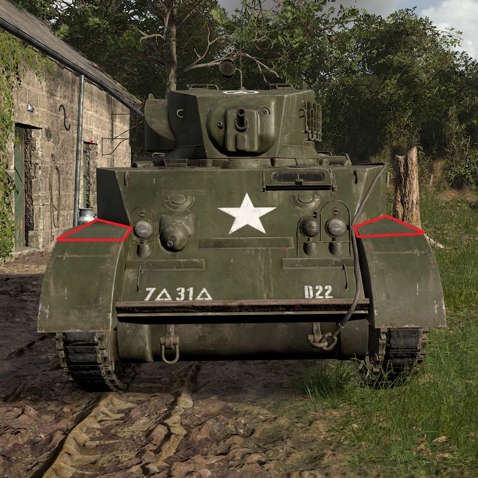 
Figure 66: Stuart Non-Penetrating Areas

The Stuart is penetrable by AT rockets and non-light tanks anywhere in its body or turret except for this area. If you try to shoot the outlined areas with any tank shell or AT rocket in the game, you will not penetrate (so don’t, duh).

### **4.5.2 The "Jumbo"**

The "Jumbo"s’ butts can be penetrated almost anywhere except for the cloth-covered equipment right below the turret (the red section, Figure 67).

 
Figure 67: "Jumbo" Non-Penetrating Areas

The red section is impervious to damage from any tank or AT cannon or rocket, while the green section is only impervious to AT rockets and the Panzer IV. If you wish to hit the rear of the "Jumbo", make sure to hit below the green section just to be safe.

### **4.5.3 The Puma**

The Puma is perhaps the most egregious instance of non-penetrating surfaces since they take up large portions of the Puma’s front and rear surface areas (and heavies should just be able to penetrate anywhere on this thing, devs). On the front, the gas canisters left and right of the main body are impenetrable (Figure 68).

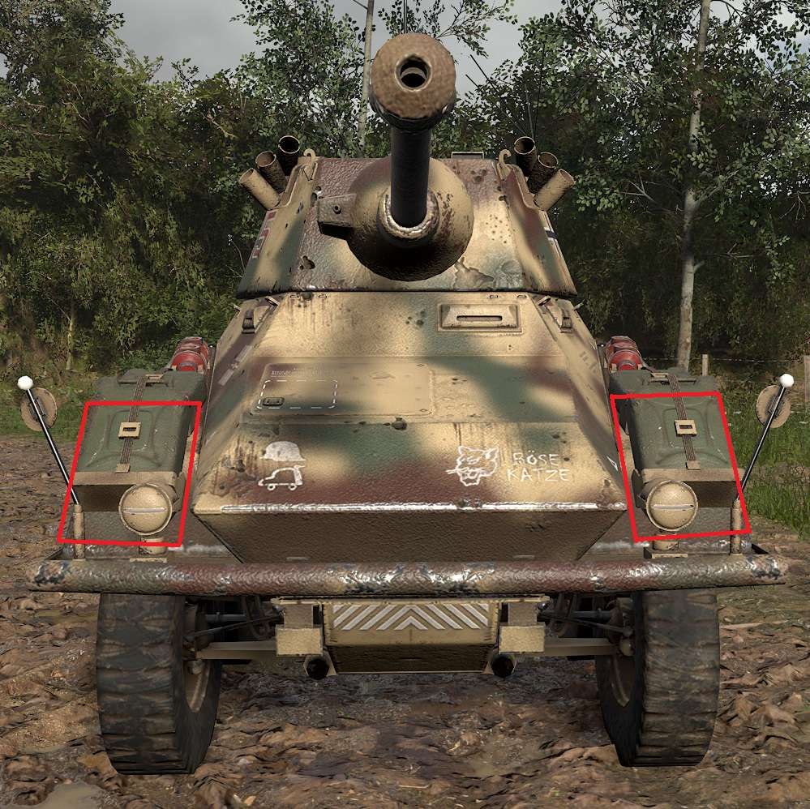 
Figure 68: Puma Non-Penetrating Areas, Front

Once again, no tank or AT gun/rocket can penetrate the sections outlined in red, including heavy tanks. This also applies to the next image, the red bumpers on the back of the Puma (Figure 69).

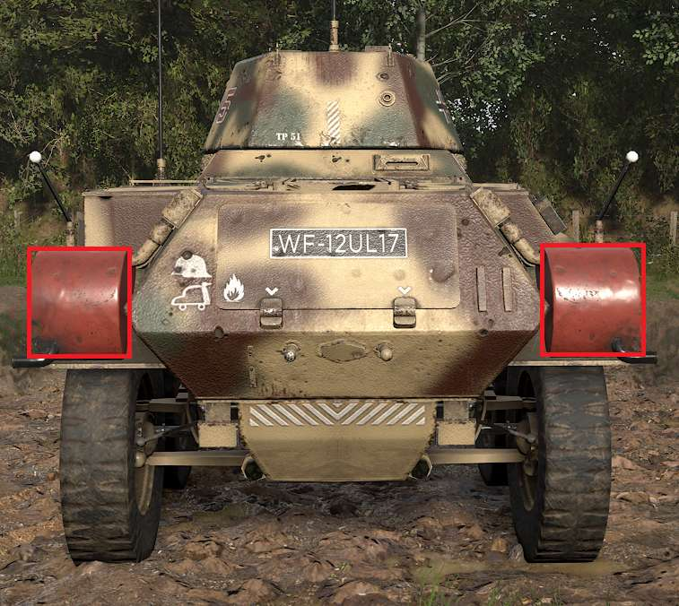 
Figure 69: Puma Non-Penetrating Areas, Rear

Although heavy tanks need not worry about recon vehicles being a problem for them in Update 12, hitting a shot that does not penetrate gives the Puma more time to escape while you are reloading, so take care not to hit these areas lest you lose your chance to kill it.

### **4.5.4 The Panzer II**

The Panzer II has two surfaces that cannot be penetrated by any source, the first being at the rear of the tank (Figure 70).

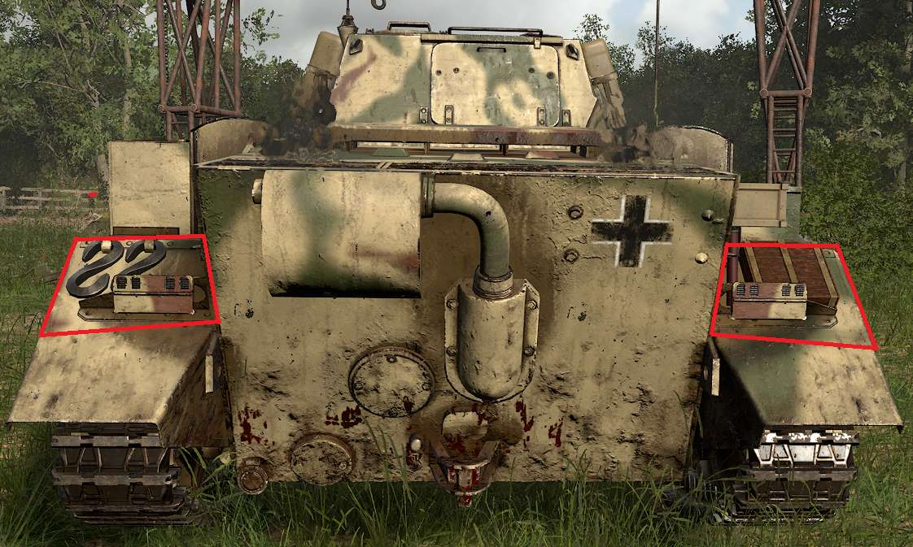 
Figure 70: Panzer II Non-Penetrating Areas, Rear

This one is pretty straight forward. Just like the Puma, avoid shooting the red outlined sections even if you are in a heavy tank so that the Panzer II does not have a chance to get away. Next, we have the fuel canisters located on the Panzer II’s turret (Figure 71).

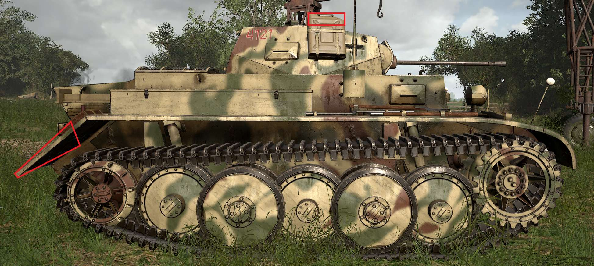 
Figure 71: Panzer II Non-Penetrating Areas, Turret

Unlike previously mentioned surfaces, the non-penetrating spot on the Panzer II’s turret is dependent on the angle that the round comes in at. If the red section is shot at from high ground where the round would hit the turret if it kept going, it will penetrate. If the round comes in at an angle where it will never hit the Panzer II at all, such as in the screenshot, then it will not penetrate even if said round is coming from a heavy tank.

The other section to notice is the track skirt towards the rear, which like the turret fuel canisters, sticks out beyond the chassis of the tank and as such is impenetrable.

### **4.5.5 The Panzer IV**

The Panzer IV, like the Panzer II, has non-penetrating surfaces that depend chiefly on the angle at which the incoming shell connects with the plate. The following 3 figures illustrate how the surfaces that are impervious to any shell shift as the angles change (Figure 72, Figure 73, Figure 74).

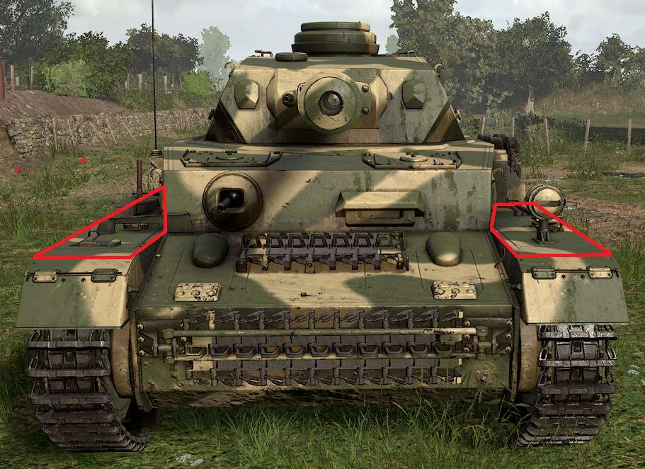 
Figure 72: Panzer IV Non-Penetrating Areas, Front

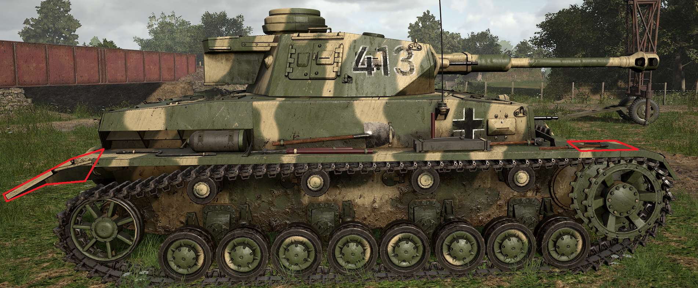 
Figure 73: Panzer IV Non-Penetrating Areas, Side

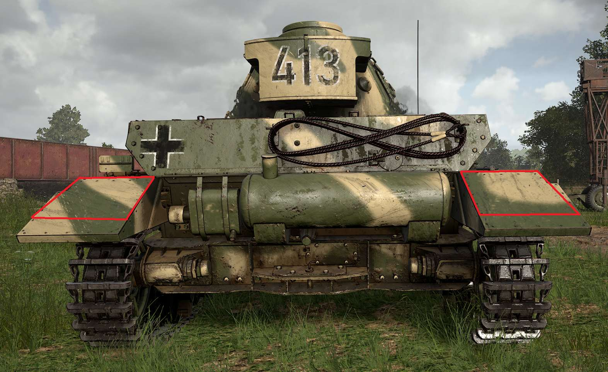 
Figure 74: Panzer IV Non-Penetrating Areas, Rear

When aiming at the front, the side skirt that covers the top of the tracks cannot be penetrated even by heavy tanks. As you turn more towards the side, the side skirt starts to penetrate the side plate, and as you reach the rear it again becomes impenetrable. To determine if your shell will land or not, imagine your shell going through the surface it hits as if it wasn’t there—would it end up hitting the body, turret or tracks? If the answer to this question is yes, then it will most likely penetrate the Panzer IV. If the shell you are shooting is at an angle that would not hit any of the above if it went through the plate, then it will give off a non-penetration animation and not penetrate. The following is a visual explanation of this dynamic using a "Jumbo" 76mm (Figure 75).

<figure style="max-width: 600px; margin: auto;">
  <video controls style="width: 100%; height: auto;">
    <source src="videos/f75.webm" type="video/mp4">
    Your browser does not support the video tag.
  </video>
</figure>
Figure 75: Panzer IV Non-Penetrating Areas, At an Angle

### **4.5.6 The Panther**

The Panther has a few annoying regions on its body that are not able to be penetrated by the 76mm "Jumbo" or IS-1. The first is the top of the skirt that goes over the tracks on the front of the tank (Figure 76).

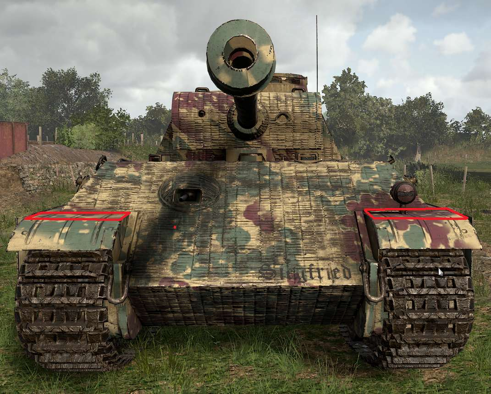 
Figure 76: Panther Non-Penetrating Areas, Front

If you hit the red sections in a "Jumbo" 76mm (or indeed, any other American or Soviet tank) you will hit neither track nor front plate, and instead not penetrate. Be careful when aiming for a Panther if it’s at an angle with respect to you, since this shot becomes easier to accidentally land. There are also some impenetrable sections on the rear of the Panther as well, namely the exhaust pipes and fans (Figure 77).

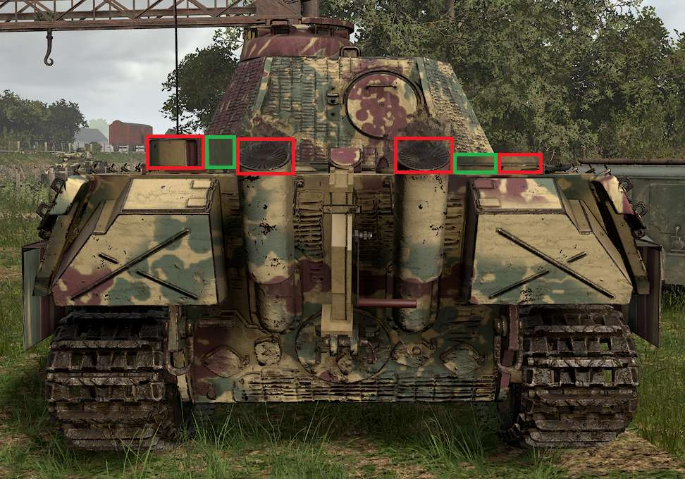 
Figure 77: Panther Non-Penetrating Areas, Rear

The tips of the exhaust pipes that stick up over the chassis of the tank, as well as the fans that are affixed to the top of the chassis on either side of the exhaust pipes, are impenetrable to all medium and heavy tanks. These are denoted by the red sections in Figure 77. The green sections are there to denote the fact that a round from a "Jumbo" 76mm and an IS-1 *can* actually penetrate that piece of the fans for turret damage (believe it or not). Despite this, the green sections are not able to be penetrated by medium tanks or AT.

### **4.5.7 The Tiger**

The Tiger’s non-penetrating areas are exclusively attached to its gigantic rear end. These are the air filters and exhaust pipes, which stick up over the tank’s chassis, and the equipment that is immediately below them when viewed from the side (Figures 78 and 79).

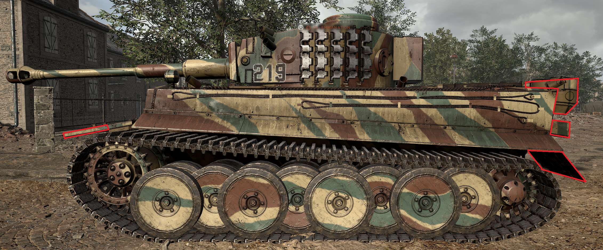 
Figure 78: Tiger Non-Penetrating Areas, Side

As an AT player, medium tank, or heavy tank, you cannot penetrate any of the surfaces outlined in red as long as you are looking at them from the side as in the figure. Note that in addition to the air filters and equipment below them, the front and rear track skirts that stick out over the front and rear of the tracks respectively do not penetrate either.

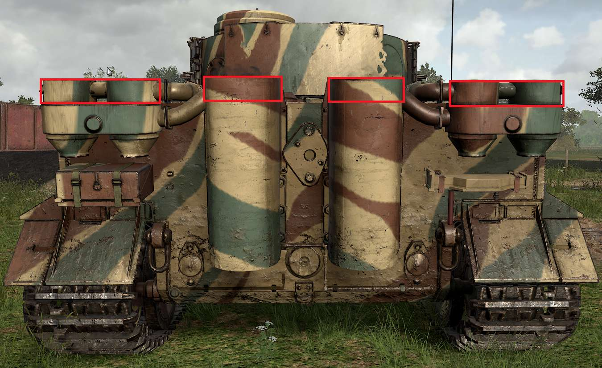 
Figure 79: Tiger Non-Penetrating Areas, Rear

Unlike from the side, from the rear you can penetrate the parts of the air filters that have the tank’s chassis behind them but not the parts that stick up above it.

### **4.5.8 The T-34/76**

The T-34/76 can also prevent penetration if it gets shot in the corners of the large cube boxes that stick out of its rear, marked in red (Figure 80).

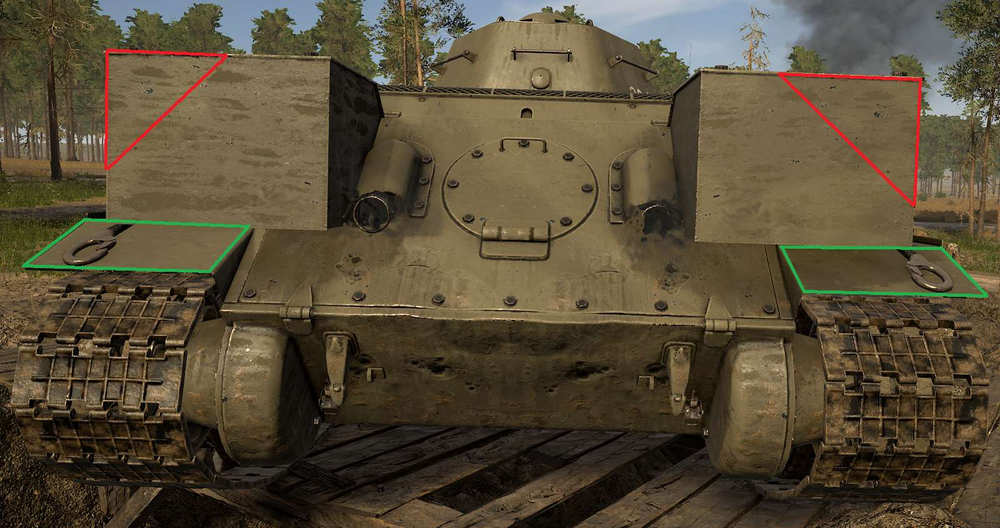 
Figure 80: T-34/76 Non-Penetrating Areas, Rear

The trick to avoiding this non-penetrating section on the rear of the T-34/76 is to, like the other examples shown above, angle your shell so that if it went through the boxes it still would connect with the body. In the screenshot, we can see that if the red sections were to be shot by any damage source, that the round would not end up going through the body but instead through the air—this means that it will not penetrate. The green sections are there to denote areas that can be penetrated only by heavy tanks, not by AT rockets or medium tanks.

### **4.5.9 The IS-1**

The portion of the IS-1’s plate that is not penetrable is very simple—it is the metal cylinders on either side of the chassis (Figure 81).

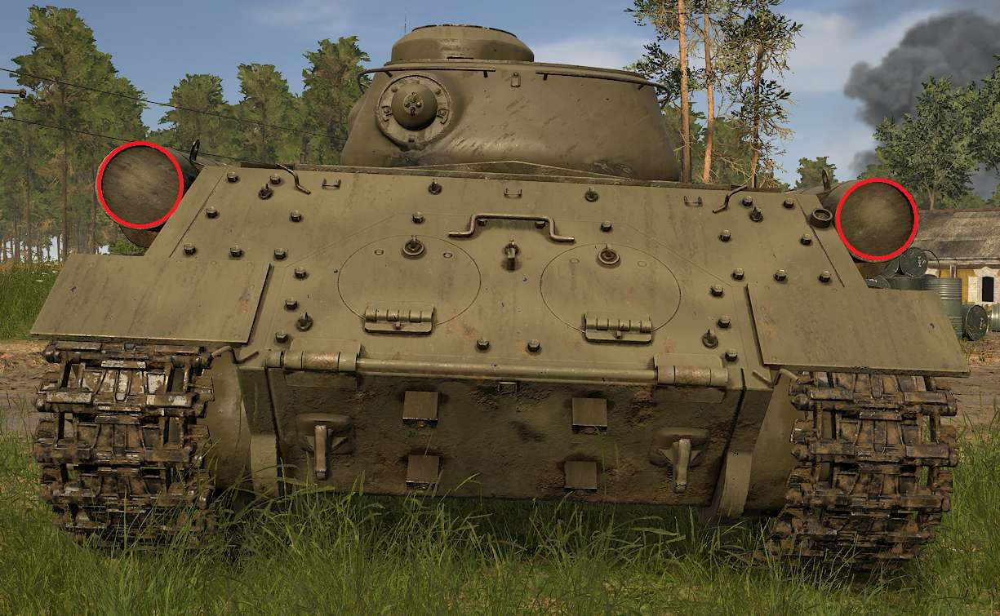 
Figure 81: IS-1 Non-Penetrating Areas, Rear

Like we have seen for all of the other tanks, the area outlined in red in Figure 81 is impervious to all damage, including heavy tanks. Take care not to aim for this portion of the tank lest you be unpleasantly surprised and bring about your timely demise.

## **5 Conclusions**

Updates 10 through 12 have completely changed the tanking scene. The standardization has removed the rage-inducing buggy hitboxes of ye olden days, and has introduced a much more rigid tank class structure. Despite this standardization, there do seem to be a number of exceptions to these rules which place certain side’s tanks above others.

Based on the data presented above, the German tanks have ousted the American tanks at the top of the food chain when it comes to the quality and performance of their tanks, with the Soviets remaining in dead last place. In the current iteration of the game, fuel can be quite scarce if it isn’t used properly in a match, and this means that the team who utilizes their first tank spawns the best will propel themselves into a fuel surplus while the other team is forced to take tanks of ever decreasing quality as the match progresses. This means that the tanks available to teams at the start of the match as well as the first heavies spawned on the field are the most important tanks, and their individual performances determine how the middle to late game will progress for the team and whether or not the tankers will have to go play infantry due to lack of fuel.

Given this fact, let’s look at how the different medium and heavy tanks compare to each other, starting with the dynamic between the Americans and Germans first. The American medium Sherman has a slight disadvantage versus the Panzer IV during the very first tank battle of the game because of the Panzer IV’s smaller profile, larger stockpile of ammunition, and better mobility, but it can go either way depending on the skill of the individual crews. When the first heavy tanks come into play, things take a massive nose-dive for the Allies. First, the first Panther (and indeed, every subsequent Panther) spawns a full 50 seconds faster than the "Jumbo" 76mm Sherman, and it’s faster top speed and mobility allow the Panther to set up in an optimal position and be ready for engagements well before the "Jumbo". When the shells actually start flying, the Panther’s superior reload speed to the "Jumbo" 76mm allows it to win most engagements head to head, meaning that there is a significant weight towards German tanks in terms of armor superiority in the average game. On top of all of that, the Panthers’ greater mobility and protection versus AT rockets allow them to put immense pressure on American infantry positions including outposts and garrisons after they have mopped the floor with the American tanks.

As for the Soviets versus the Germans, the dynamic gets even more lopsided. The T-34/76 has a less penetrable turret and smaller body than the Panzer IV, which is a moderate advantage, but the real issue is the IS-1. The fact that the IS-1 can be penetrated by the Panzer IV in the front plate is a huge problem for the Soviet forces, and means that any IS-1s spawned in the early mid game are burdened not only with the danger of heavies and AT guns but also medium tanks and even AT rocketeers, making it much harder for them to beat all the odds and come out on top consistently. Toss in the same disadvantages described above regarding the Panther, and you have an armor balance significantly skewed towards the Germans. All in all, since the American tanks are better than the Soviet tanks, and the German tanks are better than the American tanks, my final rankings in the current iteration of Hell Let Loose are the Germans being by far the best, with the Americans second, and the Soviets last.

## **6 Thank You!**

If you’ve gotten this far, I want to thank you for reading this (really overly verbose) guide. I hope you’ve at least learned something interesting from the hours my team and I spent sitting in empty lobbies and grinding tank stats. I also want to thank the following people for being absolutely instrumental in helping me test and proofread the Tank Bible for Update 12: **-TL- Bueno** (general testing), my own son and heir **-TL- Timmy Lee** (precision strike testing and driving tanks) **-TL- Bhaskara** (general testing), **-TL- SharonNeedles** (light tank testing), **-TL- Mage** (AT gun testing), my beautiful girlfriend **-TL- Emmanation** (driving tanks, general testing, and putting up with my ass), and last but not least, of course, my very own mother.

If you enjoy the work that I put into this project and you would like to contribute to keeping it updated as new changes are made to the game, consider supporting me with a donation (I greatly appreciate it!): [https://paypal.me/tankbible](https://paypal.me/tankbible)

If you just want to play a few games with some of the friendliest HLL players out there, consider joining my community, The Line, at [https://discord.gg/theline](https://discord.gg/theline), or explore our website (you’re currently on it). Hopefully this information lets you destroy the competition next time you join an armored squad. **Thank you, and good luck!**